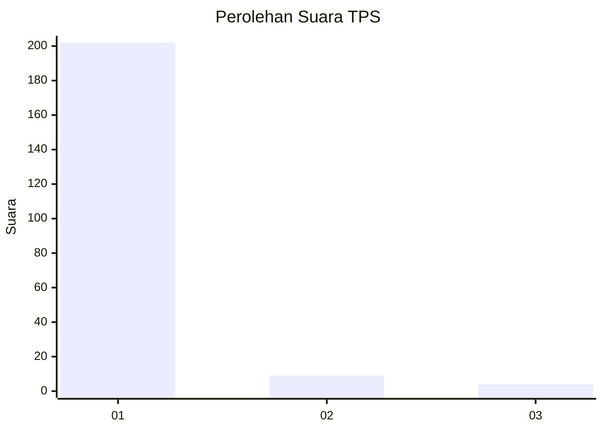
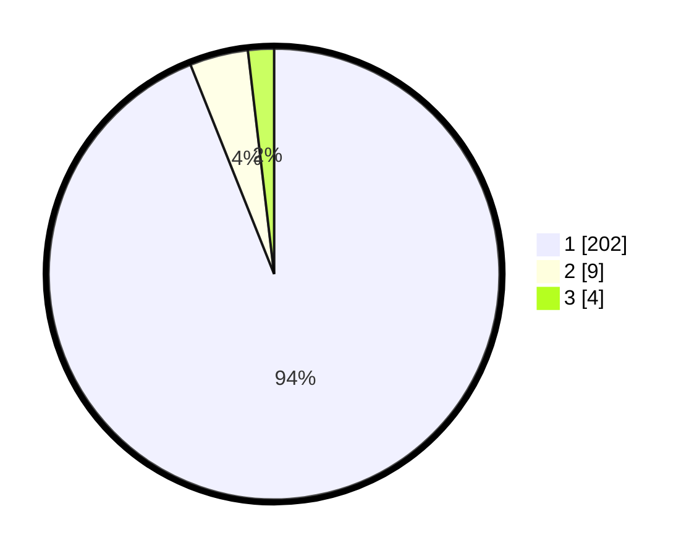

# Hasil

## Grafik

## Tabel

| No. | Nama Paslon    | Suara | Suara (raw) | Persentase |
|:--- |:-------------- | -----:| -----------:| ----------:|
| 1   | ANIES MUHAIMIN | 202   | [202][p-1]  | 93,95      |
| 2   | PRABOWO GIBRAN | 9     | [9][p-2]    | 4,19       |
| 3   | GANJAR MAHFUD  | 4     | [4][p-3]    | 1,86       |

[p-1]: https://github.com/gigit-pemilu/pemilu-2024-11-aceh/blob/main/pilpres/hitung-suara/sub/11-aceh/sub/08-aceh-utara/sub/03-kuta-makmur/sub/2003-blang-talon/sub/002-tps/sub/paslon-1.txt
[p-2]: https://github.com/gigit-pemilu/pemilu-2024-11-aceh/blob/main/pilpres/hitung-suara/sub/11-aceh/sub/08-aceh-utara/sub/03-kuta-makmur/sub/2003-blang-talon/sub/002-tps/sub/paslon-2.txt
[p-3]: https://github.com/gigit-pemilu/pemilu-2024-11-aceh/blob/main/pilpres/hitung-suara/sub/11-aceh/sub/08-aceh-utara/sub/03-kuta-makmur/sub/2003-blang-talon/sub/002-tps/sub/paslon-3.txt

## Foto C Plano

https://sirekap-obj-formc.kpu.go.id/dda6/pemilu/ppwp/11/08/03/20/03/1108032003002-20240218-131715--b6dd2e7a-b62b-4aa8-b998-9827021b314f.jpg

https://sirekap-obj-formc.kpu.go.id/dda6/pemilu/ppwp/11/08/03/20/03/1108032003002-20240218-131332--ac56360d-cbf9-4c6d-901e-8b0bb340cd65.jpg

https://sirekap-obj-formc.kpu.go.id/dda6/pemilu/ppwp/11/08/03/20/03/1108032003002-20240218-131527--d2fca26c-f80a-4198-8bde-e3144568922c.jpg

## Metadata

| Key        | Value               |
| ---------- | ------------------- |
| Time Stamp | 2024-02-21 10:00:00 |

## DATA PEMILIH TETAP

Jumlah pemilih dalam DPT: **263**.
 * L: **123**.
 * P: **140**.

## DATA PENGGUNA HAK PILIH

Jumlah pengguna hak pilih dalam DPT: **254**.
 * L: **117**.
 * P: **137**.

Jumlah pengguna hak pilih dalam DPTb: **0**.
 * L: **0**.
 * P: **0**.

Jumlah pengguna hak pilih dalam DPK: **0**.
 * L: **0**.
 * P: **0**.

Jumlah pengguna hak pilih: **254**.
 * L: **117**.
 * P: **137**.

## JUMLAH SUARA SAH DAN TIDAK SAH

JUMLAH SELURUH SUARA SAH: **215**.

JUMLAH SUARA TIDAK SAH: **39**.

JUMLAH SELURUH SUARA SAH DAN SUARA TIDAK SAH: **254**.

