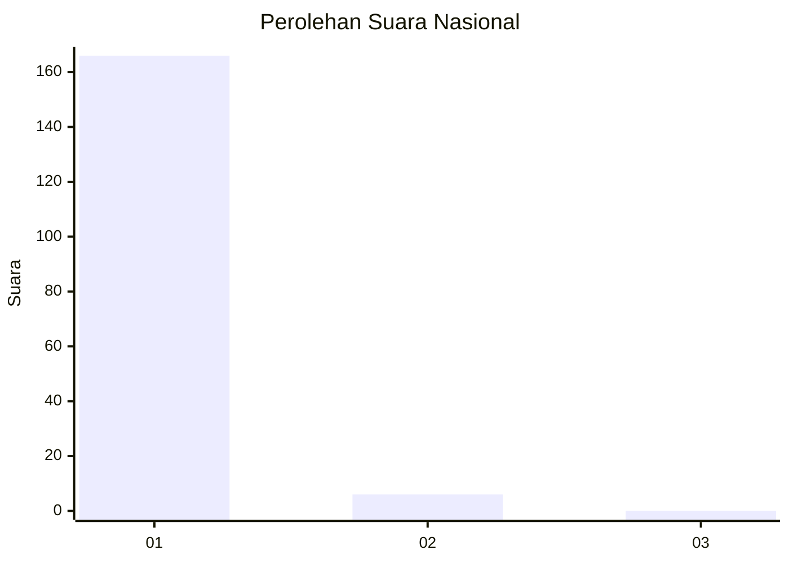
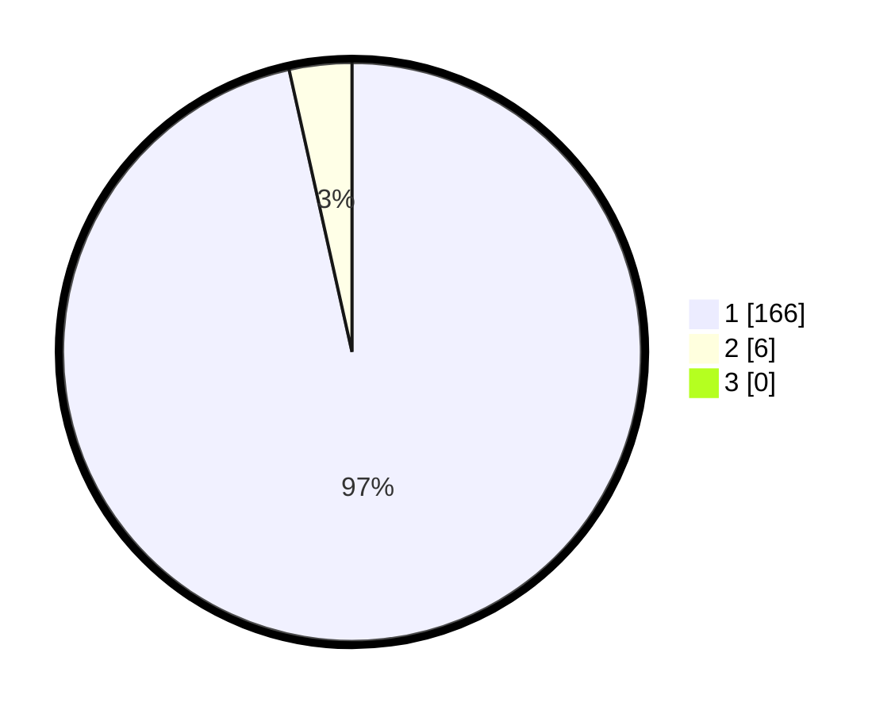

# Hasil

## Grafik

## Tabel

| No. | Nama Paslon    | Suara | Suara (raw) | Persentase |
|:--- |:-------------- | -----:| -----------:| ----------:|
| 1   | ANIES MUHAIMIN | 166   | [166][p-1]  | 96,51      |
| 2   | PRABOWO GIBRAN | 6     | [6][p-2]    | 3,49       |
| 3   | GANJAR MAHFUD  | 0     | [0][p-3]    | 0,00       |

[p-1]: https://github.com/gigit-pemilu/pemilu-2024/blob/main/pilpres/hitung-suara/sub/11-aceh/sub/08-aceh-utara/sub/03-kuta-makmur/sub/2030-meunasah-kulam/sub/001-tps/sub/paslon-1.txt
[p-2]: https://github.com/gigit-pemilu/pemilu-2024/blob/main/pilpres/hitung-suara/sub/11-aceh/sub/08-aceh-utara/sub/03-kuta-makmur/sub/2030-meunasah-kulam/sub/001-tps/sub/paslon-2.txt
[p-3]: https://github.com/gigit-pemilu/pemilu-2024/blob/main/pilpres/hitung-suara/sub/11-aceh/sub/08-aceh-utara/sub/03-kuta-makmur/sub/2030-meunasah-kulam/sub/001-tps/sub/paslon-3.txt

## Foto C Plano

https://sirekap-obj-formc.kpu.go.id/db0d/pemilu/ppwp/11/08/03/20/30/1108032030001-20240215-031129--c6ce8e7f-9f90-4214-b92c-9b29dd6418b2.jpg

https://sirekap-obj-formc.kpu.go.id/db0d/pemilu/ppwp/11/08/03/20/30/1108032030001-20240215-031014--a7a69949-e366-4013-be84-ba3766bd3876.jpg

https://sirekap-obj-formc.kpu.go.id/db0d/pemilu/ppwp/11/08/03/20/30/1108032030001-20240215-034153--78a10c97-965b-4c72-a557-e62037b369ef.jpg

## Metadata

| Key        | Value               |
| ---------- | ------------------- |
| Time Stamp | 2024-02-15 15:00:29 |

