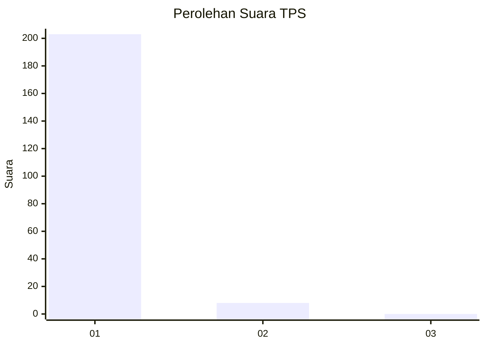
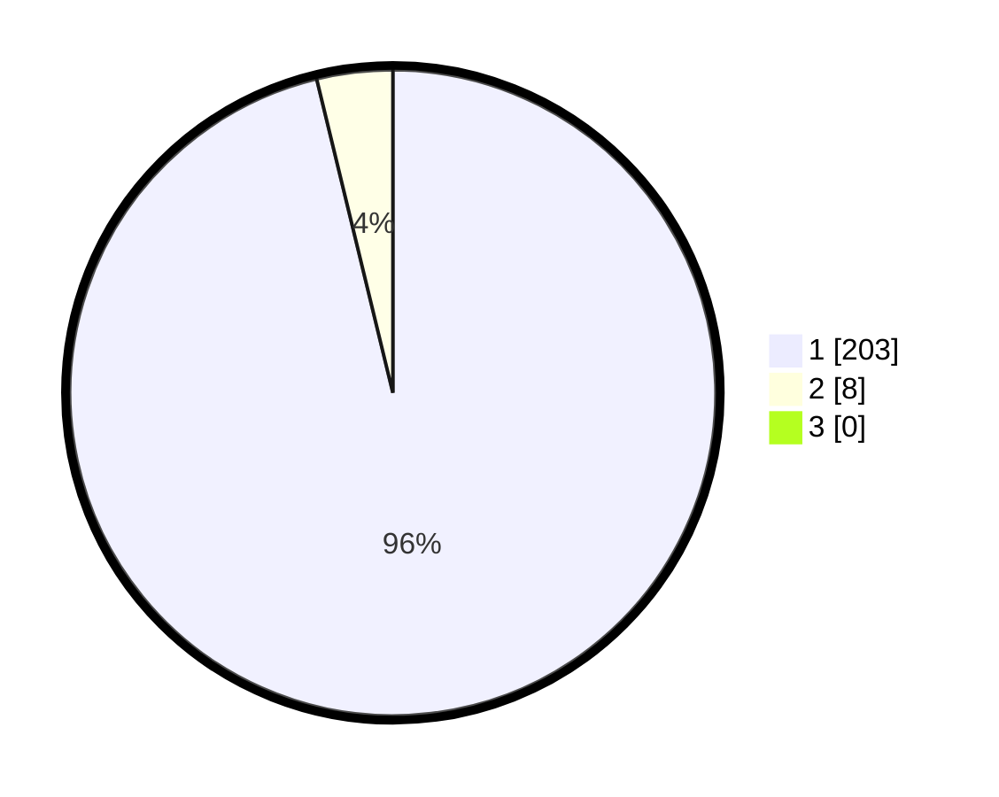

# Hasil

## Grafik

## Tabel

| No. | Nama Paslon    | Suara | Suara (raw) | Persentase |
|:--- |:-------------- | -----:| -----------:| ----------:|
| 1   | ANIES MUHAIMIN | 203   | [203][p-1]  | 96,21      |
| 2   | PRABOWO GIBRAN | 8     | [8][p-2]    | 3,79       |
| 3   | GANJAR MAHFUD  | 0     | [0][p-3]    | 0,00       |

[p-1]: https://github.com/gigit-pemilu/pemilu-2024-11-aceh/blob/main/pilpres/hitung-suara/sub/11-aceh/sub/08-aceh-utara/sub/03-kuta-makmur/sub/2032-keureusek/sub/001-tps/sub/paslon-1.txt
[p-2]: https://github.com/gigit-pemilu/pemilu-2024-11-aceh/blob/main/pilpres/hitung-suara/sub/11-aceh/sub/08-aceh-utara/sub/03-kuta-makmur/sub/2032-keureusek/sub/001-tps/sub/paslon-2.txt
[p-3]: https://github.com/gigit-pemilu/pemilu-2024-11-aceh/blob/main/pilpres/hitung-suara/sub/11-aceh/sub/08-aceh-utara/sub/03-kuta-makmur/sub/2032-keureusek/sub/001-tps/sub/paslon-3.txt

## Foto C Plano

https://sirekap-obj-formc.kpu.go.id/f4dd/pemilu/ppwp/11/08/03/20/32/1108032032001-20240214-220641--16cc42e2-ec6a-4349-8c5a-eb32155f9254.jpg

https://sirekap-obj-formc.kpu.go.id/f4dd/pemilu/ppwp/11/08/03/20/32/1108032032001-20240218-174217--2977ea6c-169d-4ff6-83b3-3d9ade4b9ba1.jpg

https://sirekap-obj-formc.kpu.go.id/f4dd/pemilu/ppwp/11/08/03/20/32/1108032032001-20240214-223423--7f8e6cc2-f119-430b-9311-85108f71f350.jpg

## Metadata

| Key        | Value               |
| ---------- | ------------------- |
| Time Stamp | 2024-02-19 06:16:00 |

