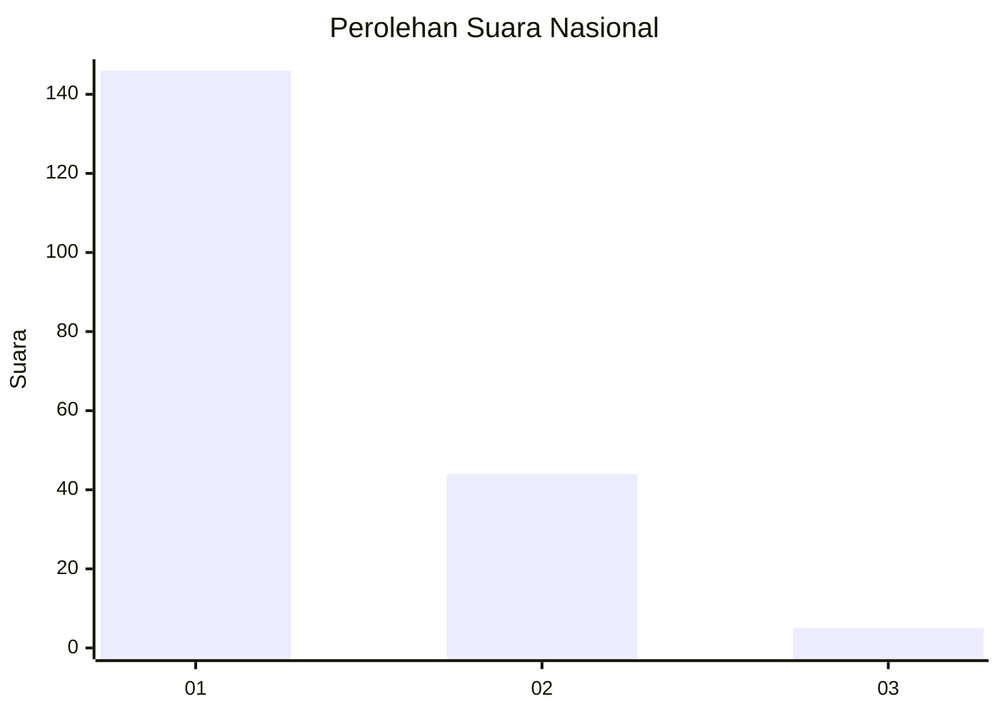
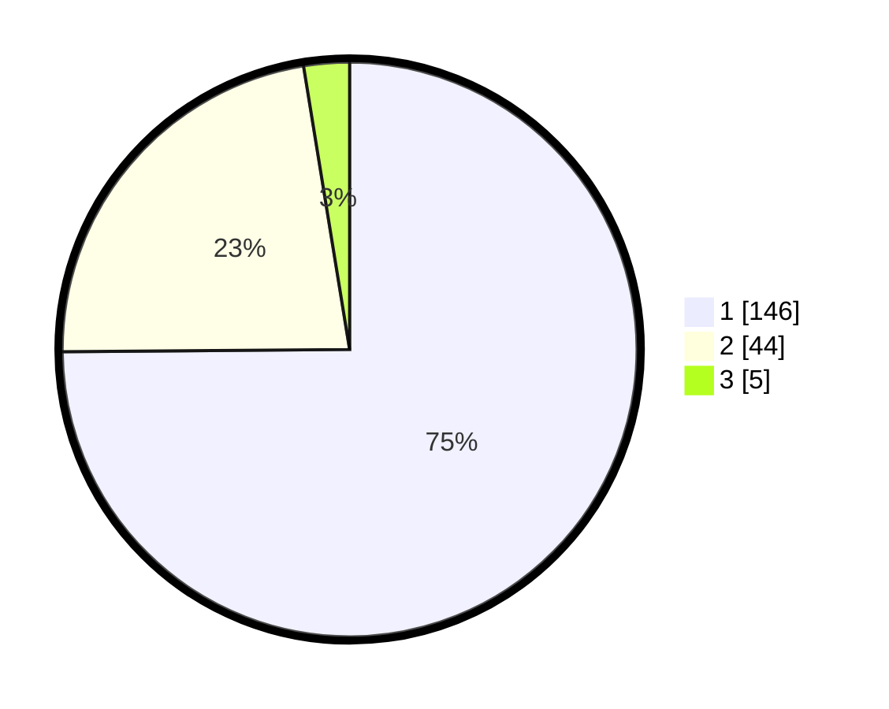

# Hasil

## Grafik

## Tabel

| No. | Nama Paslon    | Suara | Suara (raw) | Persentase |
|:--- |:-------------- | -----:| -----------:| ----------:|
| 1   | ANIES MUHAIMIN | 146   | [146][p-1]  | 74,87      |
| 2   | PRABOWO GIBRAN | 44    | [44][p-2]   | 22,56      |
| 3   | GANJAR MAHFUD  | 5     | [5][p-3]    | 2,56       |

[p-1]: https://github.com/gigit-pemilu/pemilu-2024/blob/main/pilpres/hitung-suara/sub/11-aceh/sub/08-aceh-utara/sub/03-kuta-makmur/sub/2038-panton-rayeuk-ii/sub/001-tps/sub/paslon-1.txt
[p-2]: https://github.com/gigit-pemilu/pemilu-2024/blob/main/pilpres/hitung-suara/sub/11-aceh/sub/08-aceh-utara/sub/03-kuta-makmur/sub/2038-panton-rayeuk-ii/sub/001-tps/sub/paslon-2.txt
[p-3]: https://github.com/gigit-pemilu/pemilu-2024/blob/main/pilpres/hitung-suara/sub/11-aceh/sub/08-aceh-utara/sub/03-kuta-makmur/sub/2038-panton-rayeuk-ii/sub/001-tps/sub/paslon-3.txt

## Foto C Plano

https://sirekap-obj-formc.kpu.go.id/5e18/pemilu/ppwp/11/08/03/20/38/1108032038001-20240220-152705--62ead094-cae1-4417-8622-fb9c3828e60b.jpg

https://sirekap-obj-formc.kpu.go.id/5e18/pemilu/ppwp/11/08/03/20/38/1108032038001-20240220-152842--3c0da0ca-193c-48a1-be55-1f097dbb7560.jpg

https://sirekap-obj-formc.kpu.go.id/5e18/pemilu/ppwp/11/08/03/20/38/1108032038001-20240220-214540--08f9867c-eef4-4244-a785-2f8c9b192a17.jpg

## Metadata

| Key        | Value               |
| ---------- | ------------------- |
| Time Stamp | 2024-02-20 22:00:00 |

