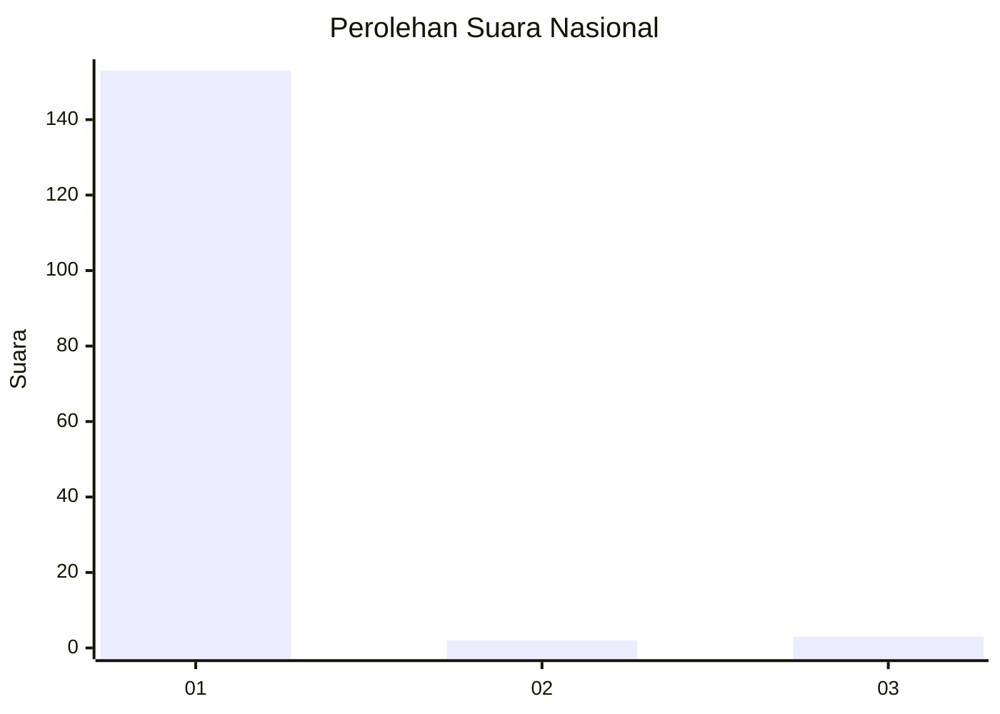
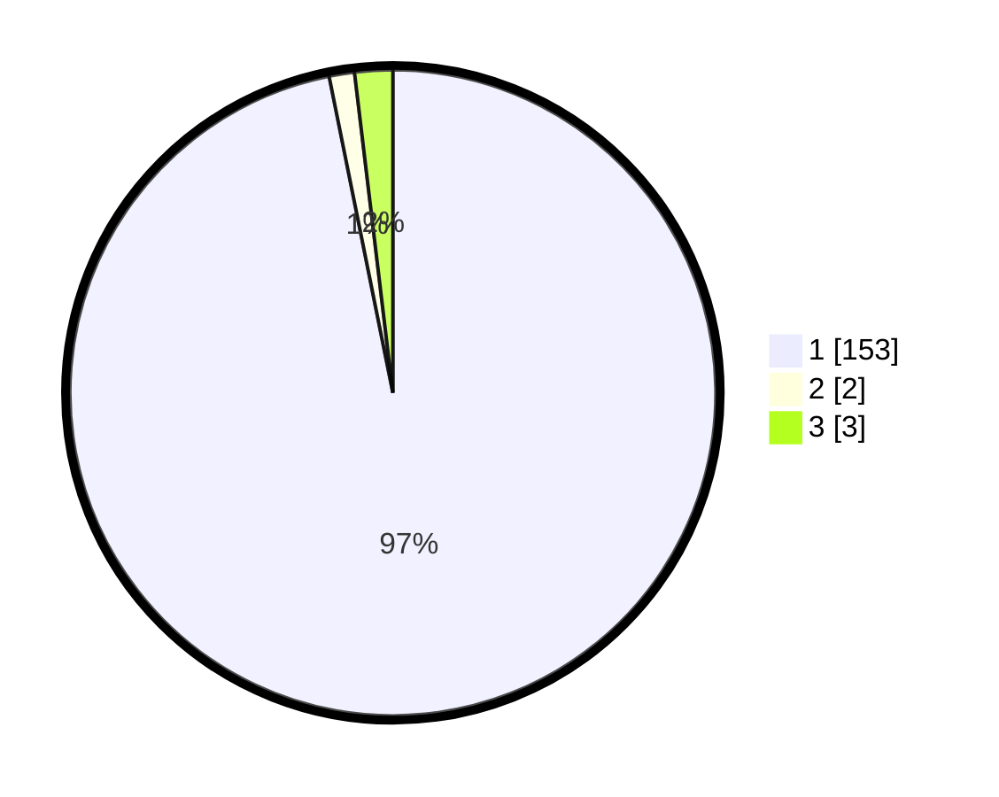

# Hasil

## Grafik

## Tabel

| No. | Nama Paslon    | Suara | Suara (raw) | Persentase |
|:--- |:-------------- | -----:| -----------:| ----------:|
| 1   | ANIES MUHAIMIN | 153   | [153][p-1]  | 96,84      |
| 2   | PRABOWO GIBRAN | 2     | [2][p-2]    | 1,27       |
| 3   | GANJAR MAHFUD  | 3     | [3][p-3]    | 1,90       |

[p-1]: https://github.com/gigit-pemilu/pemilu-2024/blob/main/pilpres/hitung-suara/sub/11-aceh/sub/08-aceh-utara/sub/03-kuta-makmur/sub/2039-sido-muliyo/sub/010-tps/sub/paslon-1.txt
[p-2]: https://github.com/gigit-pemilu/pemilu-2024/blob/main/pilpres/hitung-suara/sub/11-aceh/sub/08-aceh-utara/sub/03-kuta-makmur/sub/2039-sido-muliyo/sub/010-tps/sub/paslon-2.txt
[p-3]: https://github.com/gigit-pemilu/pemilu-2024/blob/main/pilpres/hitung-suara/sub/11-aceh/sub/08-aceh-utara/sub/03-kuta-makmur/sub/2039-sido-muliyo/sub/010-tps/sub/paslon-3.txt

## Foto C Plano

https://sirekap-obj-formc.kpu.go.id/f533/pemilu/ppwp/11/08/03/20/39/1108032039010-20240214-223407--1efabd3d-cf25-4dbc-84ac-a9e2bc10ec28.jpg

https://sirekap-obj-formc.kpu.go.id/f533/pemilu/ppwp/11/08/03/20/39/1108032039010-20240214-233036--a061accc-35d7-4252-96ac-d161cab99318.jpg

https://sirekap-obj-formc.kpu.go.id/f533/pemilu/ppwp/11/08/03/20/39/1108032039010-20240214-223608--120f8ff9-8a40-49d0-ad6d-b1c4e3ed008d.jpg

## Metadata

| Key        | Value               |
| ---------- | ------------------- |
| Time Stamp | 2024-02-16 23:00:00 |

