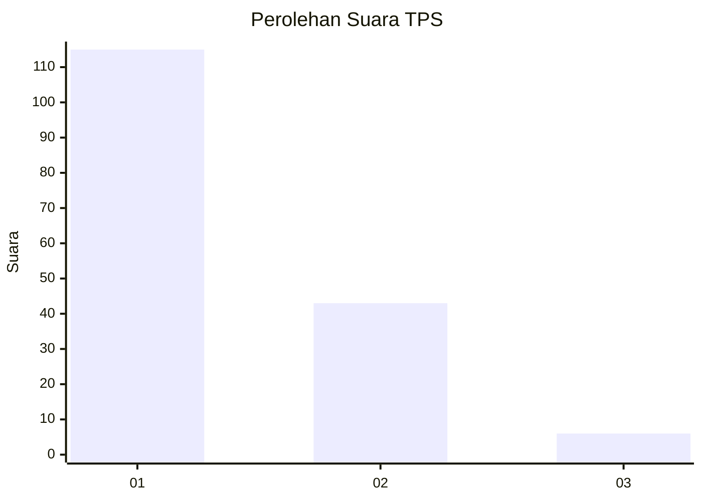
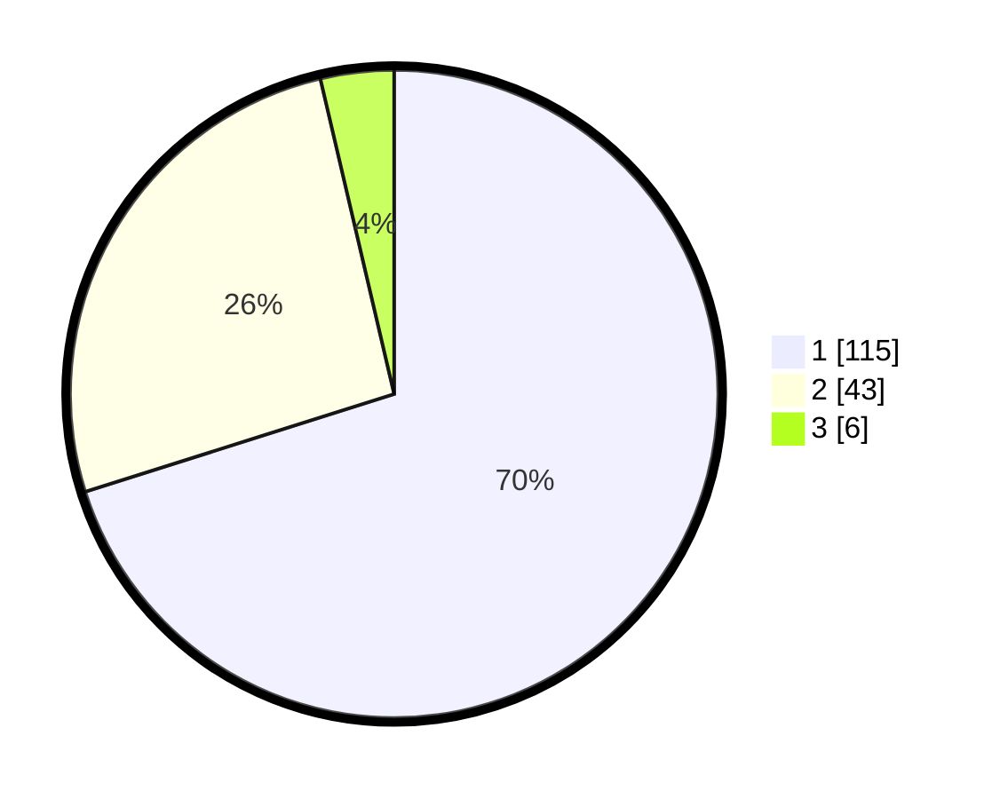

# Hasil

## Grafik

## Tabel

| No. | Nama Paslon    | Suara | Suara (raw) | Persentase |
|:--- |:-------------- | -----:| -----------:| ----------:|
| 1   | ANIES MUHAIMIN | 115   | [115][p-1]  | 70,12      |
| 2   | PRABOWO GIBRAN | 43    | [43][p-2]   | 26,22      |
| 3   | GANJAR MAHFUD  | 6     | [6][p-3]    | 3,66       |

[p-1]: https://github.com/gigit-pemilu/pemilu-2024-11-aceh/blob/main/pilpres/hitung-suara/sub/11-aceh/sub/08-aceh-utara/sub/04-lhoksukon/sub/2001-kuta-lhoksukon/sub/001-tps/sub/paslon-1.txt
[p-2]: https://github.com/gigit-pemilu/pemilu-2024-11-aceh/blob/main/pilpres/hitung-suara/sub/11-aceh/sub/08-aceh-utara/sub/04-lhoksukon/sub/2001-kuta-lhoksukon/sub/001-tps/sub/paslon-2.txt
[p-3]: https://github.com/gigit-pemilu/pemilu-2024-11-aceh/blob/main/pilpres/hitung-suara/sub/11-aceh/sub/08-aceh-utara/sub/04-lhoksukon/sub/2001-kuta-lhoksukon/sub/001-tps/sub/paslon-3.txt

## Foto C Plano

https://sirekap-obj-formc.kpu.go.id/677e/pemilu/ppwp/11/08/04/20/01/1108042001001-20240214-193129--e57396ad-3426-46e9-b566-999acc0958a4.jpg

https://sirekap-obj-formc.kpu.go.id/677e/pemilu/ppwp/11/08/04/20/01/1108042001001-20240214-193227--ee1f8aa8-19d5-4e79-8514-5fd035ed0abc.jpg

https://sirekap-obj-formc.kpu.go.id/677e/pemilu/ppwp/11/08/04/20/01/1108042001001-20240214-193317--5fa3aedb-020e-4d13-8df8-79e1286592a8.jpg

## Metadata

| Key        | Value               |
| ---------- | ------------------- |
| Time Stamp | 2024-02-14 21:46:01 |

## DATA PEMILIH TETAP

Jumlah pemilih dalam DPT: **262**.
 * L: **127**.
 * P: **135**.

## DATA PENGGUNA HAK PILIH

Jumlah pengguna hak pilih dalam DPT: **157**.
 * L: **73**.
 * P: **84**.

Jumlah pengguna hak pilih dalam DPTb: **8**.
 * L: **4**.
 * P: **4**.

Jumlah pengguna hak pilih dalam DPK: **1**.
 * L: **0**.
 * P: **1**.

Jumlah pengguna hak pilih: **166**.
 * L: **77**.
 * P: **90**.

## JUMLAH SUARA SAH DAN TIDAK SAH

JUMLAH SELURUH SUARA SAH: **164**.

JUMLAH SUARA TIDAK SAH: **2**.

JUMLAH SELURUH SUARA SAH DAN SUARA TIDAK SAH: **166**.

