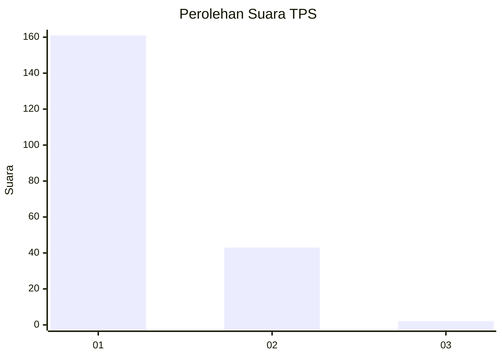
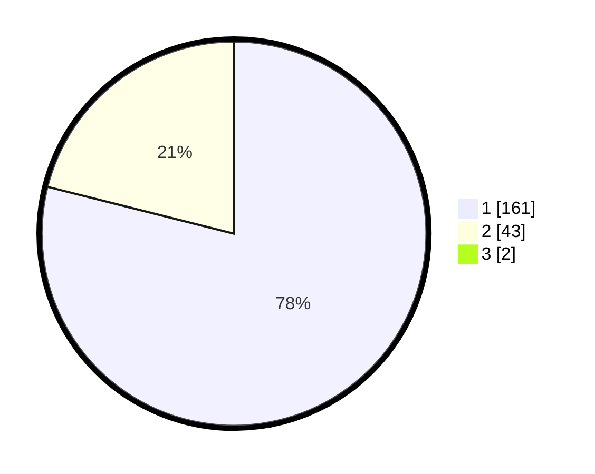

# Hasil

## Grafik

## Tabel

| No. | Nama Paslon    | Suara | Suara (raw) | Persentase |
|:--- |:-------------- | -----:| -----------:| ----------:|
| 1   | ANIES MUHAIMIN | 161   | [161][p-1]  | 78,16      |
| 2   | PRABOWO GIBRAN | 43    | [43][p-2]   | 20,87      |
| 3   | GANJAR MAHFUD  | 2     | [2][p-3]    | 0,97       |

[p-1]: https://github.com/gigit-pemilu/pemilu-2024-11-aceh/blob/main/pilpres/hitung-suara/sub/11-aceh/sub/08-aceh-utara/sub/04-lhoksukon/sub/2001-kuta-lhoksukon/sub/002-tps/sub/paslon-1.txt
[p-2]: https://github.com/gigit-pemilu/pemilu-2024-11-aceh/blob/main/pilpres/hitung-suara/sub/11-aceh/sub/08-aceh-utara/sub/04-lhoksukon/sub/2001-kuta-lhoksukon/sub/002-tps/sub/paslon-2.txt
[p-3]: https://github.com/gigit-pemilu/pemilu-2024-11-aceh/blob/main/pilpres/hitung-suara/sub/11-aceh/sub/08-aceh-utara/sub/04-lhoksukon/sub/2001-kuta-lhoksukon/sub/002-tps/sub/paslon-3.txt

## Foto C Plano

https://sirekap-obj-formc.kpu.go.id/442e/pemilu/ppwp/11/08/04/20/01/1108042001002-20240215-054421--7d13f2a2-8199-4088-9811-0cab7fac913a.jpg

https://sirekap-obj-formc.kpu.go.id/442e/pemilu/ppwp/11/08/04/20/01/1108042001002-20240215-055142--733a8b7d-c3e1-43fb-8e2a-0b1d42ac07e1.jpg

https://sirekap-obj-formc.kpu.go.id/442e/pemilu/ppwp/11/08/04/20/01/1108042001002-20240215-055024--e2733f5d-9d07-424f-917b-110645e994fd.jpg

## Metadata

| Key        | Value               |
| ---------- | ------------------- |
| Time Stamp | 2024-02-17 18:30:00 |

