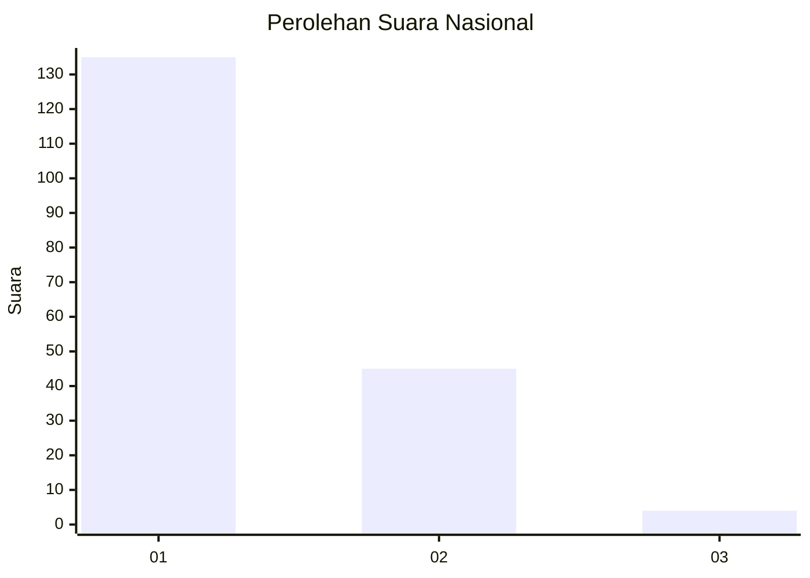
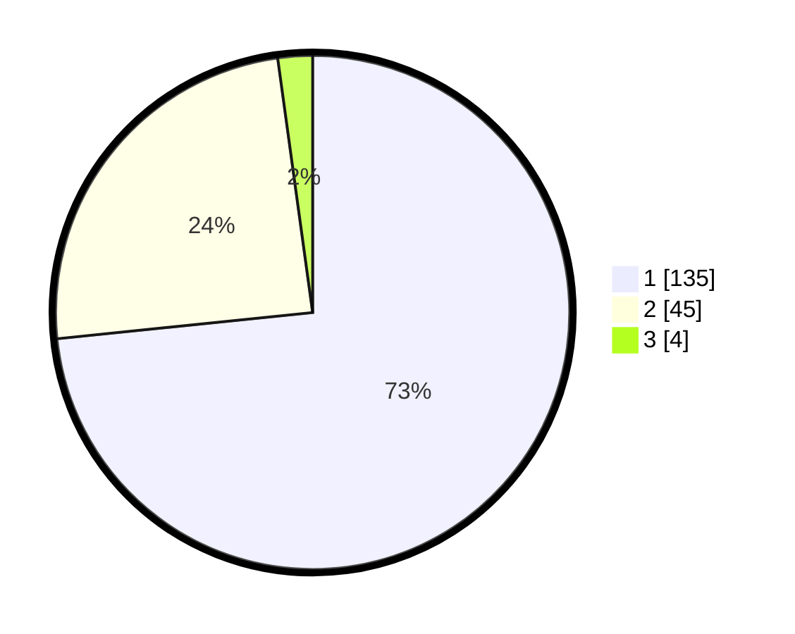

# Hasil

## Grafik

## Tabel

| No. | Nama Paslon    | Suara | Suara (raw) | Persentase |
|:--- |:-------------- | -----:| -----------:| ----------:|
| 1   | ANIES MUHAIMIN | 135   | [135][p-1]  | 73,37      |
| 2   | PRABOWO GIBRAN | 45    | [45][p-2]   | 24,46      |
| 3   | GANJAR MAHFUD  | 4     | [4][p-3]    | 2,17       |

[p-1]: https://github.com/gigit-pemilu/pemilu-2024/blob/main/pilpres/hitung-suara/sub/11-aceh/sub/08-aceh-utara/sub/04-lhoksukon/sub/2001-kuta-lhoksukon/sub/005-tps/sub/paslon-1.txt
[p-2]: https://github.com/gigit-pemilu/pemilu-2024/blob/main/pilpres/hitung-suara/sub/11-aceh/sub/08-aceh-utara/sub/04-lhoksukon/sub/2001-kuta-lhoksukon/sub/005-tps/sub/paslon-2.txt
[p-3]: https://github.com/gigit-pemilu/pemilu-2024/blob/main/pilpres/hitung-suara/sub/11-aceh/sub/08-aceh-utara/sub/04-lhoksukon/sub/2001-kuta-lhoksukon/sub/005-tps/sub/paslon-3.txt

## Foto C Plano

https://sirekap-obj-formc.kpu.go.id/0af6/pemilu/ppwp/11/08/04/20/01/1108042001005-20240215-074850--64dea2ef-9a46-4859-9fb4-69f26f9b4d54.jpg

https://sirekap-obj-formc.kpu.go.id/0af6/pemilu/ppwp/11/08/04/20/01/1108042001005-20240214-205138--d80aac07-3fca-4edf-8966-fa59e275ebb3.jpg

https://sirekap-obj-formc.kpu.go.id/0af6/pemilu/ppwp/11/08/04/20/01/1108042001005-20240214-205243--491bf775-60a6-4846-9219-16b1f2b5cb59.jpg

## Metadata

| Key        | Value               |
| ---------- | ------------------- |
| Time Stamp | 2024-02-15 16:30:25 |

## DATA PEMILIH TETAP

Jumlah pemilih dalam DPT: **249**.
 * L: **129**.
 * P: **120**.

## DATA PENGGUNA HAK PILIH

Jumlah pengguna hak pilih dalam DPT: **180**.
 * L: **93**.
 * P: **87**.

Jumlah pengguna hak pilih dalam DPTb: **2**.
 * L: **2**.
 * P: **0**.

Jumlah pengguna hak pilih dalam DPK: **4**.
 * L: **2**.
 * P: **2**.

Jumlah pengguna hak pilih: **186**.
 * L: **97**.
 * P: **89**.

## JUMLAH SUARA SAH DAN TIDAK SAH

JUMLAH SELURUH SUARA SAH: **184**.

JUMLAH SUARA TIDAK SAH: **2**.

JUMLAH SELURUH SUARA SAH DAN SUARA TIDAK SAH: **186**.

