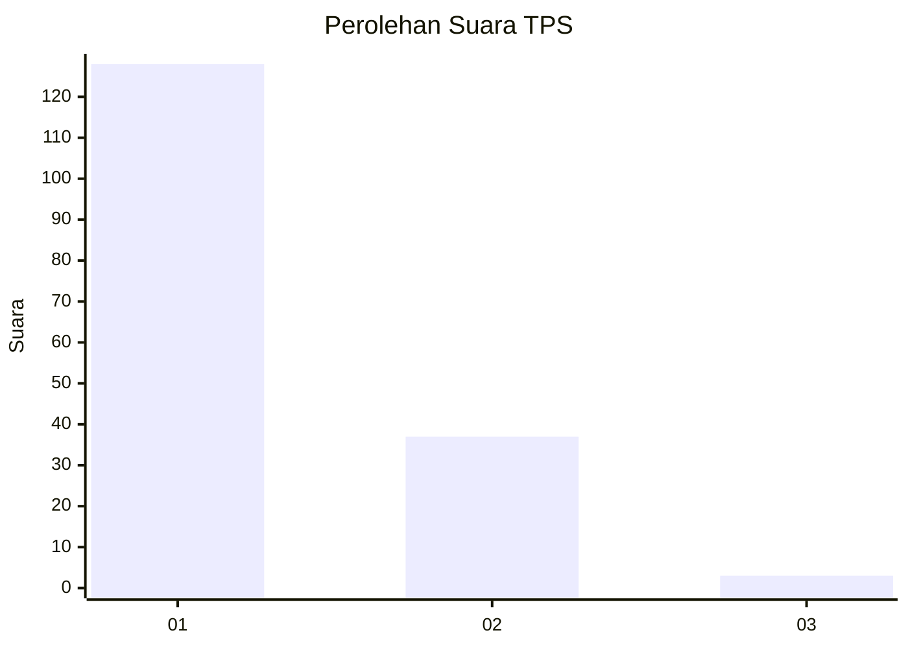
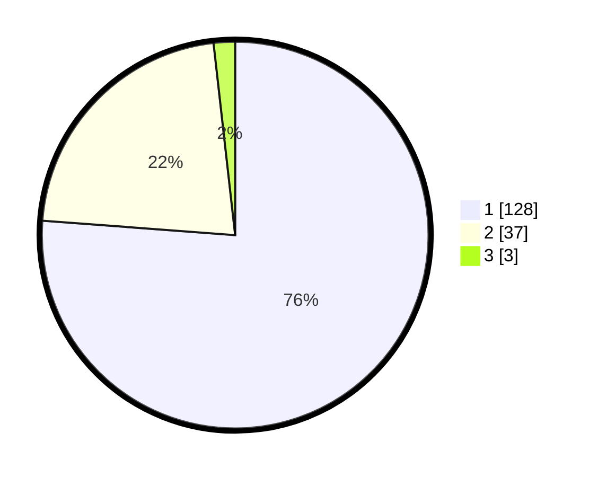

# Hasil

## Grafik

## Tabel

| No. | Nama Paslon    | Suara | Suara (raw) | Persentase |
|:--- |:-------------- | -----:| -----------:| ----------:|
| 1   | ANIES MUHAIMIN | 128   | [128][p-1]  | 76,19      |
| 2   | PRABOWO GIBRAN | 37    | [37][p-2]   | 22,02      |
| 3   | GANJAR MAHFUD  | 3     | [3][p-3]    | 1,79       |

[p-1]: https://github.com/gigit-pemilu/pemilu-2024-11-aceh/blob/main/pilpres/hitung-suara/sub/11-aceh/sub/08-aceh-utara/sub/04-lhoksukon/sub/2001-kuta-lhoksukon/sub/006-tps/sub/paslon-1.txt
[p-2]: https://github.com/gigit-pemilu/pemilu-2024-11-aceh/blob/main/pilpres/hitung-suara/sub/11-aceh/sub/08-aceh-utara/sub/04-lhoksukon/sub/2001-kuta-lhoksukon/sub/006-tps/sub/paslon-2.txt
[p-3]: https://github.com/gigit-pemilu/pemilu-2024-11-aceh/blob/main/pilpres/hitung-suara/sub/11-aceh/sub/08-aceh-utara/sub/04-lhoksukon/sub/2001-kuta-lhoksukon/sub/006-tps/sub/paslon-3.txt

## Foto C Plano

https://sirekap-obj-formc.kpu.go.id/382c/pemilu/ppwp/11/08/04/20/01/1108042001006-20240215-081555--c6334faf-1908-485d-8b54-e5f61f206388.jpg

https://sirekap-obj-formc.kpu.go.id/382c/pemilu/ppwp/11/08/04/20/01/1108042001006-20240215-081841--7e5ea8d3-066a-4b8f-91b3-a040febed4c0.jpg

https://sirekap-obj-formc.kpu.go.id/382c/pemilu/ppwp/11/08/04/20/01/1108042001006-20240215-082027--feec483a-fff8-41bd-8980-d8ece35f07ea.jpg

## Metadata

| Key        | Value               |
| ---------- | ------------------- |
| Time Stamp | 2024-02-15 16:30:25 |

