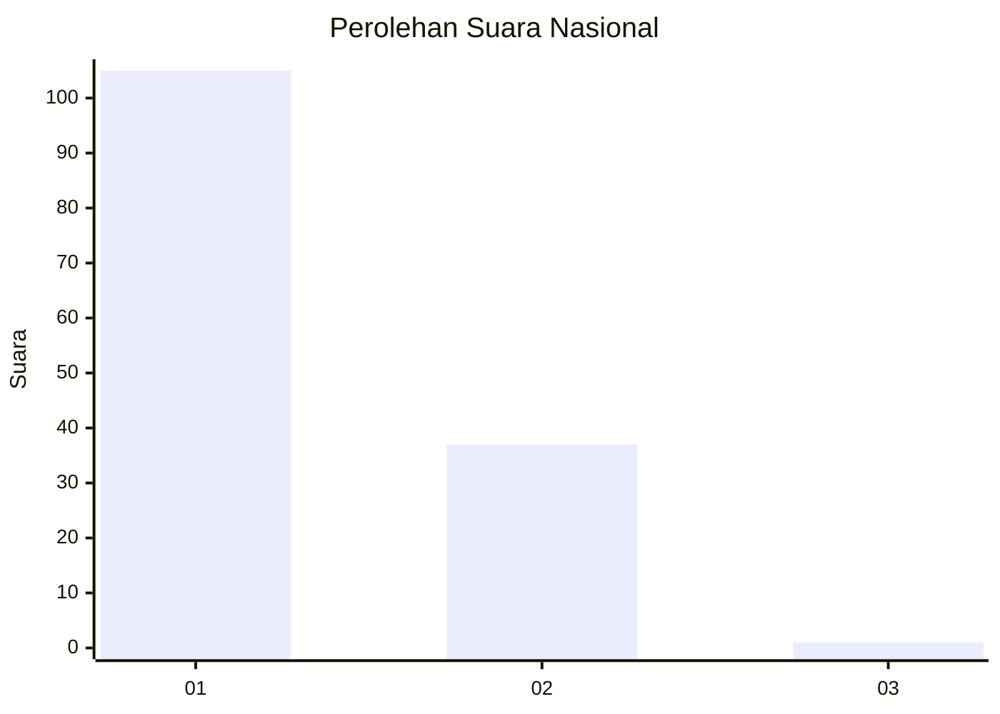
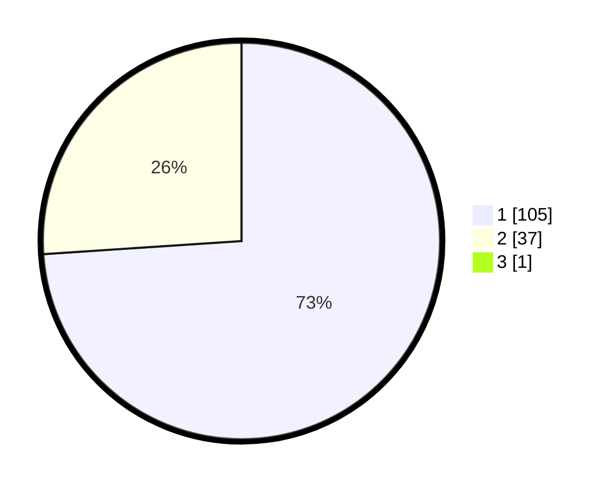

# Hasil

## Grafik

## Tabel

| No. | Nama Paslon    | Suara | Suara (raw) | Persentase |
|:--- |:-------------- | -----:| -----------:| ----------:|
| 1   | ANIES MUHAIMIN | 105   | [105][p-1]  | 73,43      |
| 2   | PRABOWO GIBRAN | 37    | [37][p-2]   | 25,87      |
| 3   | GANJAR MAHFUD  | 1     | [1][p-3]    | 0,70       |

[p-1]: https://github.com/gigit-pemilu/pemilu-2024/blob/main/pilpres/hitung-suara/sub/11-aceh/sub/08-aceh-utara/sub/04-lhoksukon/sub/2001-kuta-lhoksukon/sub/901-tps/sub/paslon-1.txt
[p-2]: https://github.com/gigit-pemilu/pemilu-2024/blob/main/pilpres/hitung-suara/sub/11-aceh/sub/08-aceh-utara/sub/04-lhoksukon/sub/2001-kuta-lhoksukon/sub/901-tps/sub/paslon-2.txt
[p-3]: https://github.com/gigit-pemilu/pemilu-2024/blob/main/pilpres/hitung-suara/sub/11-aceh/sub/08-aceh-utara/sub/04-lhoksukon/sub/2001-kuta-lhoksukon/sub/901-tps/sub/paslon-3.txt

## Foto C Plano

https://sirekap-obj-formc.kpu.go.id/cc2a/pemilu/ppwp/11/08/04/20/01/1108042001901-20240215-041915--b8d1281a-f351-4617-99f8-a88b3961dca7.jpg

https://sirekap-obj-formc.kpu.go.id/cc2a/pemilu/ppwp/11/08/04/20/01/1108042001901-20240215-213034--5e6522c2-fa95-4872-9438-50916fe9b672.jpg

https://sirekap-obj-formc.kpu.go.id/cc2a/pemilu/ppwp/11/08/04/20/01/1108042001901-20240214-215412--1a488eb7-eb78-4a5a-a008-efdce53808fb.jpg

## Metadata

| Key        | Value               |
| ---------- | ------------------- |
| Time Stamp | 2024-02-15 22:40:13 |

## DATA PEMILIH TETAP

Jumlah pemilih dalam DPT: **178**.
 * L: **176**.
 * P: **2**.

## DATA PENGGUNA HAK PILIH

Jumlah pengguna hak pilih dalam DPT: **81**.
 * L: **80**.
 * P: **1**.

Jumlah pengguna hak pilih dalam DPTb: **70**.
 * L: **68**.
 * P: **2**.

Jumlah pengguna hak pilih dalam DPK: **0**.
 * L: **0**.
 * P: **0**.

Jumlah pengguna hak pilih: **151**.
 * L: **148**.
 * P: **3**.

## JUMLAH SUARA SAH DAN TIDAK SAH

JUMLAH SELURUH SUARA SAH: **143**.

JUMLAH SUARA TIDAK SAH: **8**.

JUMLAH SELURUH SUARA SAH DAN SUARA TIDAK SAH: **151**.

