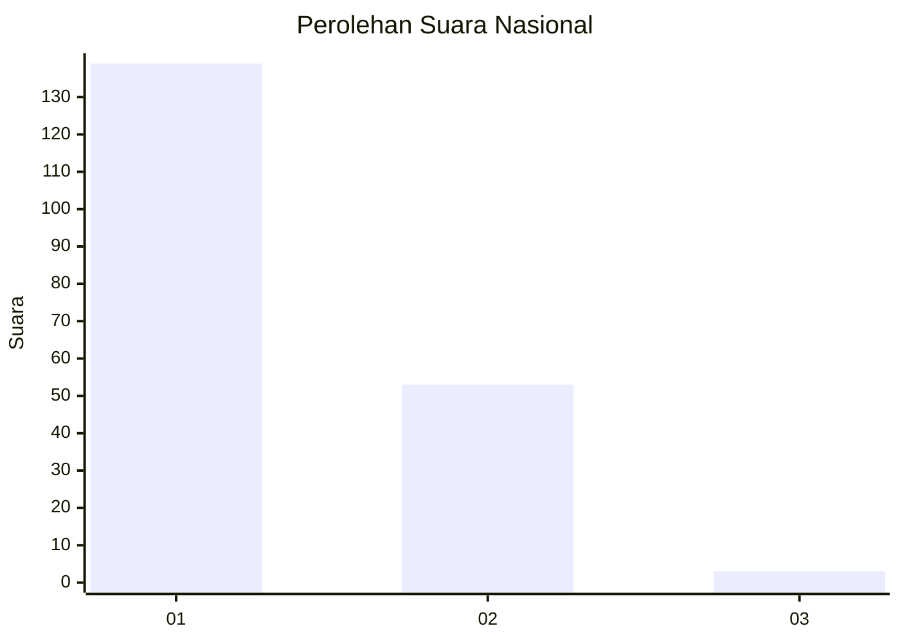
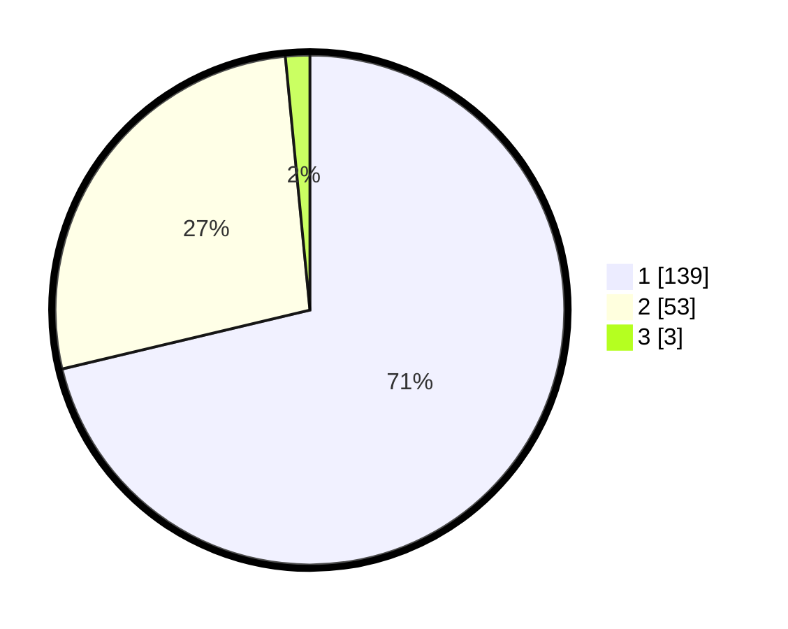

# Hasil

## Grafik

## Tabel

| No. | Nama Paslon    | Suara | Suara (raw) | Persentase |
|:--- |:-------------- | -----:| -----------:| ----------:|
| 1   | ANIES MUHAIMIN | 139   | [139][p-1]  | 71,28      |
| 2   | PRABOWO GIBRAN | 53    | [53][p-2]   | 27,18      |
| 3   | GANJAR MAHFUD  | 3     | [3][p-3]    | 1,54       |

[p-1]: https://github.com/gigit-pemilu/pemilu-2024/blob/main/pilpres/hitung-suara/sub/11-aceh/sub/08-aceh-utara/sub/04-lhoksukon/sub/2002-cot-u-sibak/sub/001-tps/sub/paslon-1.txt
[p-2]: https://github.com/gigit-pemilu/pemilu-2024/blob/main/pilpres/hitung-suara/sub/11-aceh/sub/08-aceh-utara/sub/04-lhoksukon/sub/2002-cot-u-sibak/sub/001-tps/sub/paslon-2.txt
[p-3]: https://github.com/gigit-pemilu/pemilu-2024/blob/main/pilpres/hitung-suara/sub/11-aceh/sub/08-aceh-utara/sub/04-lhoksukon/sub/2002-cot-u-sibak/sub/001-tps/sub/paslon-3.txt

## Foto C Plano

https://sirekap-obj-formc.kpu.go.id/a704/pemilu/ppwp/11/08/04/20/02/1108042002001-20240215-051318--bf863b01-07bd-4086-9d71-a226abff4282.jpg

https://sirekap-obj-formc.kpu.go.id/a704/pemilu/ppwp/11/08/04/20/02/1108042002001-20240215-042713--d0339102-e64e-4453-aabf-b1c11886fa7a.jpg

https://sirekap-obj-formc.kpu.go.id/a704/pemilu/ppwp/11/08/04/20/02/1108042002001-20240215-042654--7df1f17a-c35a-48c8-823f-9b3147f36fd9.jpg

## Metadata

| Key        | Value               |
| ---------- | ------------------- |
| Time Stamp | 2024-02-15 16:30:25 |

