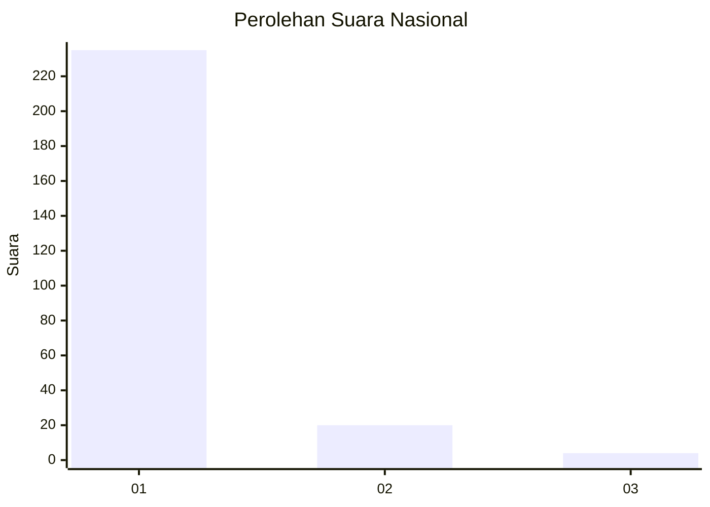
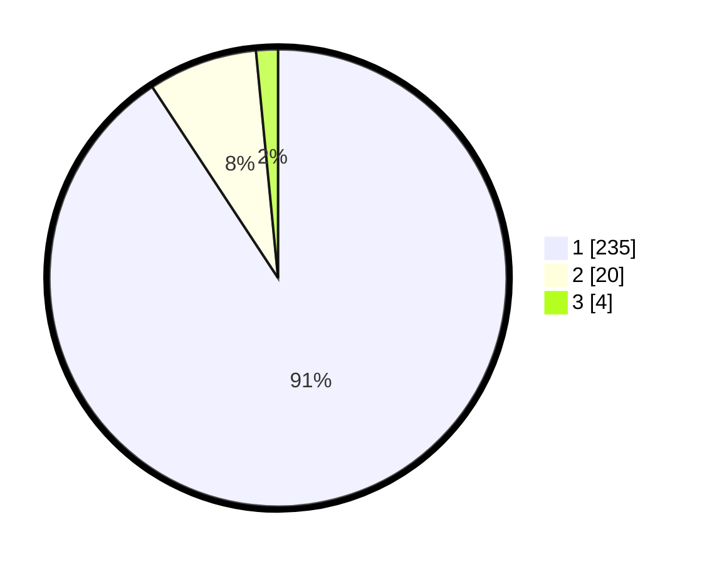

# Hasil

## Grafik

## Tabel

| No. | Nama Paslon    | Suara | Suara (raw) | Persentase |
|:--- |:-------------- | -----:| -----------:| ----------:|
| 1   | ANIES MUHAIMIN | 235   | [235][p-1]  | 90,73      |
| 2   | PRABOWO GIBRAN | 20    | [20][p-2]   | 7,72       |
| 3   | GANJAR MAHFUD  | 4     | [4][p-3]    | 1,54       |

[p-1]: https://github.com/gigit-pemilu/pemilu-2024/blob/main/pilpres/hitung-suara/sub/11-aceh/sub/08-aceh-utara/sub/04-lhoksukon/sub/2003-bintang-hu/sub/001-tps/sub/paslon-1.txt
[p-2]: https://github.com/gigit-pemilu/pemilu-2024/blob/main/pilpres/hitung-suara/sub/11-aceh/sub/08-aceh-utara/sub/04-lhoksukon/sub/2003-bintang-hu/sub/001-tps/sub/paslon-2.txt
[p-3]: https://github.com/gigit-pemilu/pemilu-2024/blob/main/pilpres/hitung-suara/sub/11-aceh/sub/08-aceh-utara/sub/04-lhoksukon/sub/2003-bintang-hu/sub/001-tps/sub/paslon-3.txt

## Foto C Plano

https://sirekap-obj-formc.kpu.go.id/8ca7/pemilu/ppwp/11/08/04/20/03/1108042003001-20240215-024402--43bb189b-40cc-47a6-97ec-3f02289b2780.jpg

https://sirekap-obj-formc.kpu.go.id/8ca7/pemilu/ppwp/11/08/04/20/03/1108042003001-20240215-024536--900abf14-fe7c-4629-8e37-6c063adfbfa2.jpg

https://sirekap-obj-formc.kpu.go.id/8ca7/pemilu/ppwp/11/08/04/20/03/1108042003001-20240215-024708--666995f1-02e5-469f-9d96-5d6f06eeb682.jpg

## Metadata

| Key        | Value               |
| ---------- | ------------------- |
| Time Stamp | 2024-02-15 17:00:25 |

