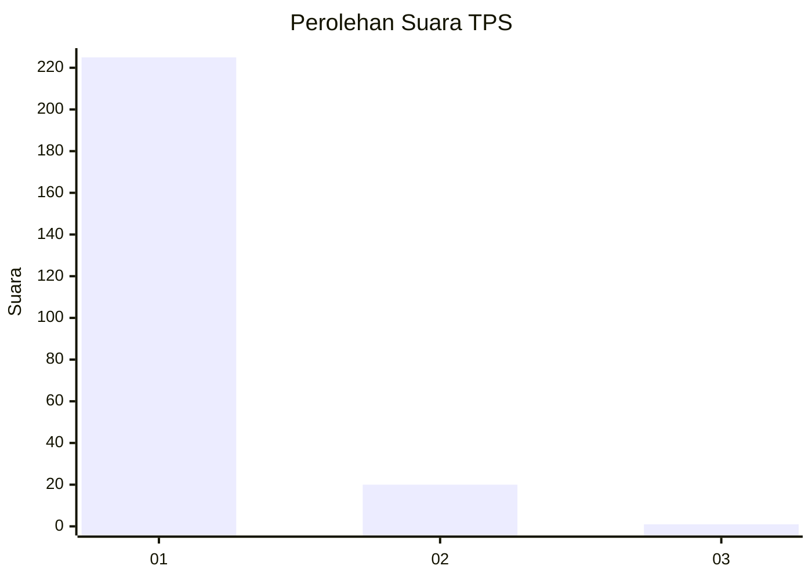
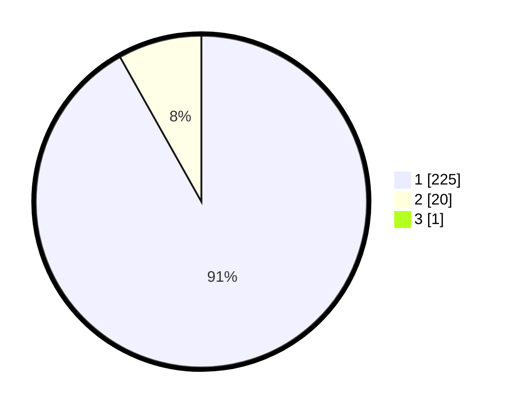

# Hasil

## Grafik

## Tabel

| No. | Nama Paslon    | Suara | Suara (raw) | Persentase |
|:--- |:-------------- | -----:| -----------:| ----------:|
| 1   | ANIES MUHAIMIN | 225   | [225][p-1]  | 91,46      |
| 2   | PRABOWO GIBRAN | 20    | [20][p-2]   | 8,13       |
| 3   | GANJAR MAHFUD  | 1     | [1][p-3]    | 0,41       |

[p-1]: https://github.com/gigit-pemilu/pemilu-2024-11-aceh/blob/main/pilpres/hitung-suara/sub/11-aceh/sub/08-aceh-utara/sub/04-lhoksukon/sub/2003-bintang-hu/sub/002-tps/sub/paslon-1.txt
[p-2]: https://github.com/gigit-pemilu/pemilu-2024-11-aceh/blob/main/pilpres/hitung-suara/sub/11-aceh/sub/08-aceh-utara/sub/04-lhoksukon/sub/2003-bintang-hu/sub/002-tps/sub/paslon-2.txt
[p-3]: https://github.com/gigit-pemilu/pemilu-2024-11-aceh/blob/main/pilpres/hitung-suara/sub/11-aceh/sub/08-aceh-utara/sub/04-lhoksukon/sub/2003-bintang-hu/sub/002-tps/sub/paslon-3.txt

## Foto C Plano

https://sirekap-obj-formc.kpu.go.id/e441/pemilu/ppwp/11/08/04/20/03/1108042003002-20240215-031051--a3feea3e-603f-4e2a-a08f-54aa092668b4.jpg

https://sirekap-obj-formc.kpu.go.id/e441/pemilu/ppwp/11/08/04/20/03/1108042003002-20240215-031237--67d4d8c2-7041-422d-9aee-deda9fecb892.jpg

https://sirekap-obj-formc.kpu.go.id/e441/pemilu/ppwp/11/08/04/20/03/1108042003002-20240215-032105--7d2e8b30-3cbe-4aa9-aad4-b7e8a85d3ba9.jpg

## Metadata

| Key        | Value               |
| ---------- | ------------------- |
| Time Stamp | 2024-02-15 17:00:25 |

