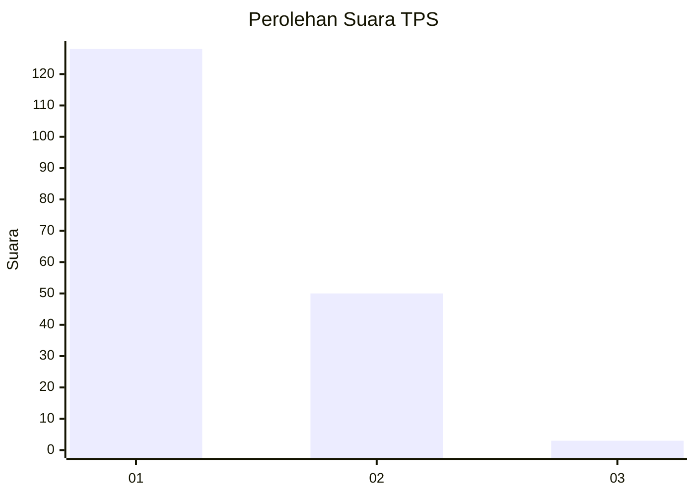
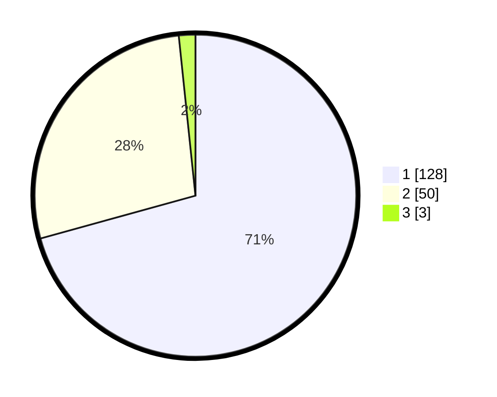

# Hasil

## Grafik

## Tabel

| No. | Nama Paslon    | Suara | Suara (raw) | Persentase |
|:--- |:-------------- | -----:| -----------:| ----------:|
| 1   | ANIES MUHAIMIN | 128   | [128][p-1]  | 70,72      |
| 2   | PRABOWO GIBRAN | 50    | [50][p-2]   | 27,62      |
| 3   | GANJAR MAHFUD  | 3     | [3][p-3]    | 1,66       |

[p-1]: https://github.com/gigit-pemilu/pemilu-2024-11-aceh/blob/main/pilpres/hitung-suara/sub/11-aceh/sub/08-aceh-utara/sub/04-lhoksukon/sub/2004-blang-aman/sub/001-tps/sub/paslon-1.txt
[p-2]: https://github.com/gigit-pemilu/pemilu-2024-11-aceh/blob/main/pilpres/hitung-suara/sub/11-aceh/sub/08-aceh-utara/sub/04-lhoksukon/sub/2004-blang-aman/sub/001-tps/sub/paslon-2.txt
[p-3]: https://github.com/gigit-pemilu/pemilu-2024-11-aceh/blob/main/pilpres/hitung-suara/sub/11-aceh/sub/08-aceh-utara/sub/04-lhoksukon/sub/2004-blang-aman/sub/001-tps/sub/paslon-3.txt

## Foto C Plano

https://sirekap-obj-formc.kpu.go.id/3ed9/pemilu/ppwp/11/08/04/20/04/1108042004001-20240215-000401--6976e329-b3d3-4f8c-965b-2211bf4f9e2b.jpg

https://sirekap-obj-formc.kpu.go.id/3ed9/pemilu/ppwp/11/08/04/20/04/1108042004001-20240215-021702--18e3b173-1996-4bcc-b364-3556856c3d37.jpg

https://sirekap-obj-formc.kpu.go.id/3ed9/pemilu/ppwp/11/08/04/20/04/1108042004001-20240215-021746--9d06b8ed-dca8-4838-b6ed-9555f04e97f5.jpg

## Metadata

| Key        | Value               |
| ---------- | ------------------- |
| Time Stamp | 2024-02-15 15:00:29 |

