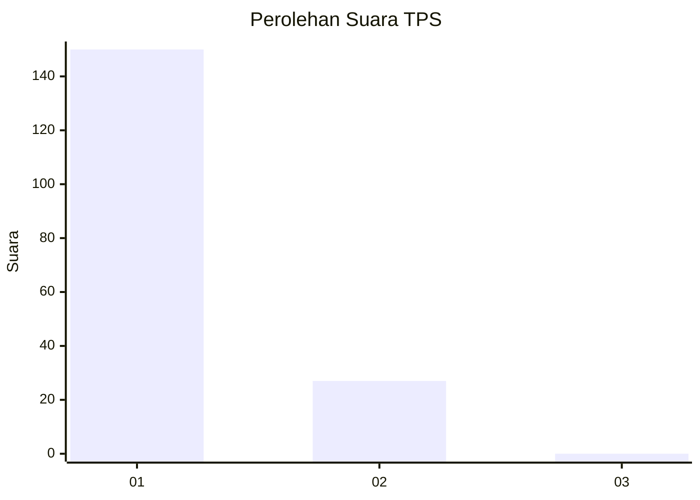
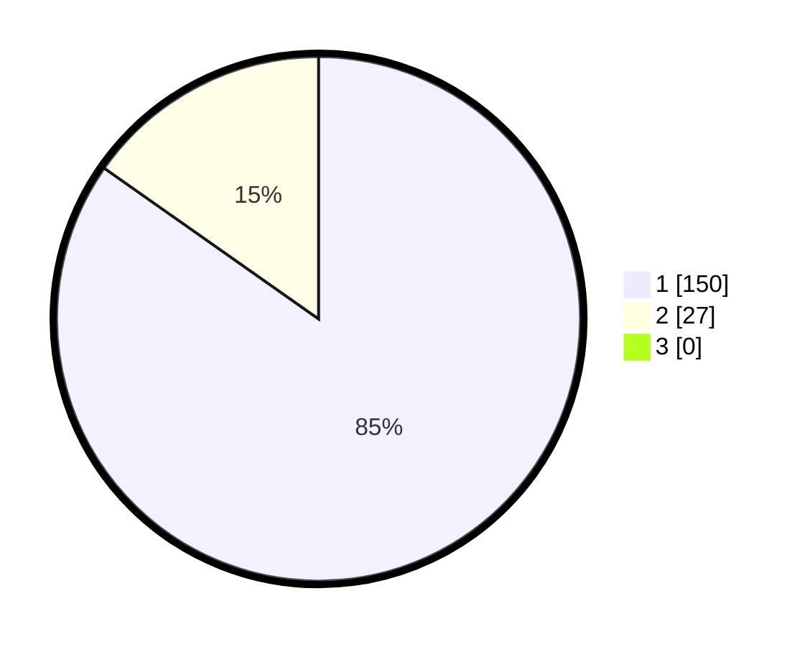

# Hasil

## Grafik

## Tabel

| No. | Nama Paslon    | Suara | Suara (raw) | Persentase |
|:--- |:-------------- | -----:| -----------:| ----------:|
| 1   | ANIES MUHAIMIN | 150   | [150][p-1]  | 84,75      |
| 2   | PRABOWO GIBRAN | 27    | [27][p-2]   | 15,25      |
| 3   | GANJAR MAHFUD  | 0     | [0][p-3]    | 0,00       |

[p-1]: https://github.com/gigit-pemilu/pemilu-2024-11-aceh/blob/main/pilpres/hitung-suara/sub/11-aceh/sub/08-aceh-utara/sub/04-lhoksukon/sub/2004-blang-aman/sub/002-tps/sub/paslon-1.txt
[p-2]: https://github.com/gigit-pemilu/pemilu-2024-11-aceh/blob/main/pilpres/hitung-suara/sub/11-aceh/sub/08-aceh-utara/sub/04-lhoksukon/sub/2004-blang-aman/sub/002-tps/sub/paslon-2.txt
[p-3]: https://github.com/gigit-pemilu/pemilu-2024-11-aceh/blob/main/pilpres/hitung-suara/sub/11-aceh/sub/08-aceh-utara/sub/04-lhoksukon/sub/2004-blang-aman/sub/002-tps/sub/paslon-3.txt

## Foto C Plano

https://sirekap-obj-formc.kpu.go.id/4cce/pemilu/ppwp/11/08/04/20/04/1108042004002-20240215-091533--0944421a-a5ee-438b-8e6a-b8e9f139645f.jpg

https://sirekap-obj-formc.kpu.go.id/4cce/pemilu/ppwp/11/08/04/20/04/1108042004002-20240215-091622--83b6dc7c-9a02-428b-b5be-d3db2c39e885.jpg

https://sirekap-obj-formc.kpu.go.id/4cce/pemilu/ppwp/11/08/04/20/04/1108042004002-20240215-091659--cd969189-493a-4949-9955-ea1ba35feadc.jpg

## Metadata

| Key        | Value               |
| ---------- | ------------------- |
| Time Stamp | 2024-02-16 12:51:22 |

