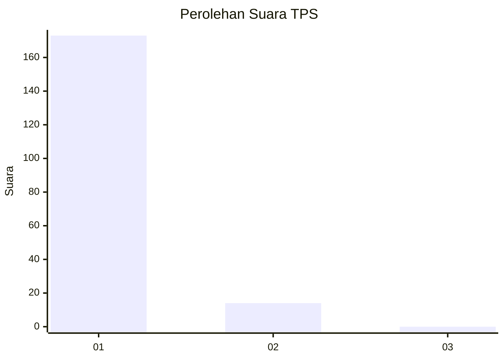
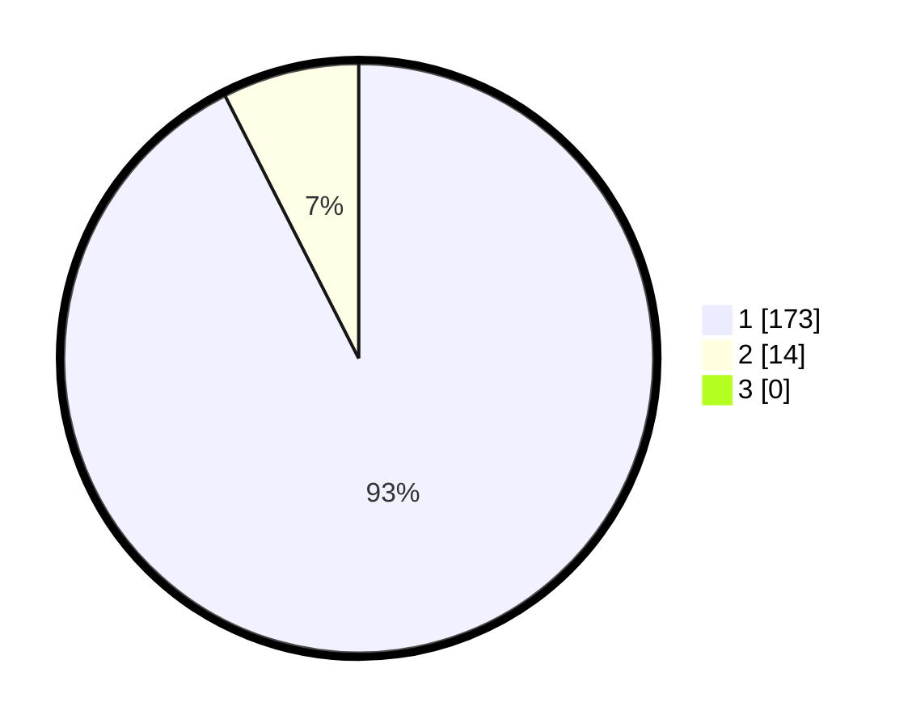

# Hasil

## Grafik

## Tabel

| No. | Nama Paslon    | Suara | Suara (raw) | Persentase |
|:--- |:-------------- | -----:| -----------:| ----------:|
| 1   | ANIES MUHAIMIN | 173   | [173][p-1]  | 92,51      |
| 2   | PRABOWO GIBRAN | 14    | [14][p-2]   | 7,49       |
| 3   | GANJAR MAHFUD  | 0     | [0][p-3]    | 0,00       |

[p-1]: https://github.com/gigit-pemilu/pemilu-2024-11-aceh/blob/main/pilpres/hitung-suara/sub/11-aceh/sub/08-aceh-utara/sub/04-lhoksukon/sub/2007-nga-matang-ubi/sub/003-tps/sub/paslon-1.txt
[p-2]: https://github.com/gigit-pemilu/pemilu-2024-11-aceh/blob/main/pilpres/hitung-suara/sub/11-aceh/sub/08-aceh-utara/sub/04-lhoksukon/sub/2007-nga-matang-ubi/sub/003-tps/sub/paslon-2.txt
[p-3]: https://github.com/gigit-pemilu/pemilu-2024-11-aceh/blob/main/pilpres/hitung-suara/sub/11-aceh/sub/08-aceh-utara/sub/04-lhoksukon/sub/2007-nga-matang-ubi/sub/003-tps/sub/paslon-3.txt

## Foto C Plano

https://sirekap-obj-formc.kpu.go.id/efc7/pemilu/ppwp/11/08/04/20/07/1108042007003-20240215-131418--940e9a75-2fb6-4c55-9ab5-ab3ff22a9aba.jpg

https://sirekap-obj-formc.kpu.go.id/efc7/pemilu/ppwp/11/08/04/20/07/1108042007003-20240215-204034--92bb199e-8486-4af3-a747-23b45698a5d2.jpg

https://sirekap-obj-formc.kpu.go.id/efc7/pemilu/ppwp/11/08/04/20/07/1108042007003-20240215-204045--cd02593f-9075-4a53-af8f-4793df40f1d5.jpg

## Metadata

| Key        | Value               |
| ---------- | ------------------- |
| Time Stamp | 2024-02-17 00:28:35 |

