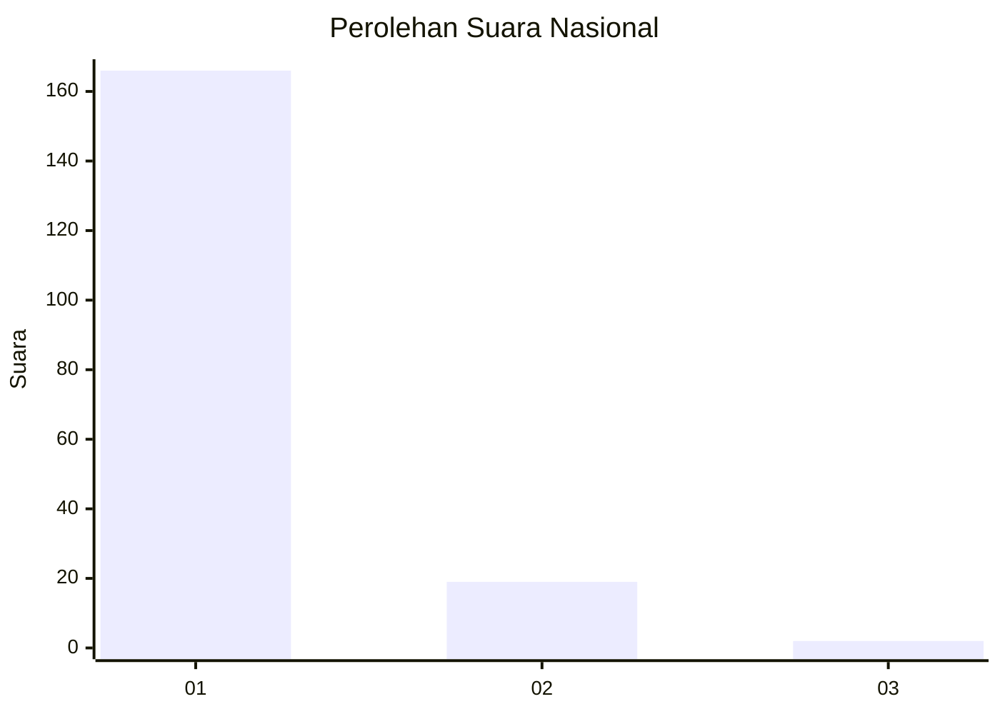
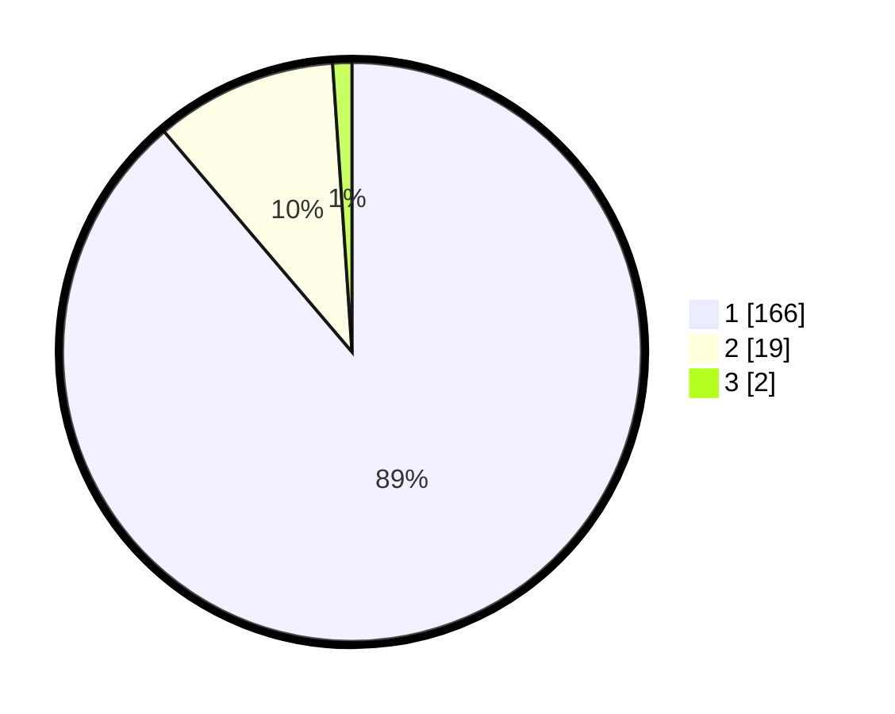

# Hasil

## Grafik

## Tabel

| No. | Nama Paslon    | Suara | Suara (raw) | Persentase |
|:--- |:-------------- | -----:| -----------:| ----------:|
| 1   | ANIES MUHAIMIN | 166   | [166][p-1]  | 88,77      |
| 2   | PRABOWO GIBRAN | 19    | [19][p-2]   | 10,16      |
| 3   | GANJAR MAHFUD  | 2     | [2][p-3]    | 1,07       |

[p-1]: https://github.com/gigit-pemilu/pemilu-2024/blob/main/pilpres/hitung-suara/sub/11-aceh/sub/08-aceh-utara/sub/04-lhoksukon/sub/2008-meunasah-reudeup/sub/002-tps/sub/paslon-1.txt
[p-2]: https://github.com/gigit-pemilu/pemilu-2024/blob/main/pilpres/hitung-suara/sub/11-aceh/sub/08-aceh-utara/sub/04-lhoksukon/sub/2008-meunasah-reudeup/sub/002-tps/sub/paslon-2.txt
[p-3]: https://github.com/gigit-pemilu/pemilu-2024/blob/main/pilpres/hitung-suara/sub/11-aceh/sub/08-aceh-utara/sub/04-lhoksukon/sub/2008-meunasah-reudeup/sub/002-tps/sub/paslon-3.txt

## Foto C Plano

https://sirekap-obj-formc.kpu.go.id/ca49/pemilu/ppwp/11/08/04/20/08/1108042008002-20240214-221607--e2c77d9e-ef98-426a-8ae9-b9a255d9f654.jpg

https://sirekap-obj-formc.kpu.go.id/ca49/pemilu/ppwp/11/08/04/20/08/1108042008002-20240214-222027--5080a7ce-dfc3-4d1a-bb4c-2b521e9433e0.jpg

https://sirekap-obj-formc.kpu.go.id/ca49/pemilu/ppwp/11/08/04/20/08/1108042008002-20240214-222148--237eeb03-b19b-436f-b3cc-f8959fc09f20.jpg

## Metadata

| Key        | Value               |
| ---------- | ------------------- |
| Time Stamp | 2024-02-15 17:00:25 |

