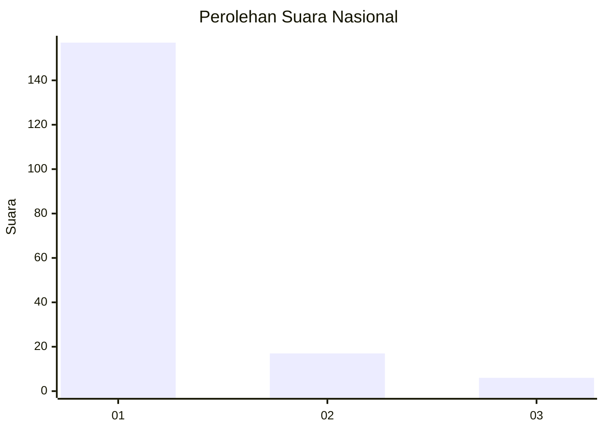
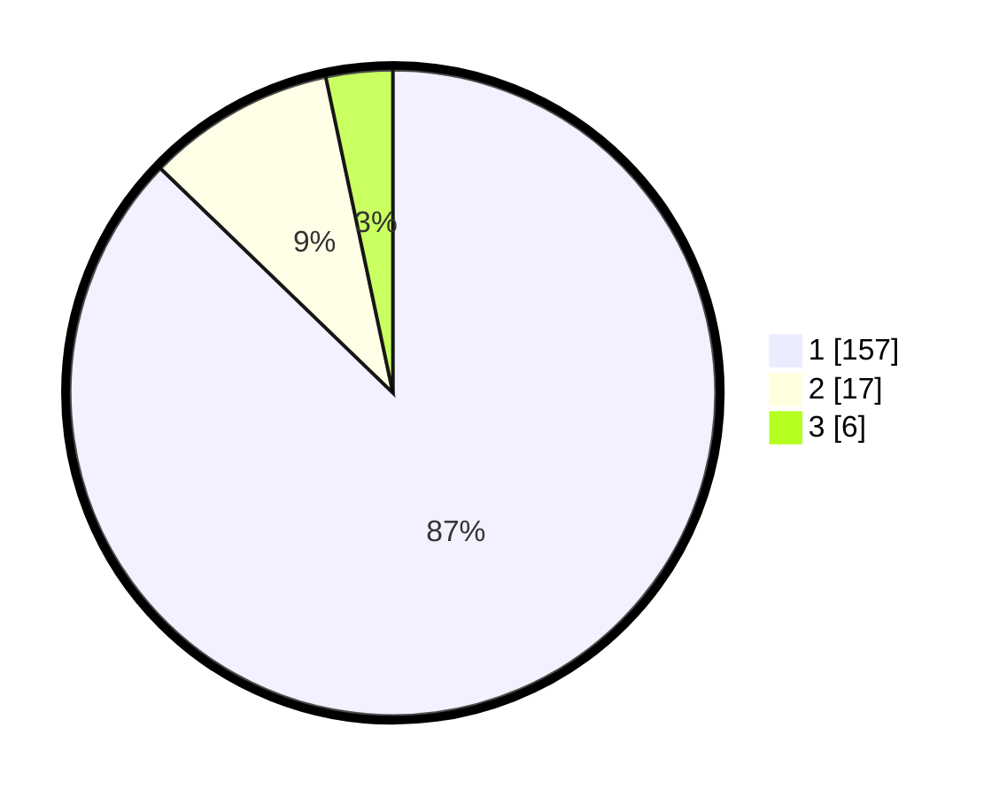

# Hasil

## Grafik

## Tabel

| No. | Nama Paslon    | Suara | Suara (raw) | Persentase |
|:--- |:-------------- | -----:| -----------:| ----------:|
| 1   | ANIES MUHAIMIN | 157   | [157][p-1]  | 87,22      |
| 2   | PRABOWO GIBRAN | 17    | [17][p-2]   | 9,44       |
| 3   | GANJAR MAHFUD  | 6     | [6][p-3]    | 3,33       |

[p-1]: https://github.com/gigit-pemilu/pemilu-2024/blob/main/pilpres/hitung-suara/sub/11-aceh/sub/08-aceh-utara/sub/04-lhoksukon/sub/2008-meunasah-reudeup/sub/003-tps/sub/paslon-1.txt
[p-2]: https://github.com/gigit-pemilu/pemilu-2024/blob/main/pilpres/hitung-suara/sub/11-aceh/sub/08-aceh-utara/sub/04-lhoksukon/sub/2008-meunasah-reudeup/sub/003-tps/sub/paslon-2.txt
[p-3]: https://github.com/gigit-pemilu/pemilu-2024/blob/main/pilpres/hitung-suara/sub/11-aceh/sub/08-aceh-utara/sub/04-lhoksukon/sub/2008-meunasah-reudeup/sub/003-tps/sub/paslon-3.txt

## Foto C Plano

https://sirekap-obj-formc.kpu.go.id/bc7d/pemilu/ppwp/11/08/04/20/08/1108042008003-20240214-194102--d631bf41-f10f-477d-9bfb-affa52c7681c.jpg

https://sirekap-obj-formc.kpu.go.id/bc7d/pemilu/ppwp/11/08/04/20/08/1108042008003-20240214-194243--19240b30-ba48-4857-85c5-d33a1244f9c5.jpg

https://sirekap-obj-formc.kpu.go.id/bc7d/pemilu/ppwp/11/08/04/20/08/1108042008003-20240214-194418--817dcd6c-9c79-46d4-ba87-3f1f9dc87216.jpg

## Metadata

| Key        | Value               |
| ---------- | ------------------- |
| Time Stamp | 2024-02-15 17:00:25 |

