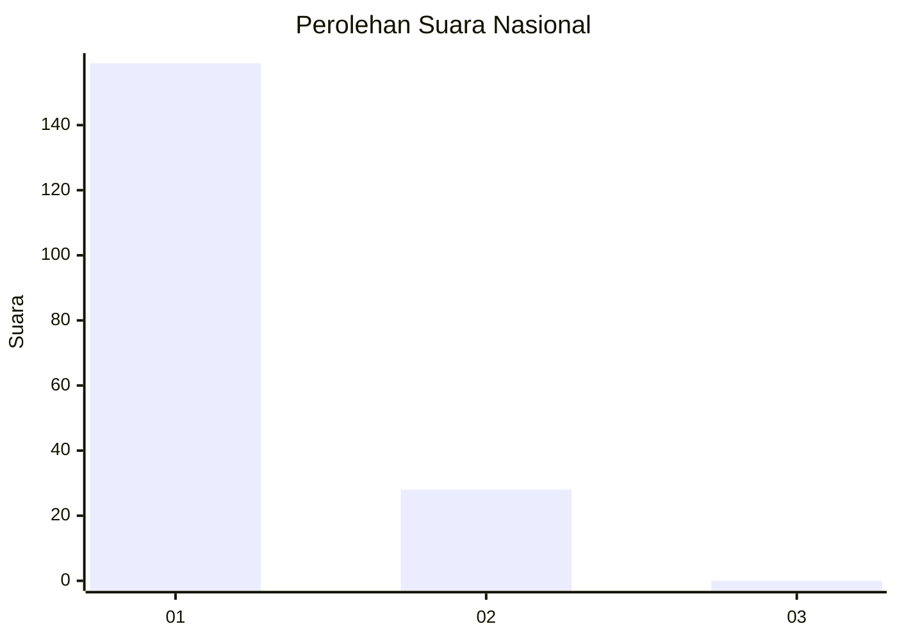
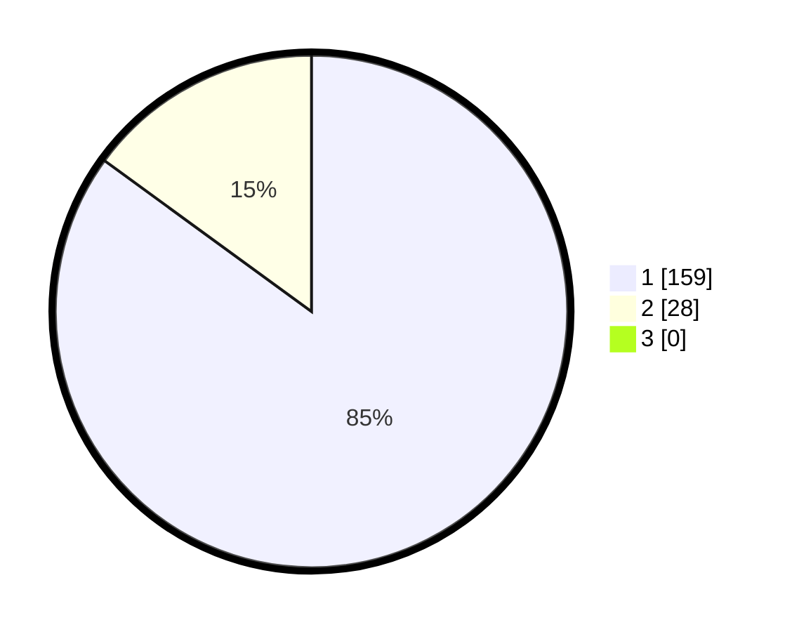

# Hasil

## Grafik

## Tabel

| No. | Nama Paslon    | Suara | Suara (raw) | Persentase |
|:--- |:-------------- | -----:| -----------:| ----------:|
| 1   | ANIES MUHAIMIN | 159   | [159][p-1]  | 85,03      |
| 2   | PRABOWO GIBRAN | 28    | [28][p-2]   | 14,97      |
| 3   | GANJAR MAHFUD  | 0     | [0][p-3]    | 0,00       |

[p-1]: https://github.com/gigit-pemilu/pemilu-2024/blob/main/pilpres/hitung-suara/sub/11-aceh/sub/08-aceh-utara/sub/04-lhoksukon/sub/2009-alue-buket/sub/001-tps/sub/paslon-1.txt
[p-2]: https://github.com/gigit-pemilu/pemilu-2024/blob/main/pilpres/hitung-suara/sub/11-aceh/sub/08-aceh-utara/sub/04-lhoksukon/sub/2009-alue-buket/sub/001-tps/sub/paslon-2.txt
[p-3]: https://github.com/gigit-pemilu/pemilu-2024/blob/main/pilpres/hitung-suara/sub/11-aceh/sub/08-aceh-utara/sub/04-lhoksukon/sub/2009-alue-buket/sub/001-tps/sub/paslon-3.txt

## Foto C Plano

https://sirekap-obj-formc.kpu.go.id/574a/pemilu/ppwp/11/08/04/20/09/1108042009001-20240215-020340--9c50433a-e033-4607-9500-83bec891a7db.jpg

https://sirekap-obj-formc.kpu.go.id/574a/pemilu/ppwp/11/08/04/20/09/1108042009001-20240215-020037--2d5afe56-03b5-48a9-9dc9-a0f242d10be4.jpg

https://sirekap-obj-formc.kpu.go.id/574a/pemilu/ppwp/11/08/04/20/09/1108042009001-20240215-020121--d49bcbfc-e178-4626-9d07-ce8331d2fc6a.jpg

## Metadata

| Key        | Value               |
| ---------- | ------------------- |
| Time Stamp | 2024-02-16 12:51:22 |

