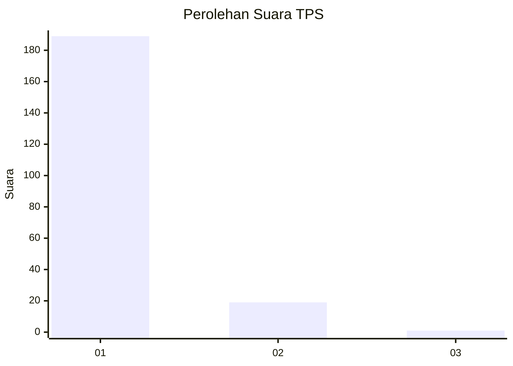
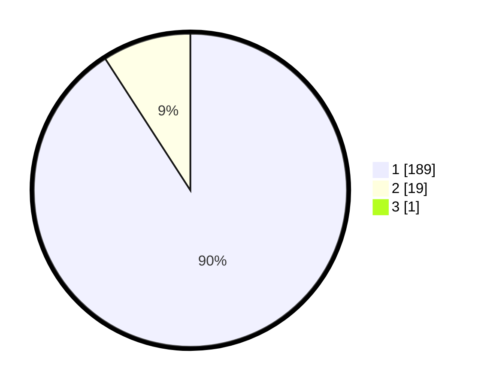

# Hasil

## Grafik

## Tabel

| No. | Nama Paslon    | Suara | Suara (raw) | Persentase |
|:--- |:-------------- | -----:| -----------:| ----------:|
| 1   | ANIES MUHAIMIN | 189   | [189][p-1]  | 90,43      |
| 2   | PRABOWO GIBRAN | 19    | [19][p-2]   | 9,09       |
| 3   | GANJAR MAHFUD  | 1     | [1][p-3]    | 0,48       |

[p-1]: https://github.com/gigit-pemilu/pemilu-2024-11-aceh/blob/main/pilpres/hitung-suara/sub/11-aceh/sub/08-aceh-utara/sub/04-lhoksukon/sub/2011-trieng-matang-ubi/sub/002-tps/sub/paslon-1.txt
[p-2]: https://github.com/gigit-pemilu/pemilu-2024-11-aceh/blob/main/pilpres/hitung-suara/sub/11-aceh/sub/08-aceh-utara/sub/04-lhoksukon/sub/2011-trieng-matang-ubi/sub/002-tps/sub/paslon-2.txt
[p-3]: https://github.com/gigit-pemilu/pemilu-2024-11-aceh/blob/main/pilpres/hitung-suara/sub/11-aceh/sub/08-aceh-utara/sub/04-lhoksukon/sub/2011-trieng-matang-ubi/sub/002-tps/sub/paslon-3.txt

## Foto C Plano

https://sirekap-obj-formc.kpu.go.id/0c0d/pemilu/ppwp/11/08/04/20/11/1108042011002-20240215-030314--3882766a-6d74-48c2-985b-92630d836436.jpg

https://sirekap-obj-formc.kpu.go.id/0c0d/pemilu/ppwp/11/08/04/20/11/1108042011002-20240215-042531--cea4d30d-a206-40b7-82f0-091a46a7c9f1.jpg

https://sirekap-obj-formc.kpu.go.id/0c0d/pemilu/ppwp/11/08/04/20/11/1108042011002-20240215-042627--bc2b27b4-0fb2-4131-be7a-067b07eb7a55.jpg

## Metadata

| Key        | Value               |
| ---------- | ------------------- |
| Time Stamp | 2024-02-15 17:00:25 |

