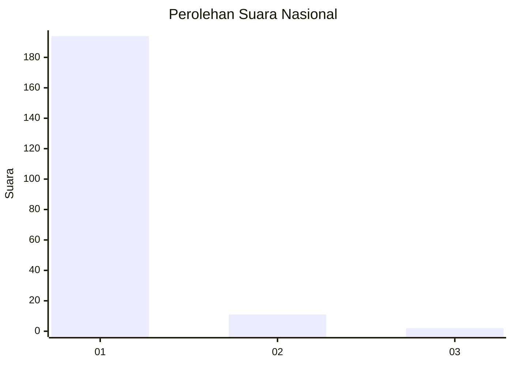
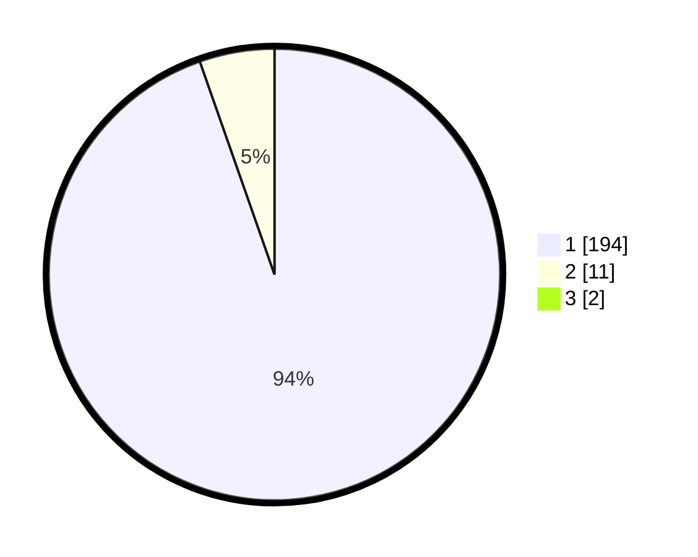

# Hasil

## Grafik

## Tabel

| No. | Nama Paslon    | Suara | Suara (raw) | Persentase |
|:--- |:-------------- | -----:| -----------:| ----------:|
| 1   | ANIES MUHAIMIN | 194   | [194][p-1]  | 93,72      |
| 2   | PRABOWO GIBRAN | 11    | [11][p-2]   | 5,31       |
| 3   | GANJAR MAHFUD  | 2     | [2][p-3]    | 0,97       |

[p-1]: https://github.com/gigit-pemilu/pemilu-2024/blob/main/pilpres/hitung-suara/sub/11-aceh/sub/08-aceh-utara/sub/04-lhoksukon/sub/2011-trieng-matang-ubi/sub/004-tps/sub/paslon-1.txt
[p-2]: https://github.com/gigit-pemilu/pemilu-2024/blob/main/pilpres/hitung-suara/sub/11-aceh/sub/08-aceh-utara/sub/04-lhoksukon/sub/2011-trieng-matang-ubi/sub/004-tps/sub/paslon-2.txt
[p-3]: https://github.com/gigit-pemilu/pemilu-2024/blob/main/pilpres/hitung-suara/sub/11-aceh/sub/08-aceh-utara/sub/04-lhoksukon/sub/2011-trieng-matang-ubi/sub/004-tps/sub/paslon-3.txt

## Foto C Plano

https://sirekap-obj-formc.kpu.go.id/ebac/pemilu/ppwp/11/08/04/20/11/1108042011004-20240215-123108--f8ec3c50-e304-44bc-b2f8-21e0bfd054e8.jpg

https://sirekap-obj-formc.kpu.go.id/ebac/pemilu/ppwp/11/08/04/20/11/1108042011004-20240215-123213--a69de61f-7b90-442f-8e4c-1c298476e3c8.jpg

https://sirekap-obj-formc.kpu.go.id/ebac/pemilu/ppwp/11/08/04/20/11/1108042011004-20240215-123320--952e3170-2f0f-481d-816f-cd8b223db6cc.jpg

## Metadata

| Key        | Value               |
| ---------- | ------------------- |
| Time Stamp | 2024-02-15 17:00:25 |

