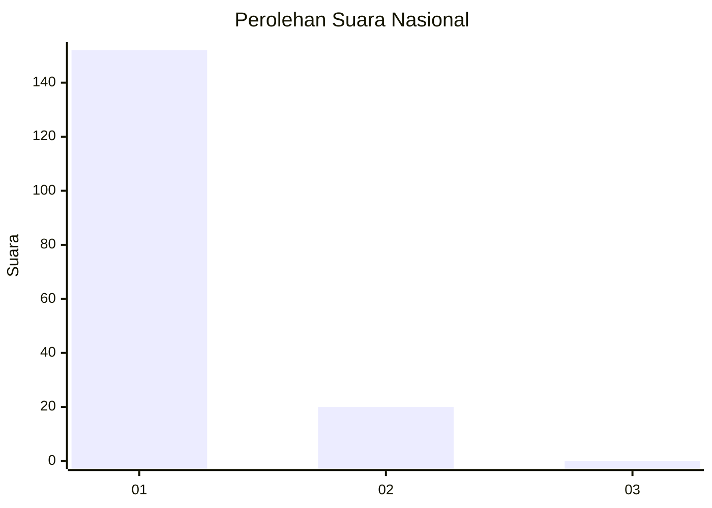
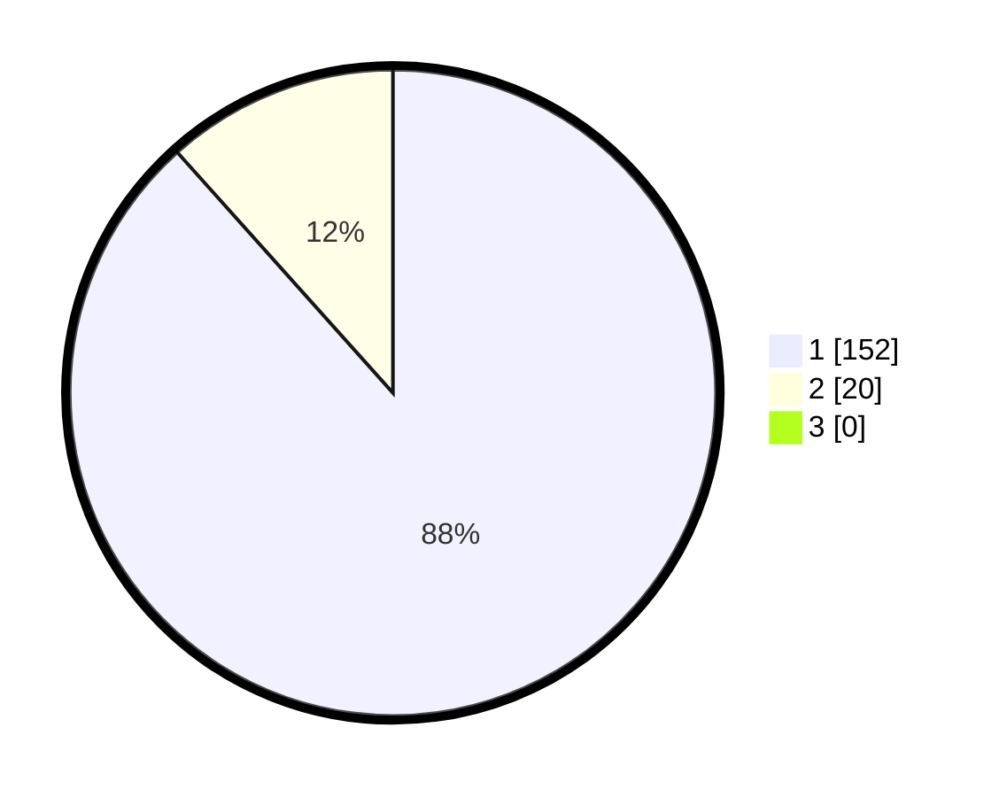

# Hasil

## Grafik

## Tabel

| No. | Nama Paslon    | Suara | Suara (raw) | Persentase |
|:--- |:-------------- | -----:| -----------:| ----------:|
| 1   | ANIES MUHAIMIN | 152   | [152][p-1]  | 88,37      |
| 2   | PRABOWO GIBRAN | 20    | [20][p-2]   | 11,63      |
| 3   | GANJAR MAHFUD  | 0     | [0][p-3]    | 0,00       |

[p-1]: https://github.com/gigit-pemilu/pemilu-2024/blob/main/pilpres/hitung-suara/sub/11-aceh/sub/08-aceh-utara/sub/04-lhoksukon/sub/2013-meunasah-blang/sub/003-tps/sub/paslon-1.txt
[p-2]: https://github.com/gigit-pemilu/pemilu-2024/blob/main/pilpres/hitung-suara/sub/11-aceh/sub/08-aceh-utara/sub/04-lhoksukon/sub/2013-meunasah-blang/sub/003-tps/sub/paslon-2.txt
[p-3]: https://github.com/gigit-pemilu/pemilu-2024/blob/main/pilpres/hitung-suara/sub/11-aceh/sub/08-aceh-utara/sub/04-lhoksukon/sub/2013-meunasah-blang/sub/003-tps/sub/paslon-3.txt

## Foto C Plano

https://sirekap-obj-formc.kpu.go.id/d54e/pemilu/ppwp/11/08/04/20/13/1108042013003-20240215-082945--c238fd8a-9798-4c8e-9f91-797ac7c7518a.jpg

https://sirekap-obj-formc.kpu.go.id/d54e/pemilu/ppwp/11/08/04/20/13/1108042013003-20240215-083416--526cca03-05b5-42e1-a7cf-573613028bb0.jpg

https://sirekap-obj-formc.kpu.go.id/d54e/pemilu/ppwp/11/08/04/20/13/1108042013003-20240215-083539--6681385c-c34d-4329-bd3e-0d01504bf0f7.jpg

## Metadata

| Key        | Value               |
| ---------- | ------------------- |
| Time Stamp | 2024-02-15 17:00:25 |

