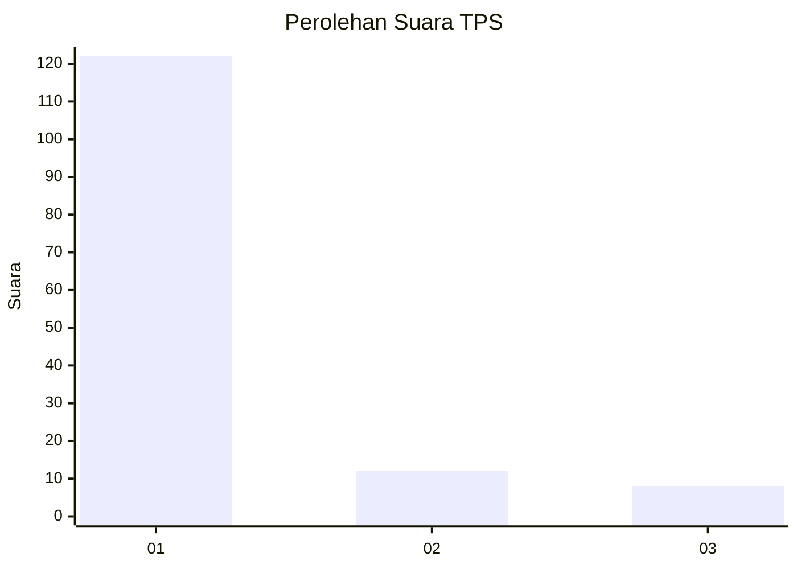
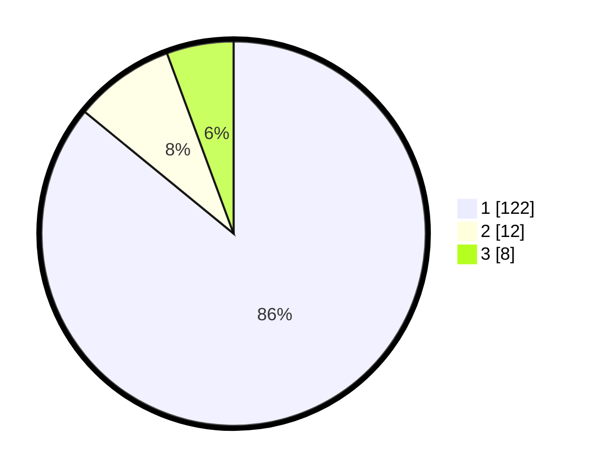

# Hasil

## Grafik

## Tabel

| No. | Nama Paslon    | Suara | Suara (raw) | Persentase |
|:--- |:-------------- | -----:| -----------:| ----------:|
| 1   | ANIES MUHAIMIN | 122   | [122][p-1]  | 85,92      |
| 2   | PRABOWO GIBRAN | 12    | [12][p-2]   | 8,45       |
| 3   | GANJAR MAHFUD  | 8     | [8][p-3]    | 5,63       |

[p-1]: https://github.com/gigit-pemilu/pemilu-2024-11-aceh/blob/main/pilpres/hitung-suara/sub/11-aceh/sub/08-aceh-utara/sub/04-lhoksukon/sub/2015-meunasah-arongan-ab/sub/001-tps/sub/paslon-1.txt
[p-2]: https://github.com/gigit-pemilu/pemilu-2024-11-aceh/blob/main/pilpres/hitung-suara/sub/11-aceh/sub/08-aceh-utara/sub/04-lhoksukon/sub/2015-meunasah-arongan-ab/sub/001-tps/sub/paslon-2.txt
[p-3]: https://github.com/gigit-pemilu/pemilu-2024-11-aceh/blob/main/pilpres/hitung-suara/sub/11-aceh/sub/08-aceh-utara/sub/04-lhoksukon/sub/2015-meunasah-arongan-ab/sub/001-tps/sub/paslon-3.txt

## Foto C Plano

https://sirekap-obj-formc.kpu.go.id/dd5c/pemilu/ppwp/11/08/04/20/15/1108042015001-20240214-202355--21a6ff4e-3b72-4152-895c-22a2d532e71f.jpg

https://sirekap-obj-formc.kpu.go.id/dd5c/pemilu/ppwp/11/08/04/20/15/1108042015001-20240215-024037--99e1c1fc-6245-4129-8684-6bbe04cbf64e.jpg

https://sirekap-obj-formc.kpu.go.id/dd5c/pemilu/ppwp/11/08/04/20/15/1108042015001-20240214-203001--1661175b-bb83-49ab-b370-1e4375a3b2b2.jpg

## Metadata

| Key        | Value               |
| ---------- | ------------------- |
| Time Stamp | 2024-02-15 20:00:44 |

## DATA PEMILIH TETAP

Jumlah pemilih dalam DPT: **165**.
 * L: **85**.
 * P: **80**.

## DATA PENGGUNA HAK PILIH

Jumlah pengguna hak pilih dalam DPT: **145**.
 * L: **73**.
 * P: **72**.

Jumlah pengguna hak pilih dalam DPTb: **1**.
 * L: **84**.
 * P: **0**.

Jumlah pengguna hak pilih dalam DPK: **4**.
 * L: **0**.
 * P: **4**.

Jumlah pengguna hak pilih: **147**.
 * L: **74**.
 * P: **73**.

## JUMLAH SUARA SAH DAN TIDAK SAH

JUMLAH SELURUH SUARA SAH: **142**.

JUMLAH SUARA TIDAK SAH: **5**.

JUMLAH SELURUH SUARA SAH DAN SUARA TIDAK SAH: **147**.

