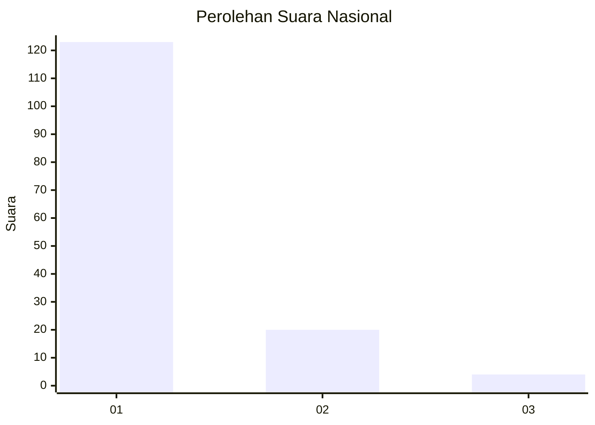
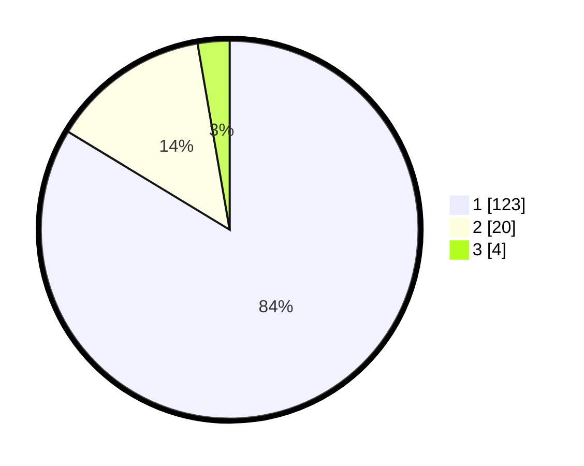

# Hasil

## Grafik

## Tabel

| No. | Nama Paslon    | Suara | Suara (raw) | Persentase |
|:--- |:-------------- | -----:| -----------:| ----------:|
| 1   | ANIES MUHAIMIN | 123   | [123][p-1]  | 83,67      |
| 2   | PRABOWO GIBRAN | 20    | [20][p-2]   | 13,61      |
| 3   | GANJAR MAHFUD  | 4     | [4][p-3]    | 2,72       |

[p-1]: https://github.com/gigit-pemilu/pemilu-2024/blob/main/pilpres/hitung-suara/sub/11-aceh/sub/08-aceh-utara/sub/04-lhoksukon/sub/2016-trieng-pantang/sub/001-tps/sub/paslon-1.txt
[p-2]: https://github.com/gigit-pemilu/pemilu-2024/blob/main/pilpres/hitung-suara/sub/11-aceh/sub/08-aceh-utara/sub/04-lhoksukon/sub/2016-trieng-pantang/sub/001-tps/sub/paslon-2.txt
[p-3]: https://github.com/gigit-pemilu/pemilu-2024/blob/main/pilpres/hitung-suara/sub/11-aceh/sub/08-aceh-utara/sub/04-lhoksukon/sub/2016-trieng-pantang/sub/001-tps/sub/paslon-3.txt

## Foto C Plano

https://sirekap-obj-formc.kpu.go.id/81eb/pemilu/ppwp/11/08/04/20/16/1108042016001-20240215-130933--73796a2e-98ac-437c-87a6-bf3536d9c667.jpg

https://sirekap-obj-formc.kpu.go.id/81eb/pemilu/ppwp/11/08/04/20/16/1108042016001-20240215-131247--4305ad04-8091-464e-8baa-59333a3aa2de.jpg

https://sirekap-obj-formc.kpu.go.id/81eb/pemilu/ppwp/11/08/04/20/16/1108042016001-20240215-131426--d92ebd40-5b7d-4330-a964-73d6d65ed639.jpg

## Metadata

| Key        | Value               |
| ---------- | ------------------- |
| Time Stamp | 2024-02-15 20:30:46 |

