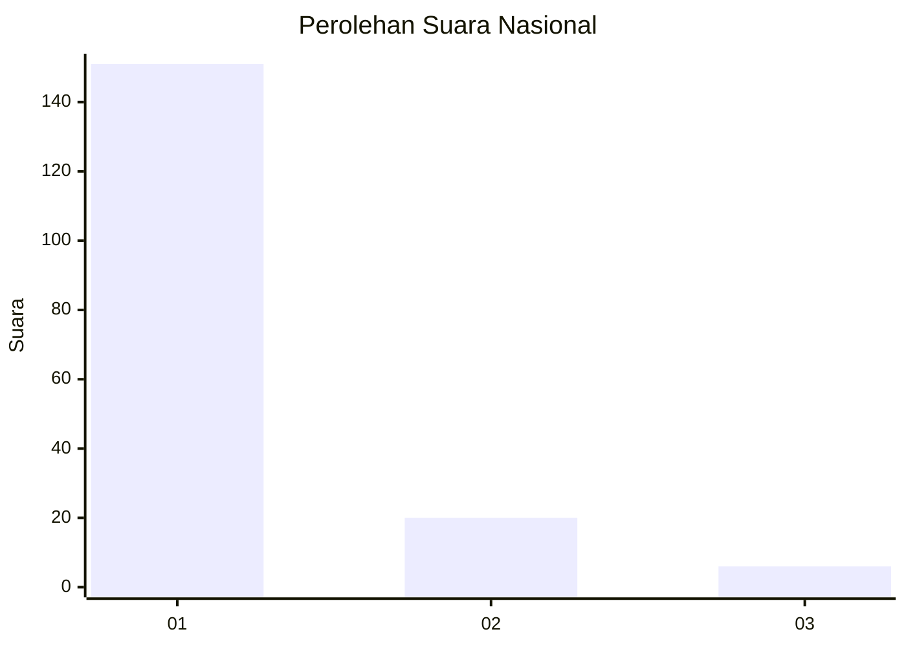
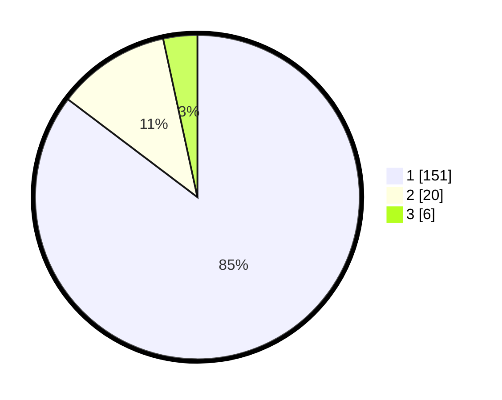

# Hasil

## Grafik

## Tabel

| No. | Nama Paslon    | Suara | Suara (raw) | Persentase |
|:--- |:-------------- | -----:| -----------:| ----------:|
| 1   | ANIES MUHAIMIN | 151   | [151][p-1]  | 85,31      |
| 2   | PRABOWO GIBRAN | 20    | [20][p-2]   | 11,30      |
| 3   | GANJAR MAHFUD  | 6     | [6][p-3]    | 3,39       |

[p-1]: https://github.com/gigit-pemilu/pemilu-2024/blob/main/pilpres/hitung-suara/sub/11-aceh/sub/08-aceh-utara/sub/04-lhoksukon/sub/2016-trieng-pantang/sub/002-tps/sub/paslon-1.txt
[p-2]: https://github.com/gigit-pemilu/pemilu-2024/blob/main/pilpres/hitung-suara/sub/11-aceh/sub/08-aceh-utara/sub/04-lhoksukon/sub/2016-trieng-pantang/sub/002-tps/sub/paslon-2.txt
[p-3]: https://github.com/gigit-pemilu/pemilu-2024/blob/main/pilpres/hitung-suara/sub/11-aceh/sub/08-aceh-utara/sub/04-lhoksukon/sub/2016-trieng-pantang/sub/002-tps/sub/paslon-3.txt

## Foto C Plano

https://sirekap-obj-formc.kpu.go.id/2c5f/pemilu/ppwp/11/08/04/20/16/1108042016002-20240215-004945--68d9c760-e5f5-43bc-85c2-018d2b8dfa51.jpg

https://sirekap-obj-formc.kpu.go.id/2c5f/pemilu/ppwp/11/08/04/20/16/1108042016002-20240215-005059--1ed468a7-facf-4185-8062-c57e141e2298.jpg

https://sirekap-obj-formc.kpu.go.id/2c5f/pemilu/ppwp/11/08/04/20/16/1108042016002-20240215-005155--e1905ff5-b824-402a-bf02-988c6090d730.jpg

## Metadata

| Key        | Value               |
| ---------- | ------------------- |
| Time Stamp | 2024-02-15 17:00:25 |

