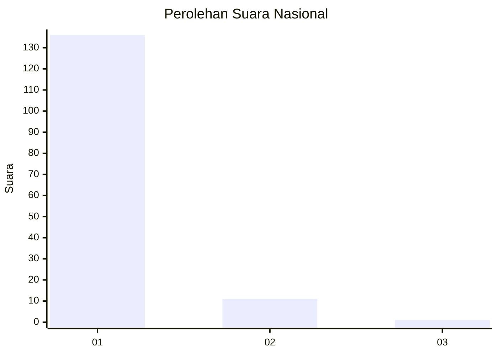
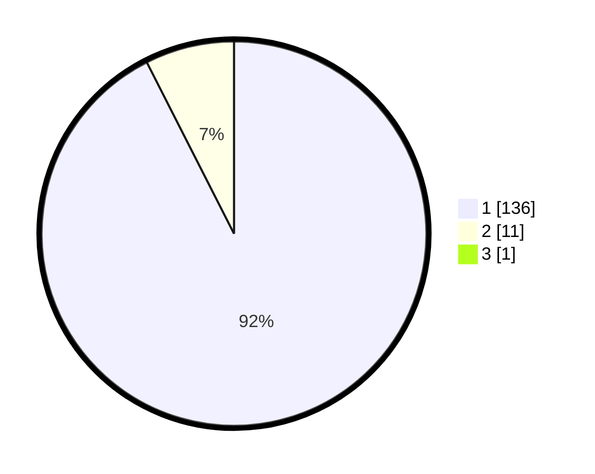

# Hasil

## Grafik

## Tabel

| No. | Nama Paslon    | Suara | Suara (raw) | Persentase |
|:--- |:-------------- | -----:| -----------:| ----------:|
| 1   | ANIES MUHAIMIN | 136   | [136][p-1]  | 91,89      |
| 2   | PRABOWO GIBRAN | 11    | [11][p-2]   | 7,43       |
| 3   | GANJAR MAHFUD  | 1     | [1][p-3]    | 0,68       |

[p-1]: https://github.com/gigit-pemilu/pemilu-2024/blob/main/pilpres/hitung-suara/sub/11-aceh/sub/08-aceh-utara/sub/04-lhoksukon/sub/2022-matang-pupanji-ab/sub/001-tps/sub/paslon-1.txt
[p-2]: https://github.com/gigit-pemilu/pemilu-2024/blob/main/pilpres/hitung-suara/sub/11-aceh/sub/08-aceh-utara/sub/04-lhoksukon/sub/2022-matang-pupanji-ab/sub/001-tps/sub/paslon-2.txt
[p-3]: https://github.com/gigit-pemilu/pemilu-2024/blob/main/pilpres/hitung-suara/sub/11-aceh/sub/08-aceh-utara/sub/04-lhoksukon/sub/2022-matang-pupanji-ab/sub/001-tps/sub/paslon-3.txt

## Foto C Plano

https://sirekap-obj-formc.kpu.go.id/c23c/pemilu/ppwp/11/08/04/20/22/1108042022001-20240215-012750--2b65e7dd-d74c-4b30-b1ad-6ed3f0ae84f8.jpg

https://sirekap-obj-formc.kpu.go.id/c23c/pemilu/ppwp/11/08/04/20/22/1108042022001-20240215-012953--30a104da-cbd3-45e9-97df-b03d05855283.jpg

https://sirekap-obj-formc.kpu.go.id/c23c/pemilu/ppwp/11/08/04/20/22/1108042022001-20240215-013251--c2f0c943-8cb6-49e6-8972-83a0c21cef92.jpg

## Metadata

| Key        | Value               |
| ---------- | ------------------- |
| Time Stamp | 2024-02-17 00:28:35 |

