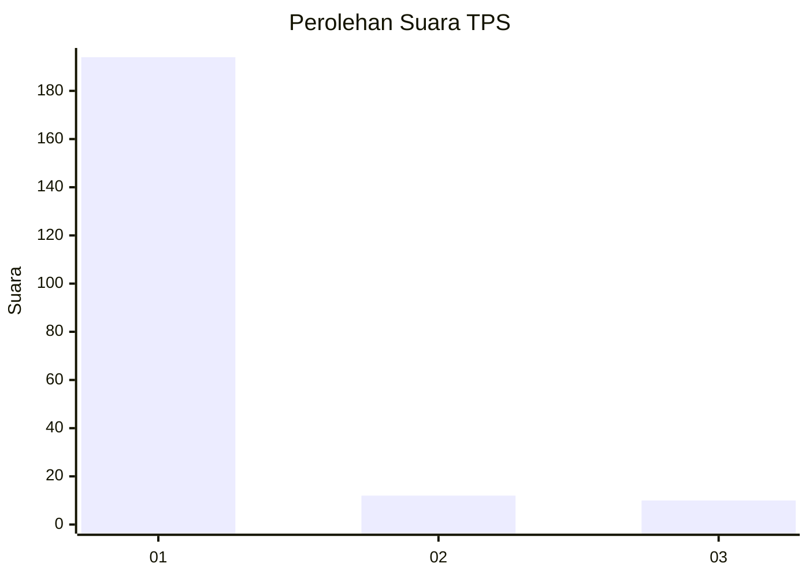
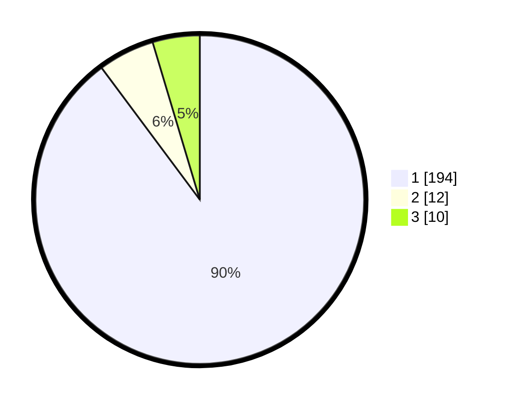

# Hasil

## Grafik

## Tabel

| No. | Nama Paslon    | Suara | Suara (raw) | Persentase |
|:--- |:-------------- | -----:| -----------:| ----------:|
| 1   | ANIES MUHAIMIN | 194   | [194][p-1]  | 89,81      |
| 2   | PRABOWO GIBRAN | 12    | [12][p-2]   | 5,56       |
| 3   | GANJAR MAHFUD  | 10    | [10][p-3]   | 4,63       |

[p-1]: https://github.com/gigit-pemilu/pemilu-2024-11-aceh/blob/main/pilpres/hitung-suara/sub/11-aceh/sub/08-aceh-utara/sub/04-lhoksukon/sub/2024-matang-teungoh-ab/sub/001-tps/sub/paslon-1.txt
[p-2]: https://github.com/gigit-pemilu/pemilu-2024-11-aceh/blob/main/pilpres/hitung-suara/sub/11-aceh/sub/08-aceh-utara/sub/04-lhoksukon/sub/2024-matang-teungoh-ab/sub/001-tps/sub/paslon-2.txt
[p-3]: https://github.com/gigit-pemilu/pemilu-2024-11-aceh/blob/main/pilpres/hitung-suara/sub/11-aceh/sub/08-aceh-utara/sub/04-lhoksukon/sub/2024-matang-teungoh-ab/sub/001-tps/sub/paslon-3.txt

## Foto C Plano

https://sirekap-obj-formc.kpu.go.id/7957/pemilu/ppwp/11/08/04/20/24/1108042024001-20240215-105518--f830ddd1-f2e9-4912-818e-658783a7273b.jpg

https://sirekap-obj-formc.kpu.go.id/7957/pemilu/ppwp/11/08/04/20/24/1108042024001-20240215-105621--aafa90cb-da55-4ab2-a172-49d43e7f4775.jpg

https://sirekap-obj-formc.kpu.go.id/7957/pemilu/ppwp/11/08/04/20/24/1108042024001-20240215-105719--f8abc26c-2efb-4685-a638-5848857f5155.jpg

## Metadata

| Key        | Value               |
| ---------- | ------------------- |
| Time Stamp | 2024-02-15 18:00:26 |

