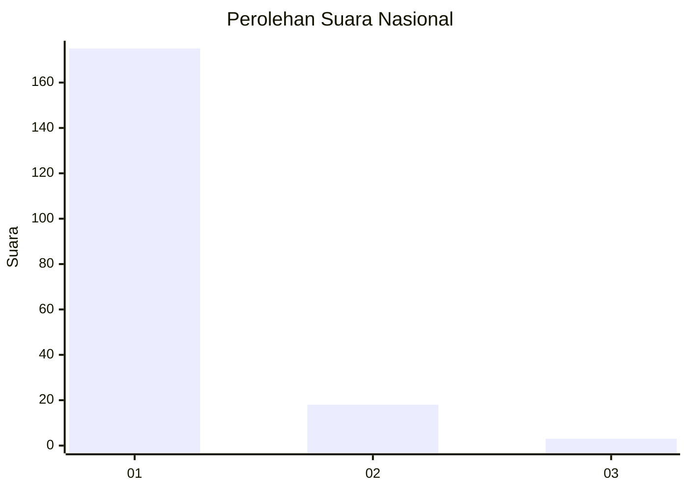
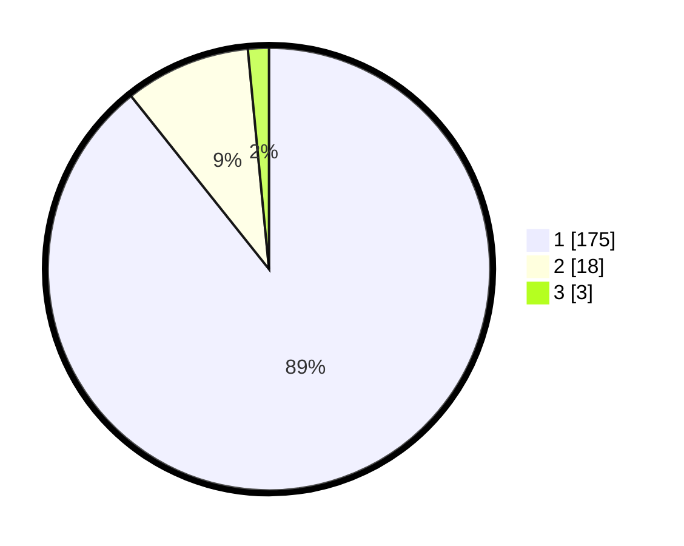

# Hasil

## Grafik

## Tabel

| No. | Nama Paslon    | Suara | Suara (raw) | Persentase |
|:--- |:-------------- | -----:| -----------:| ----------:|
| 1   | ANIES MUHAIMIN | 175   | [175][p-1]  | 89,29      |
| 2   | PRABOWO GIBRAN | 18    | [18][p-2]   | 9,18       |
| 3   | GANJAR MAHFUD  | 3     | [3][p-3]    | 1,53       |

[p-1]: https://github.com/gigit-pemilu/pemilu-2024/blob/main/pilpres/hitung-suara/sub/11-aceh/sub/08-aceh-utara/sub/04-lhoksukon/sub/2026-rambot/sub/001-tps/sub/paslon-1.txt
[p-2]: https://github.com/gigit-pemilu/pemilu-2024/blob/main/pilpres/hitung-suara/sub/11-aceh/sub/08-aceh-utara/sub/04-lhoksukon/sub/2026-rambot/sub/001-tps/sub/paslon-2.txt
[p-3]: https://github.com/gigit-pemilu/pemilu-2024/blob/main/pilpres/hitung-suara/sub/11-aceh/sub/08-aceh-utara/sub/04-lhoksukon/sub/2026-rambot/sub/001-tps/sub/paslon-3.txt

## Foto C Plano

https://sirekap-obj-formc.kpu.go.id/8e8f/pemilu/ppwp/11/08/04/20/26/1108042026001-20240215-150215--cb607143-4e0d-44f7-88e7-3f0a0c06d5ce.jpg

https://sirekap-obj-formc.kpu.go.id/8e8f/pemilu/ppwp/11/08/04/20/26/1108042026001-20240215-120255--fa6c7bf8-fa2c-4116-8bb9-816d74f2025b.jpg

https://sirekap-obj-formc.kpu.go.id/8e8f/pemilu/ppwp/11/08/04/20/26/1108042026001-20240215-150427--3d5fa874-3ff3-4f74-9726-9702d447541c.jpg

## Metadata

| Key        | Value               |
| ---------- | ------------------- |
| Time Stamp | 2024-02-17 00:28:35 |

