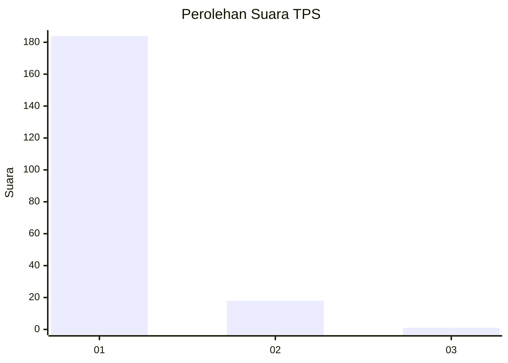
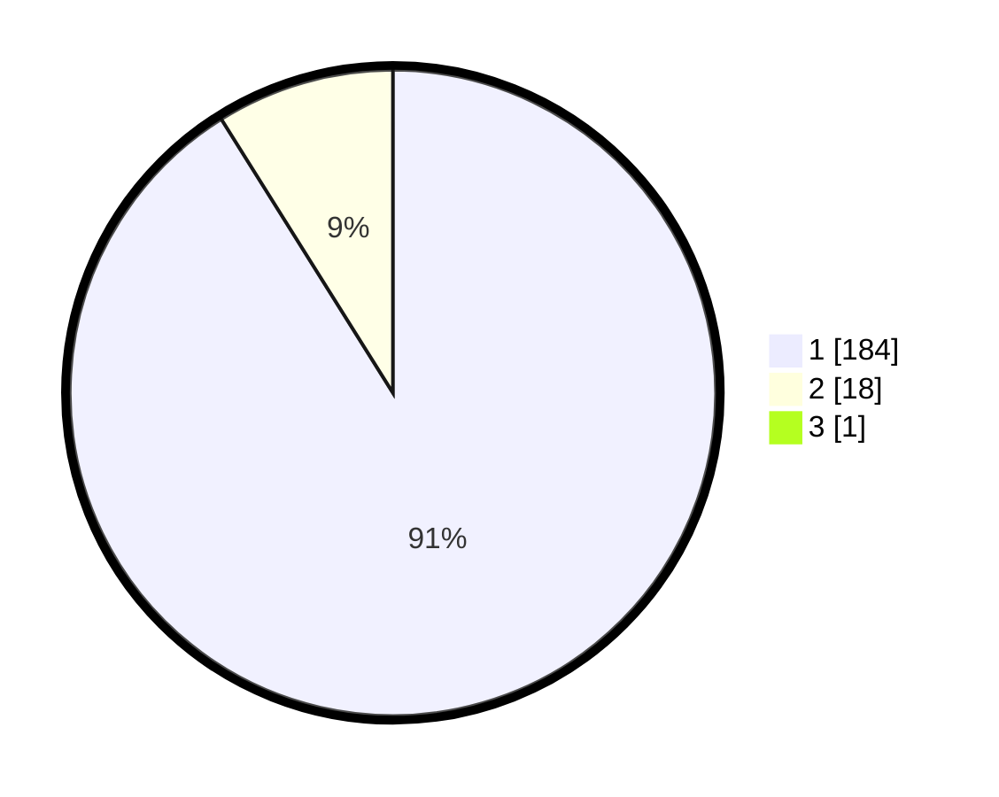

# Hasil

## Grafik

## Tabel

| No. | Nama Paslon    | Suara | Suara (raw) | Persentase |
|:--- |:-------------- | -----:| -----------:| ----------:|
| 1   | ANIES MUHAIMIN | 184   | [184][p-1]  | 90,64      |
| 2   | PRABOWO GIBRAN | 18    | [18][p-2]   | 8,87       |
| 3   | GANJAR MAHFUD  | 1     | [1][p-3]    | 0,49       |

[p-1]: https://github.com/gigit-pemilu/pemilu-2024-11-aceh/blob/main/pilpres/hitung-suara/sub/11-aceh/sub/08-aceh-utara/sub/04-lhoksukon/sub/2026-rambot/sub/002-tps/sub/paslon-1.txt
[p-2]: https://github.com/gigit-pemilu/pemilu-2024-11-aceh/blob/main/pilpres/hitung-suara/sub/11-aceh/sub/08-aceh-utara/sub/04-lhoksukon/sub/2026-rambot/sub/002-tps/sub/paslon-2.txt
[p-3]: https://github.com/gigit-pemilu/pemilu-2024-11-aceh/blob/main/pilpres/hitung-suara/sub/11-aceh/sub/08-aceh-utara/sub/04-lhoksukon/sub/2026-rambot/sub/002-tps/sub/paslon-3.txt

## Foto C Plano

https://sirekap-obj-formc.kpu.go.id/3dcb/pemilu/ppwp/11/08/04/20/26/1108042026002-20240215-105414--8673c263-1573-46b9-82cc-84b545fde045.jpg

https://sirekap-obj-formc.kpu.go.id/3dcb/pemilu/ppwp/11/08/04/20/26/1108042026002-20240215-105525--2d26c675-5b6c-40ec-8d9b-eb1edbfeed56.jpg

https://sirekap-obj-formc.kpu.go.id/3dcb/pemilu/ppwp/11/08/04/20/26/1108042026002-20240215-105752--57a70487-86c6-4165-b974-51d23bd8e72a.jpg

## Metadata

| Key        | Value               |
| ---------- | ------------------- |
| Time Stamp | 2024-02-17 00:28:35 |

