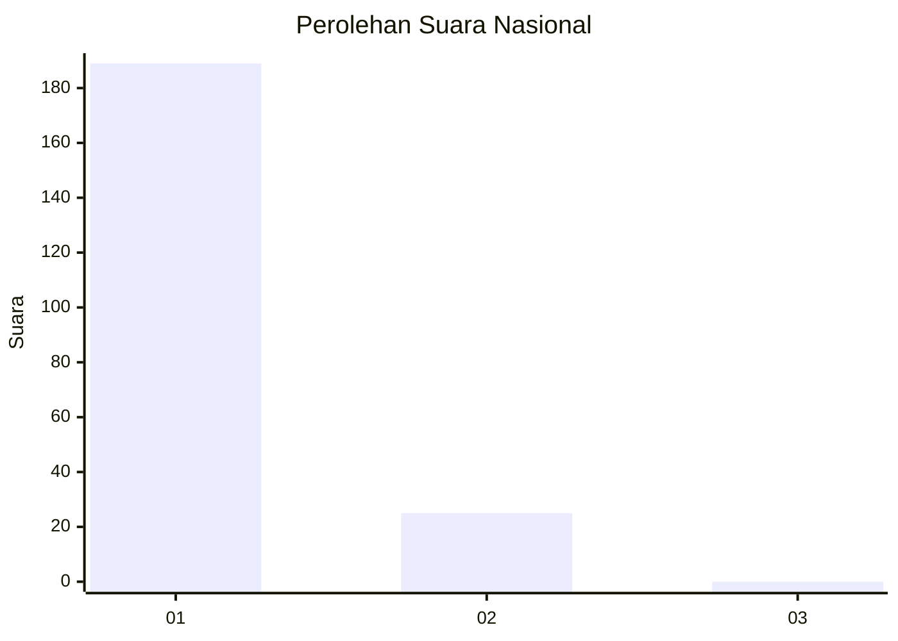
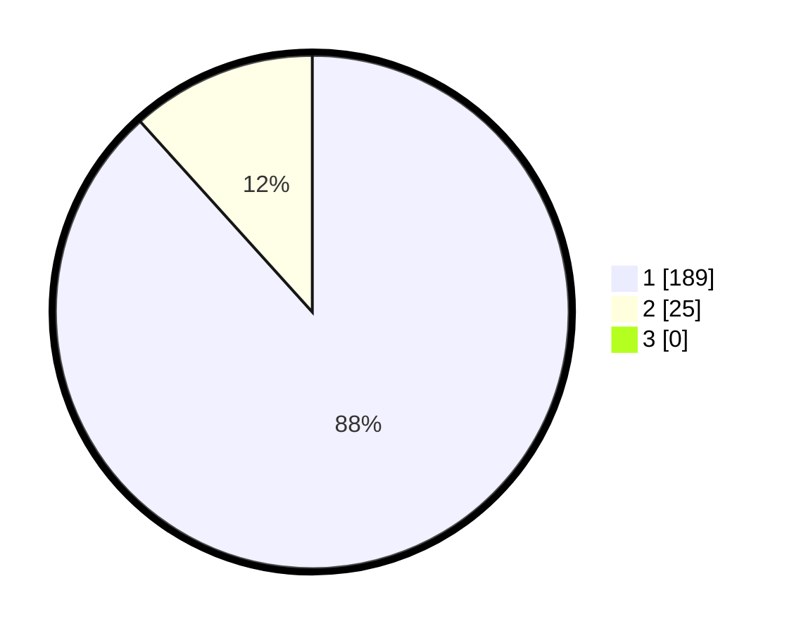

# Hasil

## Grafik

## Tabel

| No. | Nama Paslon    | Suara | Suara (raw) | Persentase |
|:--- |:-------------- | -----:| -----------:| ----------:|
| 1   | ANIES MUHAIMIN | 189   | [189][p-1]  | 88,32      |
| 2   | PRABOWO GIBRAN | 25    | [25][p-2]   | 11,68      |
| 3   | GANJAR MAHFUD  | 0     | [0][p-3]    | 0,00       |

[p-1]: https://github.com/gigit-pemilu/pemilu-2024/blob/main/pilpres/hitung-suara/sub/11-aceh/sub/08-aceh-utara/sub/04-lhoksukon/sub/2026-rambot/sub/003-tps/sub/paslon-1.txt
[p-2]: https://github.com/gigit-pemilu/pemilu-2024/blob/main/pilpres/hitung-suara/sub/11-aceh/sub/08-aceh-utara/sub/04-lhoksukon/sub/2026-rambot/sub/003-tps/sub/paslon-2.txt
[p-3]: https://github.com/gigit-pemilu/pemilu-2024/blob/main/pilpres/hitung-suara/sub/11-aceh/sub/08-aceh-utara/sub/04-lhoksukon/sub/2026-rambot/sub/003-tps/sub/paslon-3.txt

## Foto C Plano

https://sirekap-obj-formc.kpu.go.id/2d0e/pemilu/ppwp/11/08/04/20/26/1108042026003-20240215-171758--09d0a348-7e40-40e1-8b81-cb6504aecf08.jpg

https://sirekap-obj-formc.kpu.go.id/2d0e/pemilu/ppwp/11/08/04/20/26/1108042026003-20240215-171835--e817e79c-706f-4210-8619-a9a408c1e35a.jpg

https://sirekap-obj-formc.kpu.go.id/2d0e/pemilu/ppwp/11/08/04/20/26/1108042026003-20240215-171913--b9f7ca8c-6d67-4f8f-be2c-73c293f7f107.jpg

## Metadata

| Key        | Value               |
| ---------- | ------------------- |
| Time Stamp | 2024-02-16 23:00:00 |

