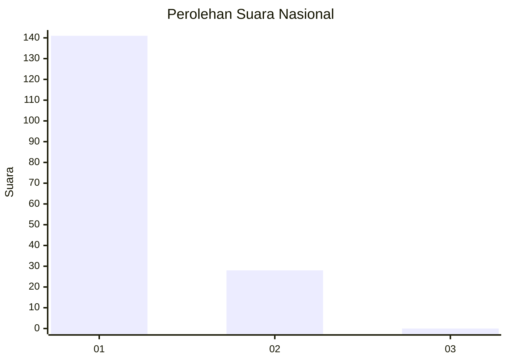
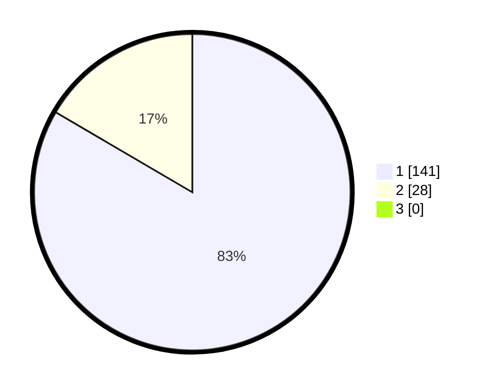

# Hasil

## Grafik

## Tabel

| No. | Nama Paslon    | Suara | Suara (raw) | Persentase |
|:--- |:-------------- | -----:| -----------:| ----------:|
| 1   | ANIES MUHAIMIN | 141   | [141][p-1]  | 83,43      |
| 2   | PRABOWO GIBRAN | 28    | [28][p-2]   | 16,57      |
| 3   | GANJAR MAHFUD  | 0     | [0][p-3]    | 0,00       |

[p-1]: https://github.com/gigit-pemilu/pemilu-2024/blob/main/pilpres/hitung-suara/sub/11-aceh/sub/08-aceh-utara/sub/04-lhoksukon/sub/2028-alue-mudem/sub/001-tps/sub/paslon-1.txt
[p-2]: https://github.com/gigit-pemilu/pemilu-2024/blob/main/pilpres/hitung-suara/sub/11-aceh/sub/08-aceh-utara/sub/04-lhoksukon/sub/2028-alue-mudem/sub/001-tps/sub/paslon-2.txt
[p-3]: https://github.com/gigit-pemilu/pemilu-2024/blob/main/pilpres/hitung-suara/sub/11-aceh/sub/08-aceh-utara/sub/04-lhoksukon/sub/2028-alue-mudem/sub/001-tps/sub/paslon-3.txt

## Foto C Plano

https://sirekap-obj-formc.kpu.go.id/4009/pemilu/ppwp/11/08/04/20/28/1108042028001-20240215-065935--fdfeba76-95c6-4992-a25b-328e242f93a0.jpg

https://sirekap-obj-formc.kpu.go.id/4009/pemilu/ppwp/11/08/04/20/28/1108042028001-20240215-070258--e8e4d6b3-ecf9-43f3-a755-7699ad72711f.jpg

https://sirekap-obj-formc.kpu.go.id/4009/pemilu/ppwp/11/08/04/20/28/1108042028001-20240215-070818--725478b2-6ad8-4f63-84bb-3dae04755089.jpg

## Metadata

| Key        | Value               |
| ---------- | ------------------- |
| Time Stamp | 2024-02-15 17:30:25 |

