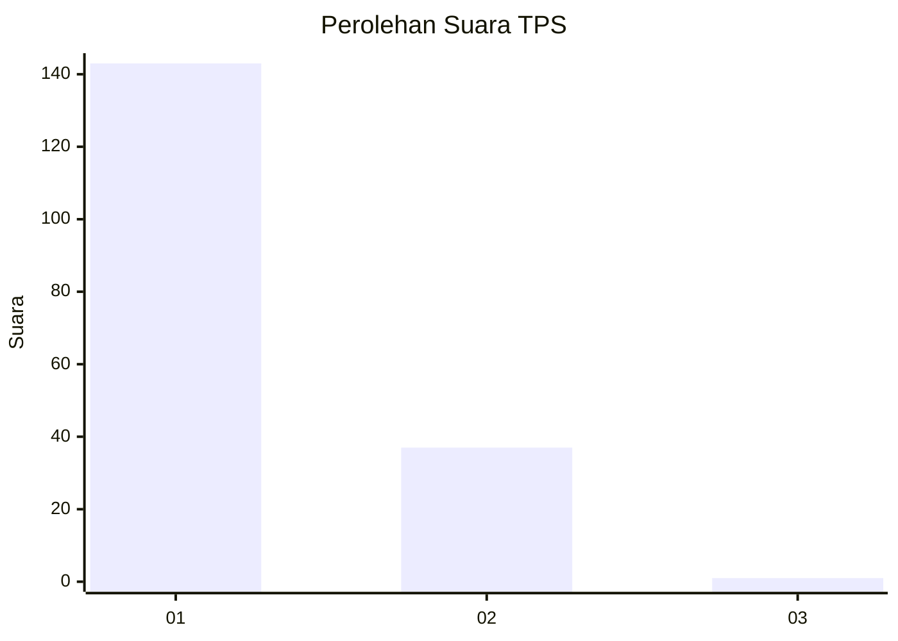
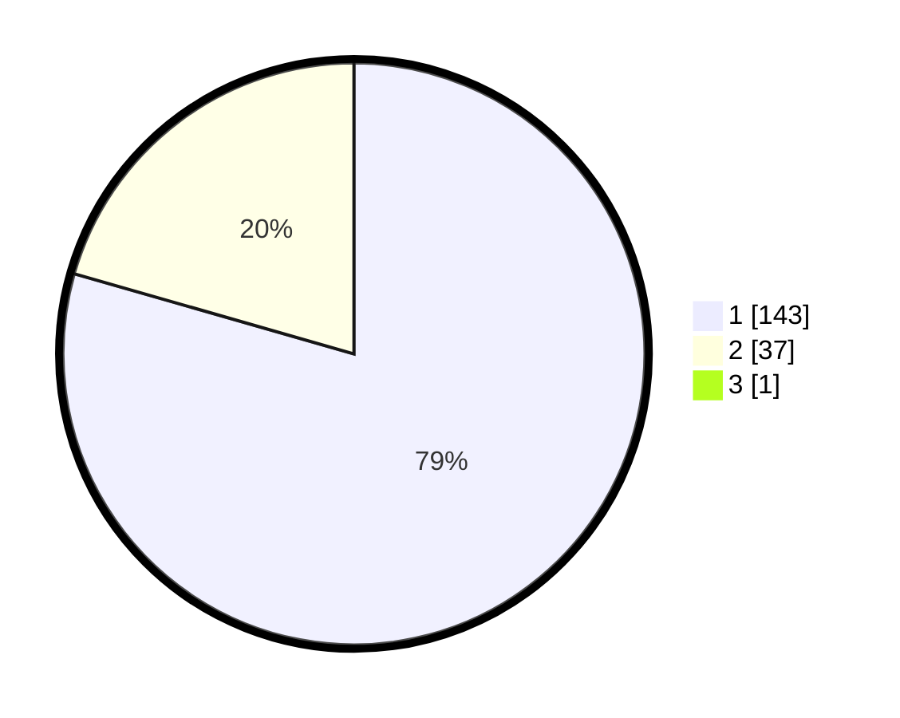

# Hasil

## Grafik

## Tabel

| No. | Nama Paslon    | Suara | Suara (raw) | Persentase |
|:--- |:-------------- | -----:| -----------:| ----------:|
| 1   | ANIES MUHAIMIN | 143   | [143][p-1]  | 79,01      |
| 2   | PRABOWO GIBRAN | 37    | [37][p-2]   | 20,44      |
| 3   | GANJAR MAHFUD  | 1     | [1][p-3]    | 0,55       |

[p-1]: https://github.com/gigit-pemilu/pemilu-2024-11-aceh/blob/main/pilpres/hitung-suara/sub/11-aceh/sub/08-aceh-utara/sub/04-lhoksukon/sub/2030-meunasah-asan-lb/sub/003-tps/sub/paslon-1.txt
[p-2]: https://github.com/gigit-pemilu/pemilu-2024-11-aceh/blob/main/pilpres/hitung-suara/sub/11-aceh/sub/08-aceh-utara/sub/04-lhoksukon/sub/2030-meunasah-asan-lb/sub/003-tps/sub/paslon-2.txt
[p-3]: https://github.com/gigit-pemilu/pemilu-2024-11-aceh/blob/main/pilpres/hitung-suara/sub/11-aceh/sub/08-aceh-utara/sub/04-lhoksukon/sub/2030-meunasah-asan-lb/sub/003-tps/sub/paslon-3.txt

## Foto C Plano

https://sirekap-obj-formc.kpu.go.id/2294/pemilu/ppwp/11/08/04/20/30/1108042030003-20240214-155353--818c9e04-2aa2-45a1-bb92-a4be657a0558.jpg

https://sirekap-obj-formc.kpu.go.id/2294/pemilu/ppwp/11/08/04/20/30/1108042030003-20240214-155515--cadc158c-6045-4c97-9cdd-f0bc9d88a867.jpg

https://sirekap-obj-formc.kpu.go.id/2294/pemilu/ppwp/11/08/04/20/30/1108042030003-20240214-155632--6a591846-822b-44eb-9e3d-f91dd2aa93e8.jpg

## Metadata

| Key        | Value               |
| ---------- | ------------------- |
| Time Stamp | 2024-02-16 23:00:00 |

