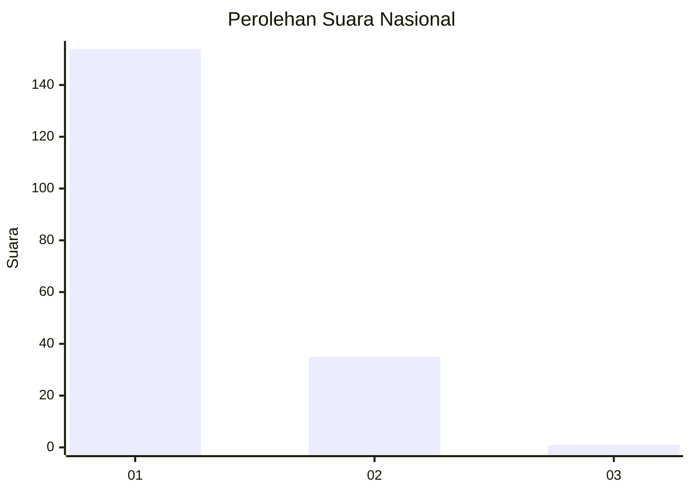
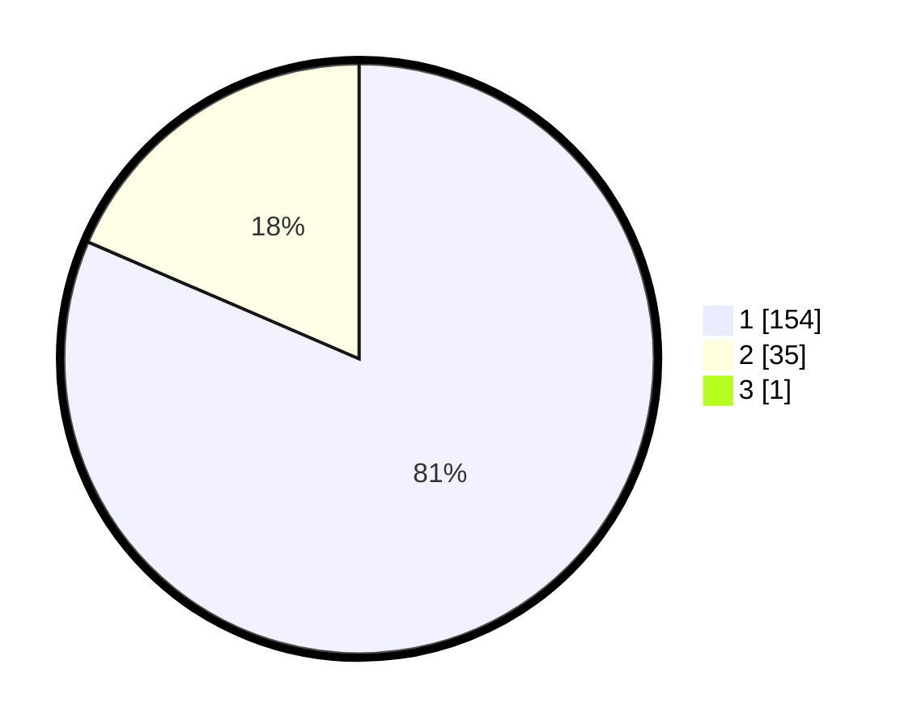

# Hasil

## Grafik

## Tabel

| No. | Nama Paslon    | Suara | Suara (raw) | Persentase |
|:--- |:-------------- | -----:| -----------:| ----------:|
| 1   | ANIES MUHAIMIN | 154   | [154][p-1]  | 81,05      |
| 2   | PRABOWO GIBRAN | 35    | [35][p-2]   | 18,42      |
| 3   | GANJAR MAHFUD  | 1     | [1][p-3]    | 0,53       |

[p-1]: https://github.com/gigit-pemilu/pemilu-2024/blob/main/pilpres/hitung-suara/sub/11-aceh/sub/08-aceh-utara/sub/04-lhoksukon/sub/2035-meunasah-ranto/sub/001-tps/sub/paslon-1.txt
[p-2]: https://github.com/gigit-pemilu/pemilu-2024/blob/main/pilpres/hitung-suara/sub/11-aceh/sub/08-aceh-utara/sub/04-lhoksukon/sub/2035-meunasah-ranto/sub/001-tps/sub/paslon-2.txt
[p-3]: https://github.com/gigit-pemilu/pemilu-2024/blob/main/pilpres/hitung-suara/sub/11-aceh/sub/08-aceh-utara/sub/04-lhoksukon/sub/2035-meunasah-ranto/sub/001-tps/sub/paslon-3.txt

## Foto C Plano

https://sirekap-obj-formc.kpu.go.id/c330/pemilu/ppwp/11/08/04/20/35/1108042035001-20240215-102659--740a7b49-a296-40ba-b45b-bd920f7528f0.jpg

https://sirekap-obj-formc.kpu.go.id/c330/pemilu/ppwp/11/08/04/20/35/1108042035001-20240215-102747--471b44f9-47b3-47f2-9f61-9bda59e7298d.jpg

https://sirekap-obj-formc.kpu.go.id/c330/pemilu/ppwp/11/08/04/20/35/1108042035001-20240215-102826--397e2c66-9f70-4273-b59b-f003bc2b50cd.jpg

## Metadata

| Key        | Value               |
| ---------- | ------------------- |
| Time Stamp | 2024-02-15 20:00:44 |

