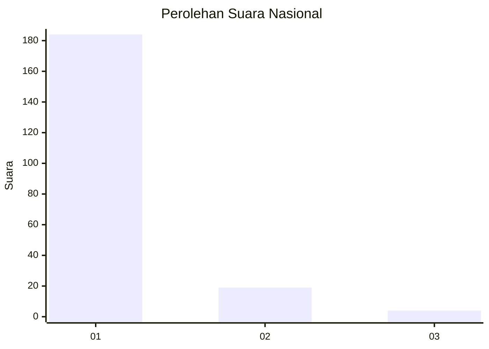
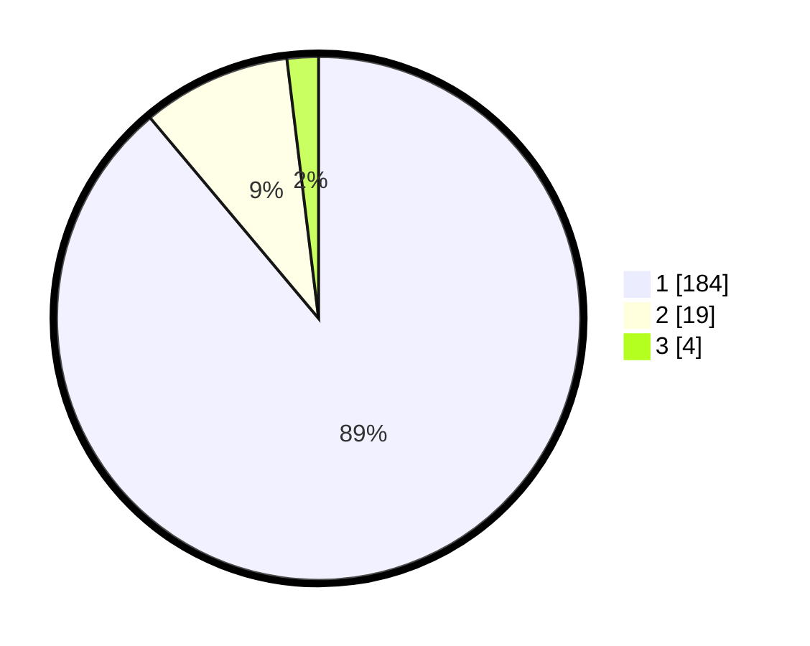

# Hasil

## Grafik

## Tabel

| No. | Nama Paslon    | Suara | Suara (raw) | Persentase |
|:--- |:-------------- | -----:| -----------:| ----------:|
| 1   | ANIES MUHAIMIN | 184   | [184][p-1]  | 88,89      |
| 2   | PRABOWO GIBRAN | 19    | [19][p-2]   | 9,18       |
| 3   | GANJAR MAHFUD  | 4     | [4][p-3]    | 1,93       |

[p-1]: https://github.com/gigit-pemilu/pemilu-2024/blob/main/pilpres/hitung-suara/sub/11-aceh/sub/08-aceh-utara/sub/04-lhoksukon/sub/2036-meunasah-tutong/sub/001-tps/sub/paslon-1.txt
[p-2]: https://github.com/gigit-pemilu/pemilu-2024/blob/main/pilpres/hitung-suara/sub/11-aceh/sub/08-aceh-utara/sub/04-lhoksukon/sub/2036-meunasah-tutong/sub/001-tps/sub/paslon-2.txt
[p-3]: https://github.com/gigit-pemilu/pemilu-2024/blob/main/pilpres/hitung-suara/sub/11-aceh/sub/08-aceh-utara/sub/04-lhoksukon/sub/2036-meunasah-tutong/sub/001-tps/sub/paslon-3.txt

## Foto C Plano

https://sirekap-obj-formc.kpu.go.id/50fa/pemilu/ppwp/11/08/04/20/36/1108042036001-20240215-085508--6e5b86d9-5986-4273-8d17-b10d156df10d.jpg

https://sirekap-obj-formc.kpu.go.id/50fa/pemilu/ppwp/11/08/04/20/36/1108042036001-20240215-085927--f5f9e36a-e771-4b9a-935d-62ffa94eecf9.jpg

https://sirekap-obj-formc.kpu.go.id/50fa/pemilu/ppwp/11/08/04/20/36/1108042036001-20240215-090307--b2c91987-37b5-4d72-a2b4-aa2377f42c76.jpg

## Metadata

| Key        | Value               |
| ---------- | ------------------- |
| Time Stamp | 2024-02-17 00:28:35 |

