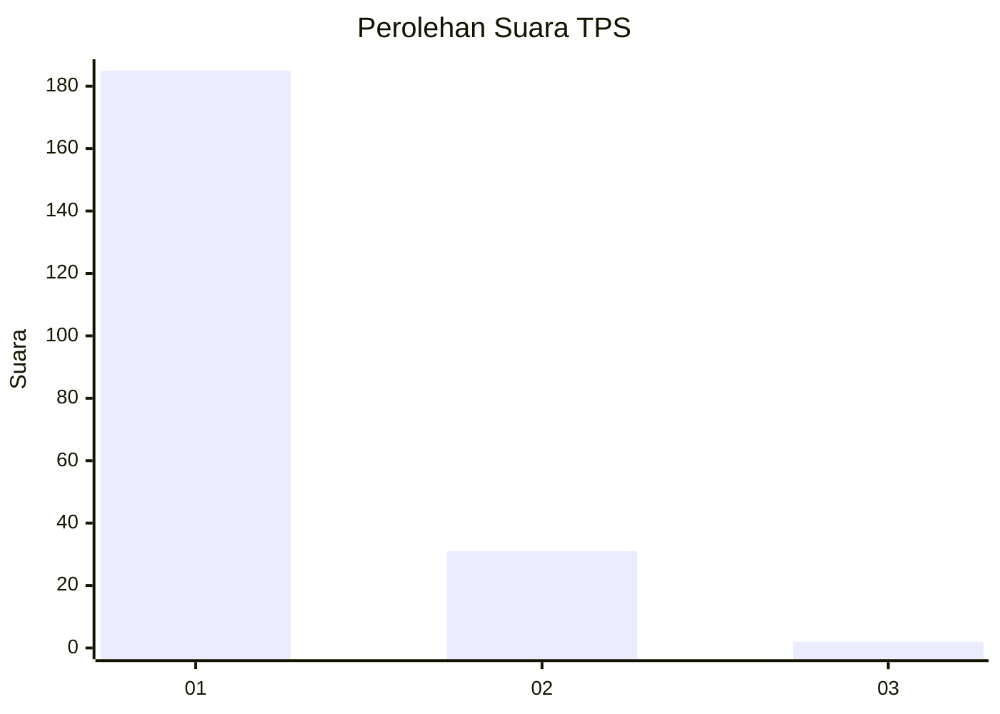
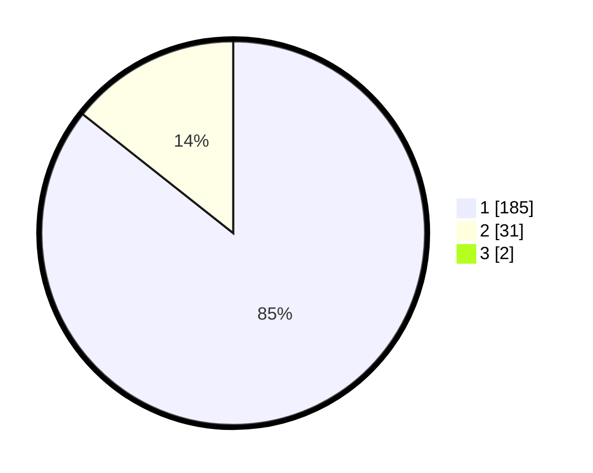

# Hasil

## Grafik

## Tabel

| No. | Nama Paslon    | Suara | Suara (raw) | Persentase |
|:--- |:-------------- | -----:| -----------:| ----------:|
| 1   | ANIES MUHAIMIN | 185   | [185][p-1]  | 84,86      |
| 2   | PRABOWO GIBRAN | 31    | [31][p-2]   | 14,22      |
| 3   | GANJAR MAHFUD  | 2     | [2][p-3]    | 0,92       |

[p-1]: https://github.com/gigit-pemilu/pemilu-2024-11-aceh/blob/main/pilpres/hitung-suara/sub/11-aceh/sub/08-aceh-utara/sub/04-lhoksukon/sub/2036-meunasah-tutong/sub/002-tps/sub/paslon-1.txt
[p-2]: https://github.com/gigit-pemilu/pemilu-2024-11-aceh/blob/main/pilpres/hitung-suara/sub/11-aceh/sub/08-aceh-utara/sub/04-lhoksukon/sub/2036-meunasah-tutong/sub/002-tps/sub/paslon-2.txt
[p-3]: https://github.com/gigit-pemilu/pemilu-2024-11-aceh/blob/main/pilpres/hitung-suara/sub/11-aceh/sub/08-aceh-utara/sub/04-lhoksukon/sub/2036-meunasah-tutong/sub/002-tps/sub/paslon-3.txt

## Foto C Plano

https://sirekap-obj-formc.kpu.go.id/3bb6/pemilu/ppwp/11/08/04/20/36/1108042036002-20240215-084922--a6361a10-acd8-49c8-a9d8-3d9165f5419c.jpg

https://sirekap-obj-formc.kpu.go.id/3bb6/pemilu/ppwp/11/08/04/20/36/1108042036002-20240215-085241--e944261a-1aa6-403c-bc83-d4946c915685.jpg

https://sirekap-obj-formc.kpu.go.id/3bb6/pemilu/ppwp/11/08/04/20/36/1108042036002-20240215-085531--1f140aeb-5460-4a08-b931-455b206d7318.jpg

## Metadata

| Key        | Value               |
| ---------- | ------------------- |
| Time Stamp | 2024-02-15 18:00:26 |

