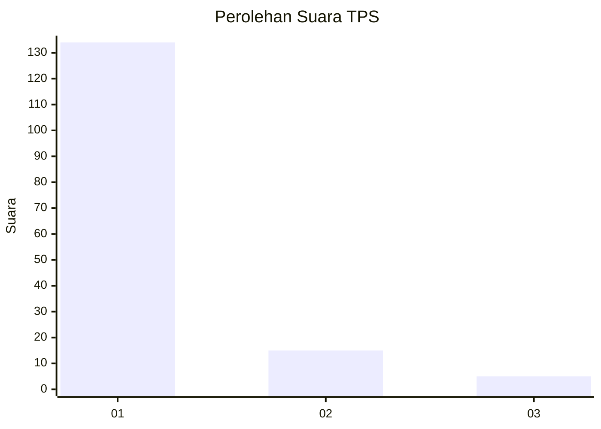
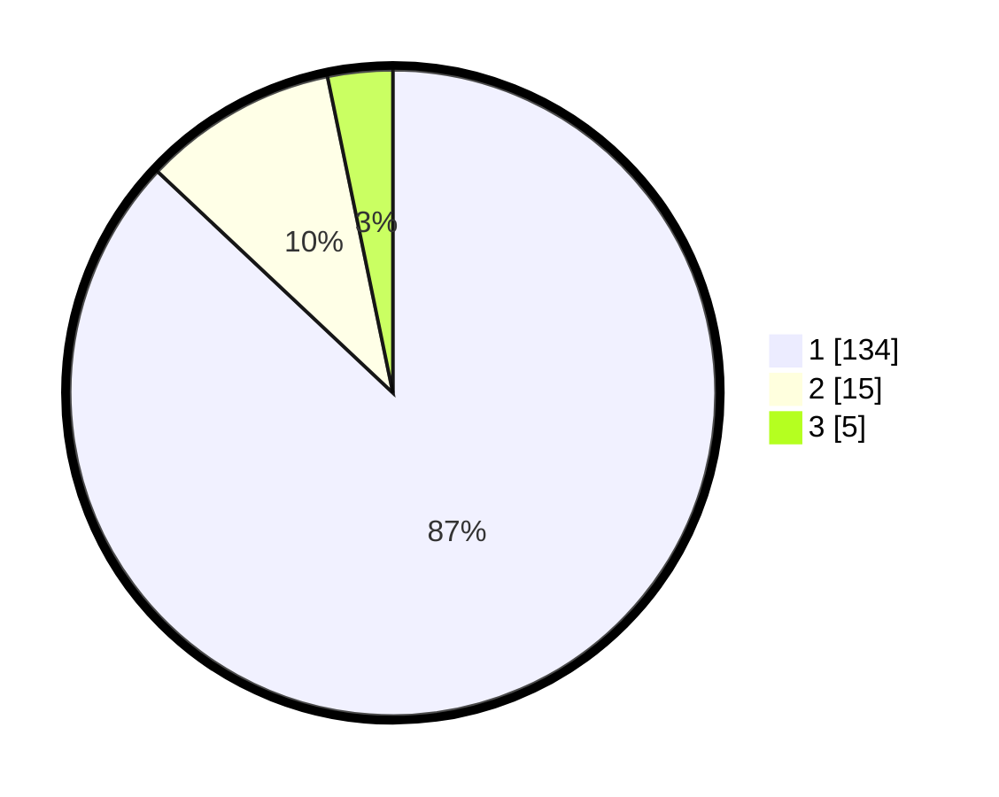

# Hasil

## Grafik

## Tabel

| No. | Nama Paslon    | Suara | Suara (raw) | Persentase |
|:--- |:-------------- | -----:| -----------:| ----------:|
| 1   | ANIES MUHAIMIN | 134   | [134][p-1]  | 87,01      |
| 2   | PRABOWO GIBRAN | 15    | [15][p-2]   | 9,74       |
| 3   | GANJAR MAHFUD  | 5     | [5][p-3]    | 3,25       |

[p-1]: https://github.com/gigit-pemilu/pemilu-2024-11-aceh/blob/main/pilpres/hitung-suara/sub/11-aceh/sub/08-aceh-utara/sub/04-lhoksukon/sub/2038-keutapang/sub/001-tps/sub/paslon-1.txt
[p-2]: https://github.com/gigit-pemilu/pemilu-2024-11-aceh/blob/main/pilpres/hitung-suara/sub/11-aceh/sub/08-aceh-utara/sub/04-lhoksukon/sub/2038-keutapang/sub/001-tps/sub/paslon-2.txt
[p-3]: https://github.com/gigit-pemilu/pemilu-2024-11-aceh/blob/main/pilpres/hitung-suara/sub/11-aceh/sub/08-aceh-utara/sub/04-lhoksukon/sub/2038-keutapang/sub/001-tps/sub/paslon-3.txt

## Foto C Plano

https://sirekap-obj-formc.kpu.go.id/d3e3/pemilu/ppwp/11/08/04/20/38/1108042038001-20240215-014812--881e203b-93b1-4966-b188-dc86b7b8cfba.jpg

https://sirekap-obj-formc.kpu.go.id/d3e3/pemilu/ppwp/11/08/04/20/38/1108042038001-20240214-234039--b82a4c12-48dd-40e5-9b86-7864fe662f40.jpg

https://sirekap-obj-formc.kpu.go.id/d3e3/pemilu/ppwp/11/08/04/20/38/1108042038001-20240214-234158--02b52908-ad16-40ec-93d4-1bd5be4cb0f6.jpg

## Metadata

| Key        | Value               |
| ---------- | ------------------- |
| Time Stamp | 2024-02-15 18:00:26 |

