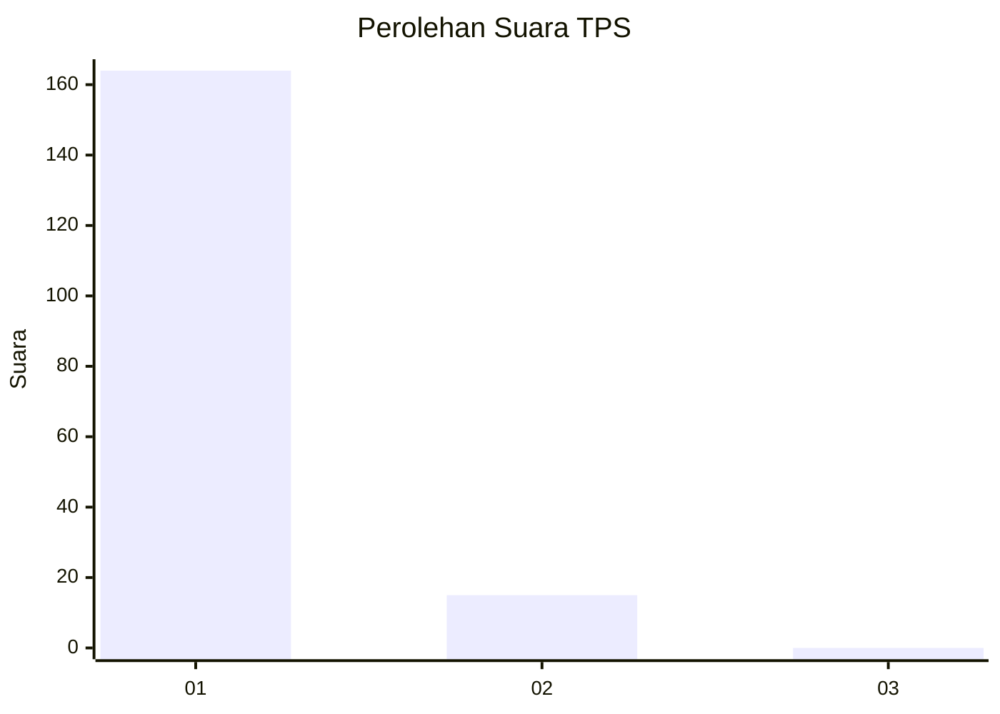
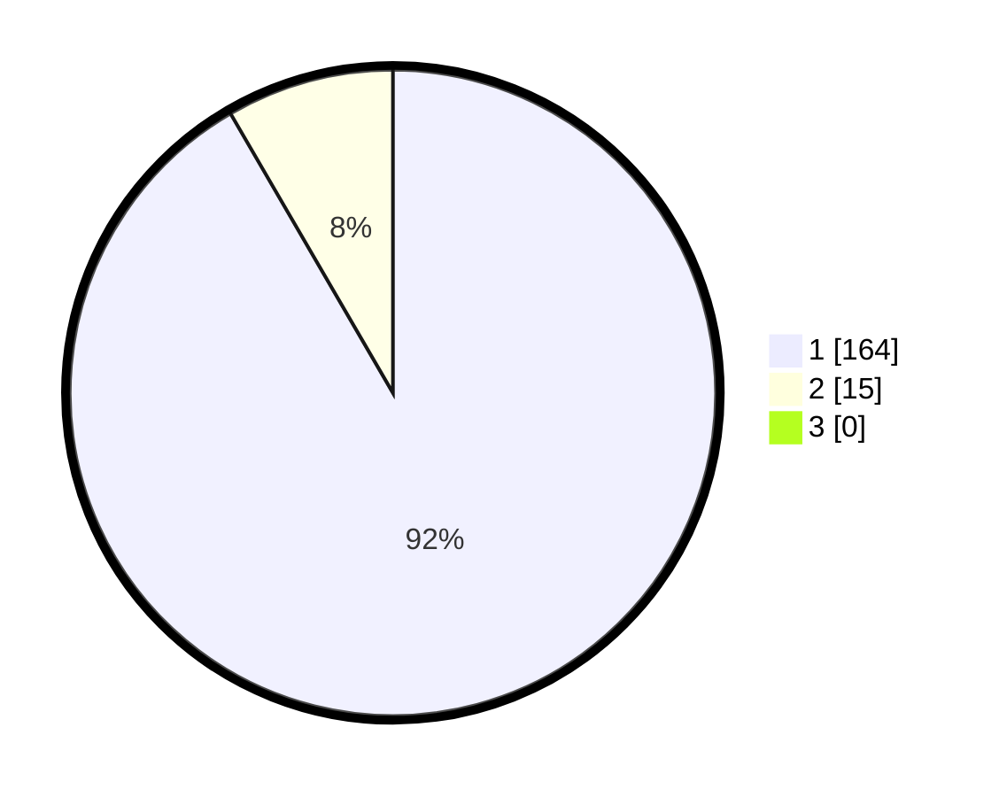

# Hasil

## Grafik

## Tabel

| No. | Nama Paslon    | Suara | Suara (raw) | Persentase |
|:--- |:-------------- | -----:| -----------:| ----------:|
| 1   | ANIES MUHAIMIN | 164   | [164][p-1]  | 91,62      |
| 2   | PRABOWO GIBRAN | 15    | [15][p-2]   | 8,38       |
| 3   | GANJAR MAHFUD  | 0     | [0][p-3]    | 0,00       |

[p-1]: https://github.com/gigit-pemilu/pemilu-2024-11-aceh/blob/main/pilpres/hitung-suara/sub/11-aceh/sub/08-aceh-utara/sub/04-lhoksukon/sub/2040-pulo-dulang/sub/001-tps/sub/paslon-1.txt
[p-2]: https://github.com/gigit-pemilu/pemilu-2024-11-aceh/blob/main/pilpres/hitung-suara/sub/11-aceh/sub/08-aceh-utara/sub/04-lhoksukon/sub/2040-pulo-dulang/sub/001-tps/sub/paslon-2.txt
[p-3]: https://github.com/gigit-pemilu/pemilu-2024-11-aceh/blob/main/pilpres/hitung-suara/sub/11-aceh/sub/08-aceh-utara/sub/04-lhoksukon/sub/2040-pulo-dulang/sub/001-tps/sub/paslon-3.txt

## Foto C Plano

https://sirekap-obj-formc.kpu.go.id/e276/pemilu/ppwp/11/08/04/20/40/1108042040001-20240215-002310--270bd5a3-9cec-4df6-924a-1890d386567c.jpg

https://sirekap-obj-formc.kpu.go.id/e276/pemilu/ppwp/11/08/04/20/40/1108042040001-20240215-002535--d06f7a94-b5fa-4e4f-afb4-bd63d7d6d5fb.jpg

https://sirekap-obj-formc.kpu.go.id/e276/pemilu/ppwp/11/08/04/20/40/1108042040001-20240215-002626--c2ced19c-6746-40ed-abde-ee5e09313cb3.jpg

## Metadata

| Key        | Value               |
| ---------- | ------------------- |
| Time Stamp | 2024-02-15 19:30:26 |

