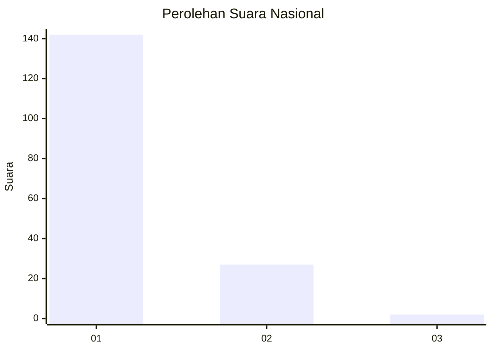
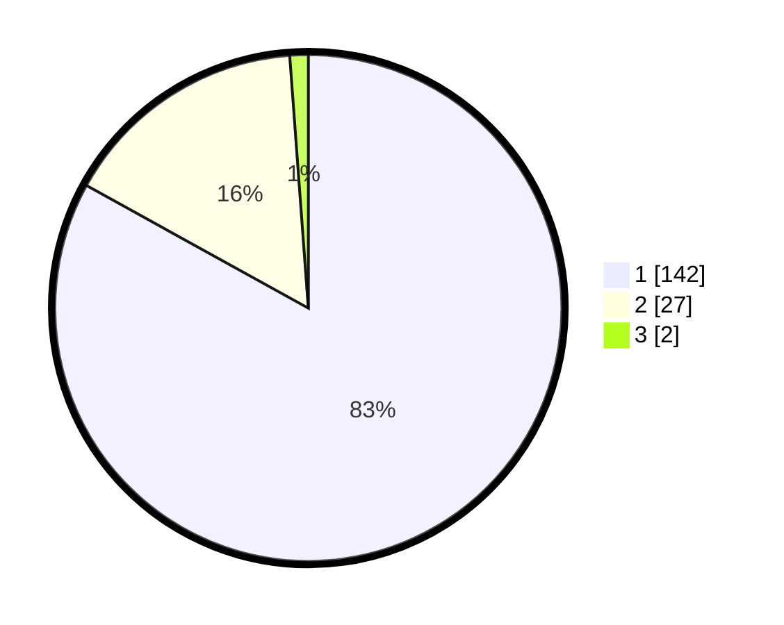

# Hasil

## Grafik

## Tabel

| No. | Nama Paslon    | Suara | Suara (raw) | Persentase |
|:--- |:-------------- | -----:| -----------:| ----------:|
| 1   | ANIES MUHAIMIN | 142   | [142][p-1]  | 83,04      |
| 2   | PRABOWO GIBRAN | 27    | [27][p-2]   | 15,79      |
| 3   | GANJAR MAHFUD  | 2     | [2][p-3]    | 1,17       |

[p-1]: https://github.com/gigit-pemilu/pemilu-2024/blob/main/pilpres/hitung-suara/sub/11-aceh/sub/08-aceh-utara/sub/04-lhoksukon/sub/2042-meunasah-geumata/sub/002-tps/sub/paslon-1.txt
[p-2]: https://github.com/gigit-pemilu/pemilu-2024/blob/main/pilpres/hitung-suara/sub/11-aceh/sub/08-aceh-utara/sub/04-lhoksukon/sub/2042-meunasah-geumata/sub/002-tps/sub/paslon-2.txt
[p-3]: https://github.com/gigit-pemilu/pemilu-2024/blob/main/pilpres/hitung-suara/sub/11-aceh/sub/08-aceh-utara/sub/04-lhoksukon/sub/2042-meunasah-geumata/sub/002-tps/sub/paslon-3.txt

## Foto C Plano

https://sirekap-obj-formc.kpu.go.id/76c9/pemilu/ppwp/11/08/04/20/42/1108042042002-20240214-155837--961c955a-bf37-47d1-8a78-6397b17a9c20.jpg

https://sirekap-obj-formc.kpu.go.id/76c9/pemilu/ppwp/11/08/04/20/42/1108042042002-20240214-160124--19f7ad21-18a4-420c-beb5-1a313a5ae142.jpg

https://sirekap-obj-formc.kpu.go.id/76c9/pemilu/ppwp/11/08/04/20/42/1108042042002-20240215-055625--ab9030ec-5346-4401-b6b0-e016a54ddfdd.jpg

## Metadata

| Key        | Value               |
| ---------- | ------------------- |
| Time Stamp | 2024-02-16 23:00:00 |

