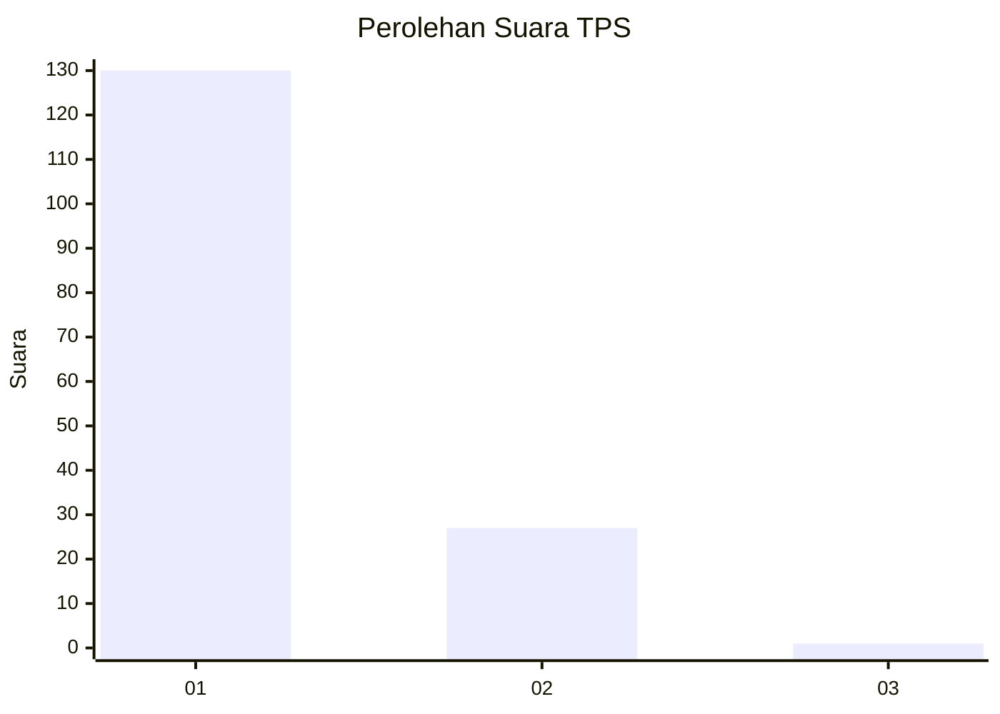
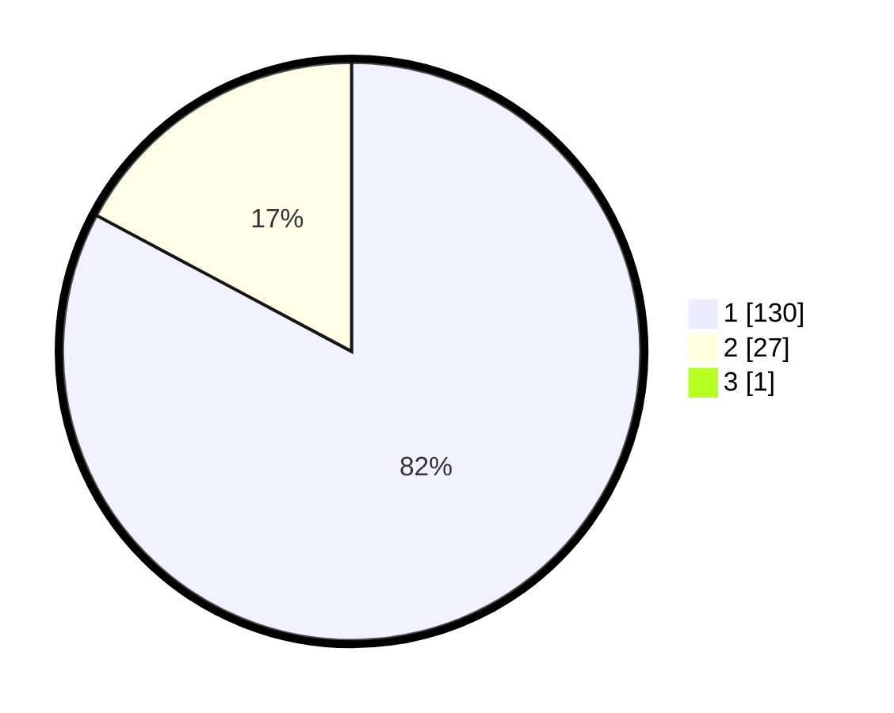

# Hasil

## Grafik

## Tabel

| No. | Nama Paslon    | Suara | Suara (raw) | Persentase |
|:--- |:-------------- | -----:| -----------:| ----------:|
| 1   | ANIES MUHAIMIN | 130   | [130][p-1]  | 82,28      |
| 2   | PRABOWO GIBRAN | 27    | [27][p-2]   | 17,09      |
| 3   | GANJAR MAHFUD  | 1     | [1][p-3]    | 0,63       |

[p-1]: https://github.com/gigit-pemilu/pemilu-2024-11-aceh/blob/main/pilpres/hitung-suara/sub/11-aceh/sub/08-aceh-utara/sub/04-lhoksukon/sub/2042-meunasah-geumata/sub/003-tps/sub/paslon-1.txt
[p-2]: https://github.com/gigit-pemilu/pemilu-2024-11-aceh/blob/main/pilpres/hitung-suara/sub/11-aceh/sub/08-aceh-utara/sub/04-lhoksukon/sub/2042-meunasah-geumata/sub/003-tps/sub/paslon-2.txt
[p-3]: https://github.com/gigit-pemilu/pemilu-2024-11-aceh/blob/main/pilpres/hitung-suara/sub/11-aceh/sub/08-aceh-utara/sub/04-lhoksukon/sub/2042-meunasah-geumata/sub/003-tps/sub/paslon-3.txt

## Foto C Plano

https://sirekap-obj-formc.kpu.go.id/8d34/pemilu/ppwp/11/08/04/20/42/1108042042003-20240215-060639--23f993d8-2cd2-404a-bab8-ae06dfe38adf.jpg

https://sirekap-obj-formc.kpu.go.id/8d34/pemilu/ppwp/11/08/04/20/42/1108042042003-20240215-060828--ea14779b-7cf9-4f17-a739-64d05c7081bc.jpg

https://sirekap-obj-formc.kpu.go.id/8d34/pemilu/ppwp/11/08/04/20/42/1108042042003-20240215-061030--e4250f03-d685-4dce-9a81-a14d93a3c8e2.jpg

## Metadata

| Key        | Value               |
| ---------- | ------------------- |
| Time Stamp | 2024-02-15 18:30:25 |

