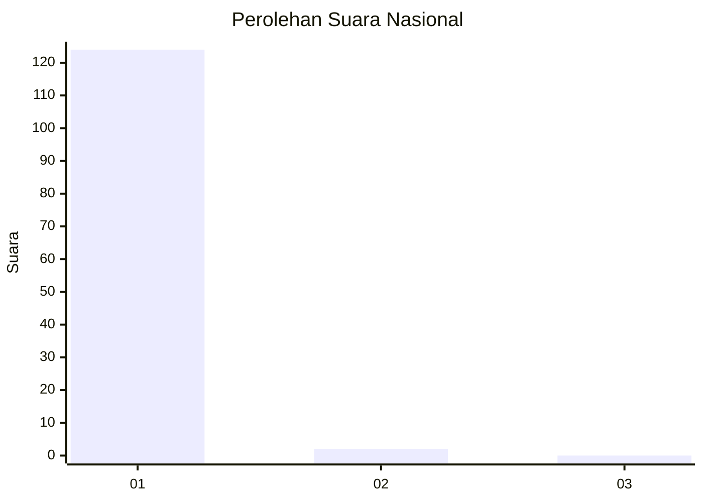
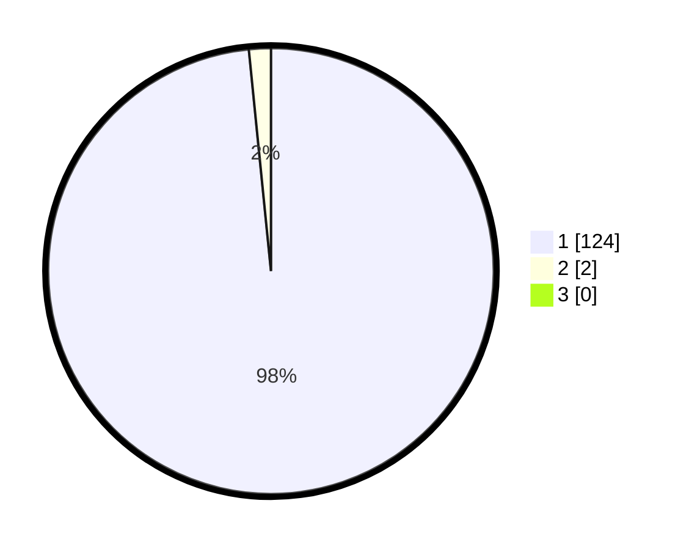

# Hasil

## Grafik

## Tabel

| No. | Nama Paslon    | Suara | Suara (raw) | Persentase |
|:--- |:-------------- | -----:| -----------:| ----------:|
| 1   | ANIES MUHAIMIN | 124   | [124][p-1]  | 98,41      |
| 2   | PRABOWO GIBRAN | 2     | [2][p-2]    | 1,59       |
| 3   | GANJAR MAHFUD  | 0     | [0][p-3]    | 0,00       |

[p-1]: https://github.com/gigit-pemilu/pemilu-2024/blob/main/pilpres/hitung-suara/sub/11-aceh/sub/08-aceh-utara/sub/04-lhoksukon/sub/2043-meunasah-meureubo/sub/002-tps/sub/paslon-1.txt
[p-2]: https://github.com/gigit-pemilu/pemilu-2024/blob/main/pilpres/hitung-suara/sub/11-aceh/sub/08-aceh-utara/sub/04-lhoksukon/sub/2043-meunasah-meureubo/sub/002-tps/sub/paslon-2.txt
[p-3]: https://github.com/gigit-pemilu/pemilu-2024/blob/main/pilpres/hitung-suara/sub/11-aceh/sub/08-aceh-utara/sub/04-lhoksukon/sub/2043-meunasah-meureubo/sub/002-tps/sub/paslon-3.txt

## Foto C Plano

https://sirekap-obj-formc.kpu.go.id/9e9e/pemilu/ppwp/11/08/04/20/43/1108042043002-20240215-080958--95e31a0f-7b15-41a1-8746-b143b2135343.jpg

https://sirekap-obj-formc.kpu.go.id/9e9e/pemilu/ppwp/11/08/04/20/43/1108042043002-20240215-022211--3ede4ead-56c7-42d6-be21-5e71623f6145.jpg

https://sirekap-obj-formc.kpu.go.id/9e9e/pemilu/ppwp/11/08/04/20/43/1108042043002-20240215-080740--086575cb-4d55-4cc0-95a3-b2a2157cc9ca.jpg

## Metadata

| Key        | Value               |
| ---------- | ------------------- |
| Time Stamp | 2024-02-15 20:30:46 |

