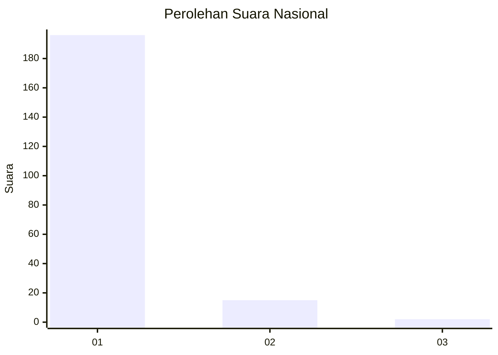
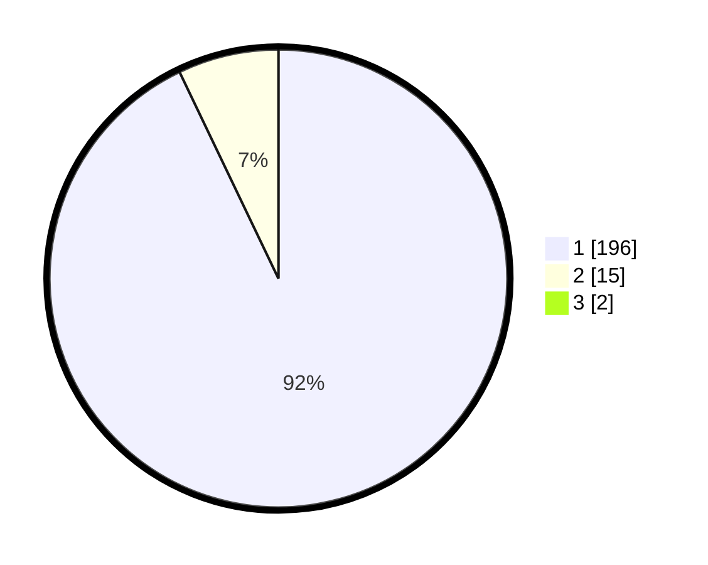

# Hasil

## Grafik

## Tabel

| No. | Nama Paslon    | Suara | Suara (raw) | Persentase |
|:--- |:-------------- | -----:| -----------:| ----------:|
| 1   | ANIES MUHAIMIN | 196   | [196][p-1]  | 92,02      |
| 2   | PRABOWO GIBRAN | 15    | [15][p-2]   | 7,04       |
| 3   | GANJAR MAHFUD  | 2     | [2][p-3]    | 0,94       |

[p-1]: https://github.com/gigit-pemilu/pemilu-2024/blob/main/pilpres/hitung-suara/sub/11-aceh/sub/08-aceh-utara/sub/04-lhoksukon/sub/2044-meunasah-dayah-lt/sub/001-tps/sub/paslon-1.txt
[p-2]: https://github.com/gigit-pemilu/pemilu-2024/blob/main/pilpres/hitung-suara/sub/11-aceh/sub/08-aceh-utara/sub/04-lhoksukon/sub/2044-meunasah-dayah-lt/sub/001-tps/sub/paslon-2.txt
[p-3]: https://github.com/gigit-pemilu/pemilu-2024/blob/main/pilpres/hitung-suara/sub/11-aceh/sub/08-aceh-utara/sub/04-lhoksukon/sub/2044-meunasah-dayah-lt/sub/001-tps/sub/paslon-3.txt

## Foto C Plano

https://sirekap-obj-formc.kpu.go.id/4bde/pemilu/ppwp/11/08/04/20/44/1108042044001-20240215-022235--920ea9f5-a40b-4cb7-94a4-afc800c44716.jpg

https://sirekap-obj-formc.kpu.go.id/4bde/pemilu/ppwp/11/08/04/20/44/1108042044001-20240215-041057--08ca3378-2ef6-40e0-9aff-3f7a952e497b.jpg

https://sirekap-obj-formc.kpu.go.id/4bde/pemilu/ppwp/11/08/04/20/44/1108042044001-20240215-022410--e9628eae-d936-4e63-9031-a6ef63be042d.jpg

## Metadata

| Key        | Value               |
| ---------- | ------------------- |
| Time Stamp | 2024-02-16 23:00:00 |

