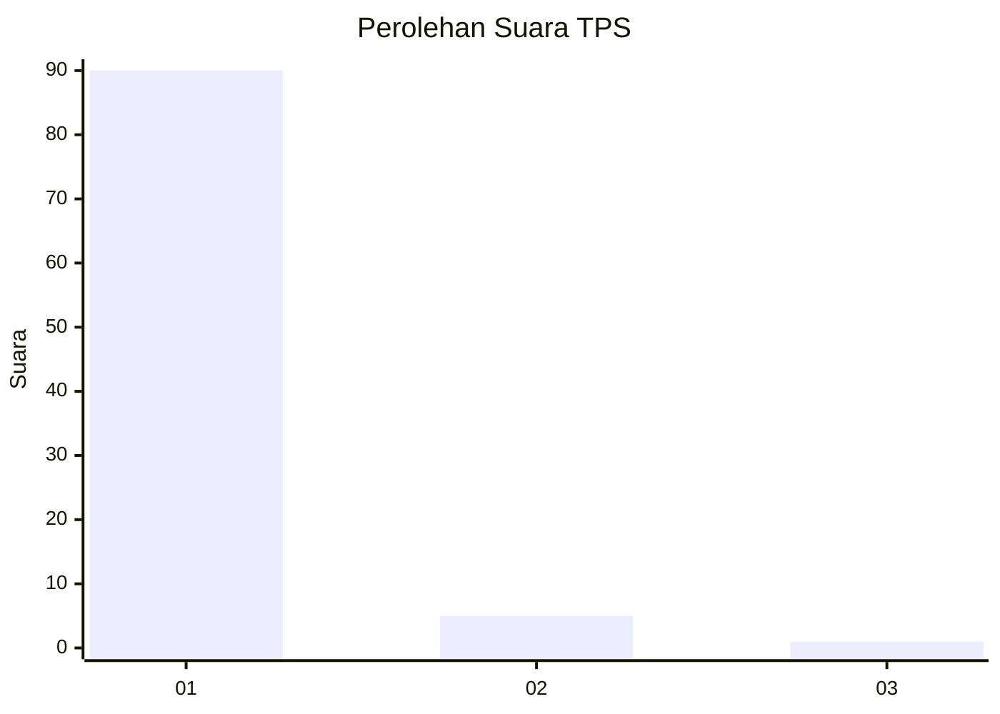
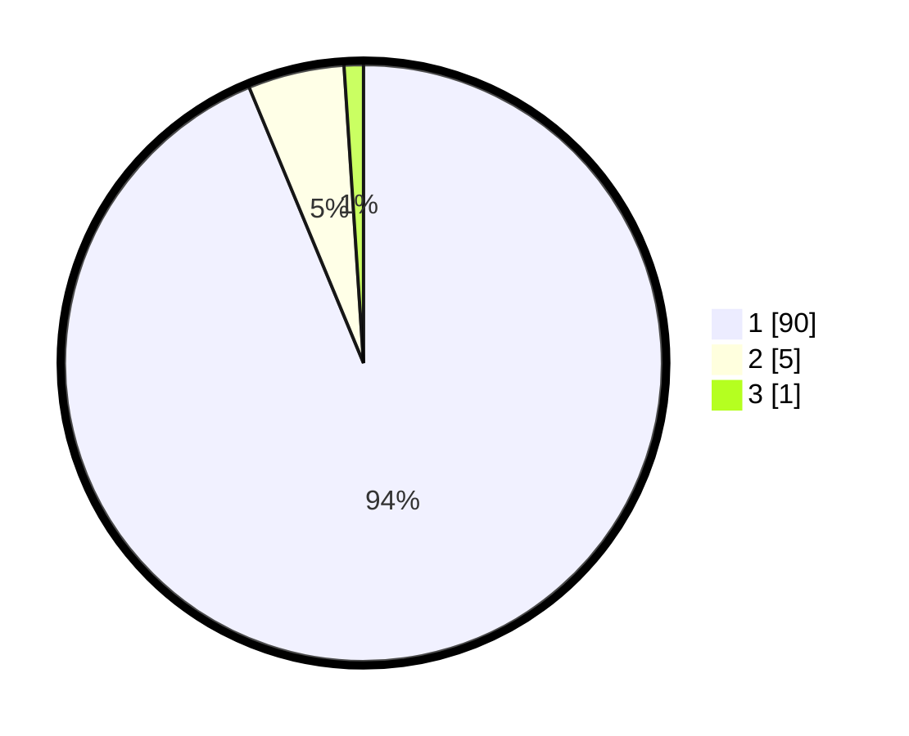

# Hasil

## Grafik

## Tabel

| No. | Nama Paslon    | Suara | Suara (raw) | Persentase |
|:--- |:-------------- | -----:| -----------:| ----------:|
| 1   | ANIES MUHAIMIN | 90    | [90][p-1]   | 93,75      |
| 2   | PRABOWO GIBRAN | 5     | [5][p-2]    | 5,21       |
| 3   | GANJAR MAHFUD  | 1     | [1][p-3]    | 1,04       |

[p-1]: https://github.com/gigit-pemilu/pemilu-2024-11-aceh/blob/main/pilpres/hitung-suara/sub/11-aceh/sub/08-aceh-utara/sub/04-lhoksukon/sub/2045-arongan-lt/sub/001-tps/sub/paslon-1.txt
[p-2]: https://github.com/gigit-pemilu/pemilu-2024-11-aceh/blob/main/pilpres/hitung-suara/sub/11-aceh/sub/08-aceh-utara/sub/04-lhoksukon/sub/2045-arongan-lt/sub/001-tps/sub/paslon-2.txt
[p-3]: https://github.com/gigit-pemilu/pemilu-2024-11-aceh/blob/main/pilpres/hitung-suara/sub/11-aceh/sub/08-aceh-utara/sub/04-lhoksukon/sub/2045-arongan-lt/sub/001-tps/sub/paslon-3.txt

## Foto C Plano

https://sirekap-obj-formc.kpu.go.id/e7eb/pemilu/ppwp/11/08/04/20/45/1108042045001-20240214-193954--7e871009-4342-406e-971f-44e1d7e81529.jpg

https://sirekap-obj-formc.kpu.go.id/e7eb/pemilu/ppwp/11/08/04/20/45/1108042045001-20240214-194014--c1dce85e-76a0-4dbf-bb2f-d1048fefb6b6.jpg

https://sirekap-obj-formc.kpu.go.id/e7eb/pemilu/ppwp/11/08/04/20/45/1108042045001-20240214-194036--4508b30a-5a1c-47af-89d7-db37d828b1f5.jpg

## Metadata

| Key        | Value               |
| ---------- | ------------------- |
| Time Stamp | 2024-02-14 21:46:01 |

## DATA PEMILIH TETAP

Jumlah pemilih dalam DPT: **95**.
 * L: **48**.
 * P: **47**.

## DATA PENGGUNA HAK PILIH

Jumlah pengguna hak pilih dalam DPT: **95**.
 * L: **48**.
 * P: **47**.

Jumlah pengguna hak pilih dalam DPTb: **1**.
 * L: **1**.
 * P: **0**.

Jumlah pengguna hak pilih dalam DPK: **0**.
 * L: **0**.
 * P: **0**.

Jumlah pengguna hak pilih: **96**.
 * L: **49**.
 * P: **47**.

## JUMLAH SUARA SAH DAN TIDAK SAH

JUMLAH SELURUH SUARA SAH: **96**.

JUMLAH SUARA TIDAK SAH: **0**.

JUMLAH SELURUH SUARA SAH DAN SUARA TIDAK SAH: **96**.

