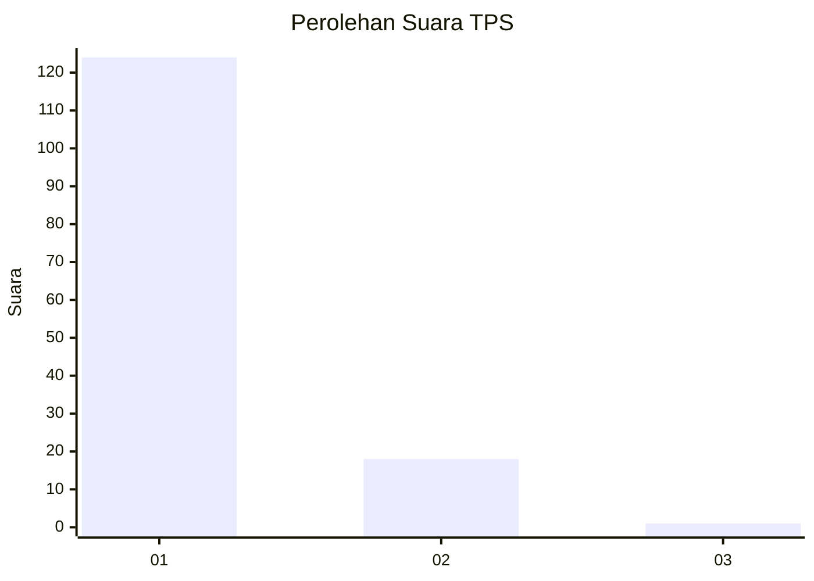
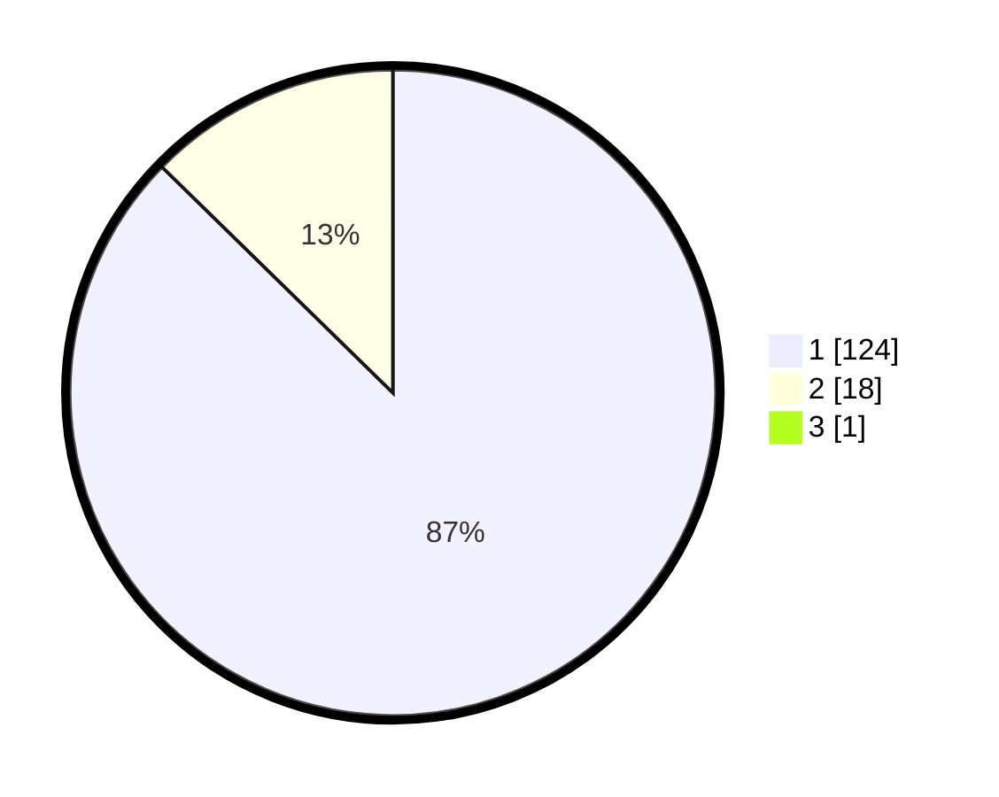

# Hasil

## Grafik

## Tabel

| No. | Nama Paslon    | Suara | Suara (raw) | Persentase |
|:--- |:-------------- | -----:| -----------:| ----------:|
| 1   | ANIES MUHAIMIN | 124   | [124][p-1]  | 86,71      |
| 2   | PRABOWO GIBRAN | 18    | [18][p-2]   | 12,59      |
| 3   | GANJAR MAHFUD  | 1     | [1][p-3]    | 0,70       |

[p-1]: https://github.com/gigit-pemilu/pemilu-2024-11-aceh/blob/main/pilpres/hitung-suara/sub/11-aceh/sub/08-aceh-utara/sub/04-lhoksukon/sub/2050-alue-itam-reudeup/sub/001-tps/sub/paslon-1.txt
[p-2]: https://github.com/gigit-pemilu/pemilu-2024-11-aceh/blob/main/pilpres/hitung-suara/sub/11-aceh/sub/08-aceh-utara/sub/04-lhoksukon/sub/2050-alue-itam-reudeup/sub/001-tps/sub/paslon-2.txt
[p-3]: https://github.com/gigit-pemilu/pemilu-2024-11-aceh/blob/main/pilpres/hitung-suara/sub/11-aceh/sub/08-aceh-utara/sub/04-lhoksukon/sub/2050-alue-itam-reudeup/sub/001-tps/sub/paslon-3.txt

## Foto C Plano

https://sirekap-obj-formc.kpu.go.id/937b/pemilu/ppwp/11/08/04/20/50/1108042050001-20240214-160129--73e3109c-54d1-418e-b268-6f3aa93aa730.jpg

https://sirekap-obj-formc.kpu.go.id/937b/pemilu/ppwp/11/08/04/20/50/1108042050001-20240214-225123--c539457f-2866-4186-9d86-e4aac0bc15d7.jpg

https://sirekap-obj-formc.kpu.go.id/937b/pemilu/ppwp/11/08/04/20/50/1108042050001-20240214-203944--d09c9fad-77a7-4122-9fa2-e4502cfbe9c4.jpg

## Metadata

| Key        | Value               |
| ---------- | ------------------- |
| Time Stamp | 2024-02-16 23:00:00 |

