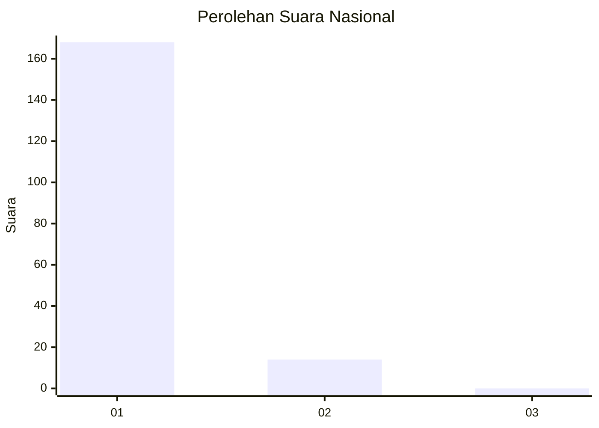
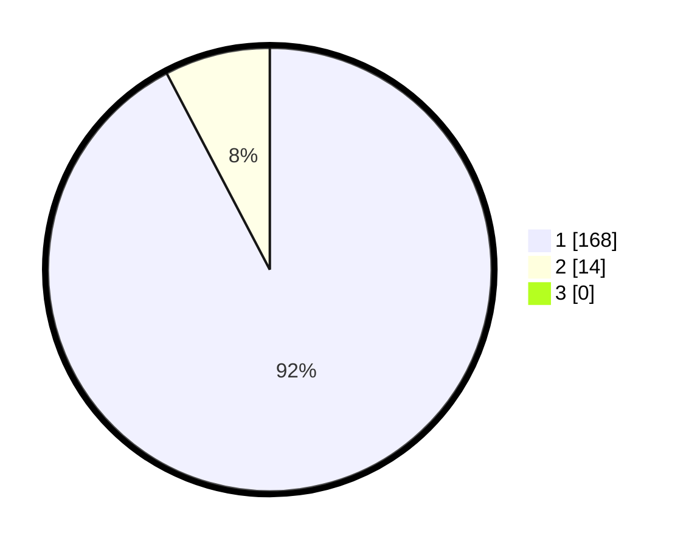

# Hasil

## Grafik

## Tabel

| No. | Nama Paslon    | Suara | Suara (raw) | Persentase |
|:--- |:-------------- | -----:| -----------:| ----------:|
| 1   | ANIES MUHAIMIN | 168   | [168][p-1]  | 92,31      |
| 2   | PRABOWO GIBRAN | 14    | [14][p-2]   | 7,69       |
| 3   | GANJAR MAHFUD  | 0     | [0][p-3]    | 0,00       |

[p-1]: https://github.com/gigit-pemilu/pemilu-2024/blob/main/pilpres/hitung-suara/sub/11-aceh/sub/08-aceh-utara/sub/04-lhoksukon/sub/2052-meunasah-nga-lt/sub/001-tps/sub/paslon-1.txt
[p-2]: https://github.com/gigit-pemilu/pemilu-2024/blob/main/pilpres/hitung-suara/sub/11-aceh/sub/08-aceh-utara/sub/04-lhoksukon/sub/2052-meunasah-nga-lt/sub/001-tps/sub/paslon-2.txt
[p-3]: https://github.com/gigit-pemilu/pemilu-2024/blob/main/pilpres/hitung-suara/sub/11-aceh/sub/08-aceh-utara/sub/04-lhoksukon/sub/2052-meunasah-nga-lt/sub/001-tps/sub/paslon-3.txt

## Foto C Plano

https://sirekap-obj-formc.kpu.go.id/622b/pemilu/ppwp/11/08/04/20/52/1108042052001-20240215-041942--223df2b6-e4fe-4d9d-aa5a-bb7521aebc2b.jpg

https://sirekap-obj-formc.kpu.go.id/622b/pemilu/ppwp/11/08/04/20/52/1108042052001-20240215-042140--0da79ea6-8282-46d9-af55-289f4681e507.jpg

https://sirekap-obj-formc.kpu.go.id/622b/pemilu/ppwp/11/08/04/20/52/1108042052001-20240215-042455--6018a8be-f89f-49b8-97e4-85d89d358460.jpg

## Metadata

| Key        | Value               |
| ---------- | ------------------- |
| Time Stamp | 2024-02-17 19:00:04 |

