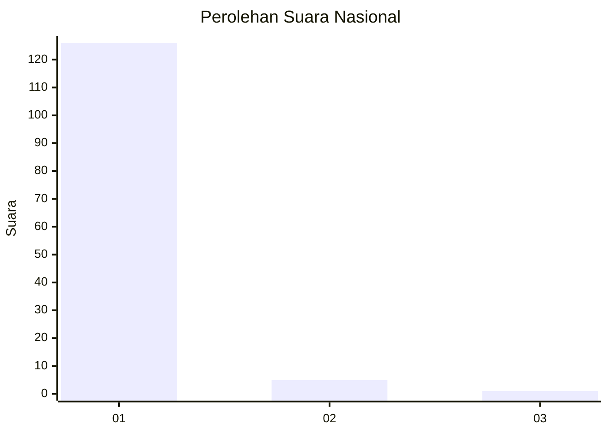
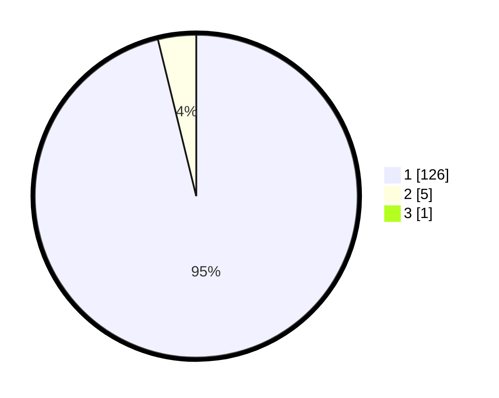

# Hasil

## Grafik

## Tabel

| No. | Nama Paslon    | Suara | Suara (raw) | Persentase |
|:--- |:-------------- | -----:| -----------:| ----------:|
| 1   | ANIES MUHAIMIN | 126   | [126][p-1]  | 95,45      |
| 2   | PRABOWO GIBRAN | 5     | [5][p-2]    | 3,79       |
| 3   | GANJAR MAHFUD  | 1     | [1][p-3]    | 0,76       |

[p-1]: https://github.com/gigit-pemilu/pemilu-2024/blob/main/pilpres/hitung-suara/sub/11-aceh/sub/08-aceh-utara/sub/04-lhoksukon/sub/2055-seuneubok-dalam/sub/002-tps/sub/paslon-1.txt
[p-2]: https://github.com/gigit-pemilu/pemilu-2024/blob/main/pilpres/hitung-suara/sub/11-aceh/sub/08-aceh-utara/sub/04-lhoksukon/sub/2055-seuneubok-dalam/sub/002-tps/sub/paslon-2.txt
[p-3]: https://github.com/gigit-pemilu/pemilu-2024/blob/main/pilpres/hitung-suara/sub/11-aceh/sub/08-aceh-utara/sub/04-lhoksukon/sub/2055-seuneubok-dalam/sub/002-tps/sub/paslon-3.txt

## Foto C Plano

https://sirekap-obj-formc.kpu.go.id/a30a/pemilu/ppwp/11/08/04/20/55/1108042055002-20240215-110328--49fe2085-3ba3-40c7-b5b4-1a3d32f59b26.jpg

https://sirekap-obj-formc.kpu.go.id/a30a/pemilu/ppwp/11/08/04/20/55/1108042055002-20240215-110444--5788d2ca-a0e4-40df-a36b-c6d3acbd7093.jpg

https://sirekap-obj-formc.kpu.go.id/a30a/pemilu/ppwp/11/08/04/20/55/1108042055002-20240215-110604--14288fc9-beaf-47c3-8b7e-26b0d97eba89.jpg

## Metadata

| Key        | Value               |
| ---------- | ------------------- |
| Time Stamp | 2024-02-15 18:00:26 |

