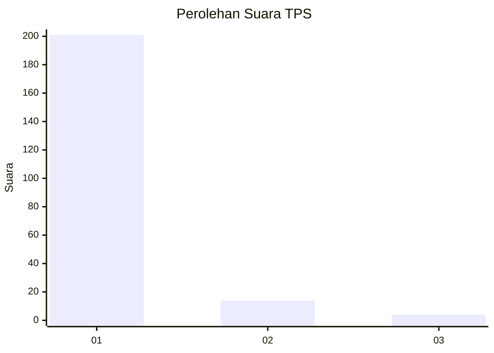
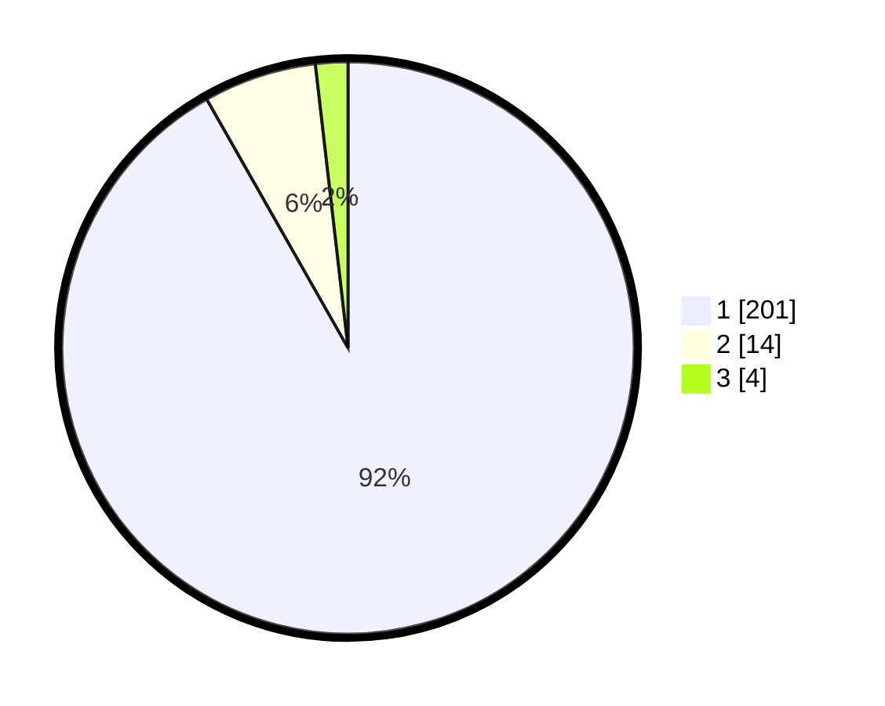

# Hasil

## Grafik

## Tabel

| No. | Nama Paslon    | Suara | Suara (raw) | Persentase |
|:--- |:-------------- | -----:| -----------:| ----------:|
| 1   | ANIES MUHAIMIN | 201   | [201][p-1]  | 91,78      |
| 2   | PRABOWO GIBRAN | 14    | [14][p-2]   | 6,39       |
| 3   | GANJAR MAHFUD  | 4     | [4][p-3]    | 1,83       |

[p-1]: https://github.com/gigit-pemilu/pemilu-2024-11-aceh/blob/main/pilpres/hitung-suara/sub/11-aceh/sub/08-aceh-utara/sub/04-lhoksukon/sub/2056-alue-eumpok/sub/001-tps/sub/paslon-1.txt
[p-2]: https://github.com/gigit-pemilu/pemilu-2024-11-aceh/blob/main/pilpres/hitung-suara/sub/11-aceh/sub/08-aceh-utara/sub/04-lhoksukon/sub/2056-alue-eumpok/sub/001-tps/sub/paslon-2.txt
[p-3]: https://github.com/gigit-pemilu/pemilu-2024-11-aceh/blob/main/pilpres/hitung-suara/sub/11-aceh/sub/08-aceh-utara/sub/04-lhoksukon/sub/2056-alue-eumpok/sub/001-tps/sub/paslon-3.txt

## Foto C Plano

https://sirekap-obj-formc.kpu.go.id/5777/pemilu/ppwp/11/08/04/20/56/1108042056001-20240215-064307--075f5f39-8725-4617-8249-bbda74fb83d9.jpg

https://sirekap-obj-formc.kpu.go.id/5777/pemilu/ppwp/11/08/04/20/56/1108042056001-20240215-064627--22ea9d29-4d6c-47b8-995c-a74cda54f10d.jpg

https://sirekap-obj-formc.kpu.go.id/5777/pemilu/ppwp/11/08/04/20/56/1108042056001-20240215-065315--2ce3fb4b-6288-4dc0-b82a-ea5bc67c680c.jpg

## Metadata

| Key        | Value               |
| ---------- | ------------------- |
| Time Stamp | 2024-02-15 22:30:27 |

