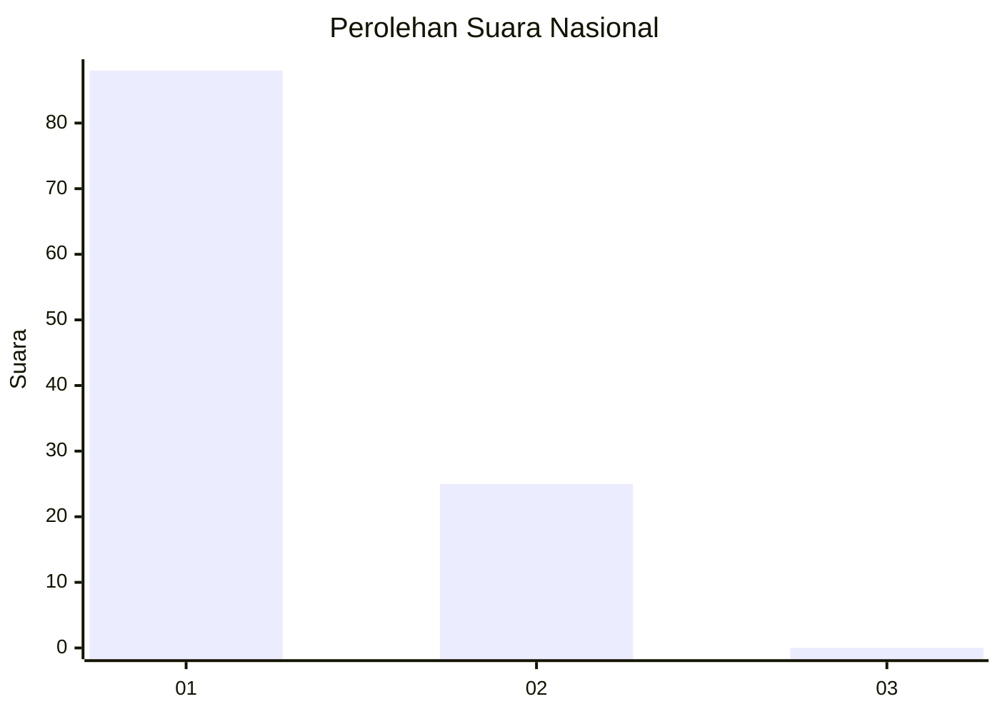
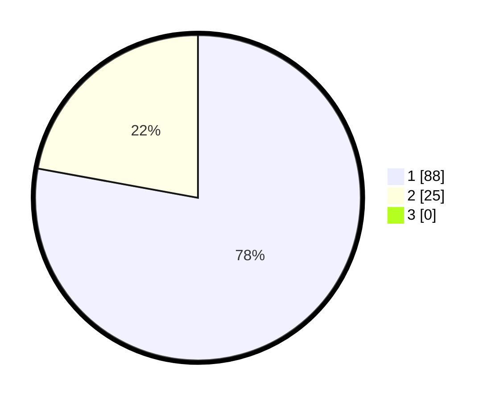

# Hasil

## Grafik

## Tabel

| No. | Nama Paslon    | Suara | Suara (raw) | Persentase |
|:--- |:-------------- | -----:| -----------:| ----------:|
| 1   | ANIES MUHAIMIN | 88    | [88][p-1]   | 77,88      |
| 2   | PRABOWO GIBRAN | 25    | [25][p-2]   | 22,12      |
| 3   | GANJAR MAHFUD  | 0     | [0][p-3]    | 0,00       |

[p-1]: https://github.com/gigit-pemilu/pemilu-2024/blob/main/pilpres/hitung-suara/sub/11-aceh/sub/08-aceh-utara/sub/04-lhoksukon/sub/2063-geulumpang/sub/002-tps/sub/paslon-1.txt
[p-2]: https://github.com/gigit-pemilu/pemilu-2024/blob/main/pilpres/hitung-suara/sub/11-aceh/sub/08-aceh-utara/sub/04-lhoksukon/sub/2063-geulumpang/sub/002-tps/sub/paslon-2.txt
[p-3]: https://github.com/gigit-pemilu/pemilu-2024/blob/main/pilpres/hitung-suara/sub/11-aceh/sub/08-aceh-utara/sub/04-lhoksukon/sub/2063-geulumpang/sub/002-tps/sub/paslon-3.txt

## Foto C Plano

https://sirekap-obj-formc.kpu.go.id/e61c/pemilu/ppwp/11/08/04/20/63/1108042063002-20240215-094525--dedadd02-3238-468a-88ad-a5ed74610bc9.jpg

https://sirekap-obj-formc.kpu.go.id/e61c/pemilu/ppwp/11/08/04/20/63/1108042063002-20240215-013003--aa058b47-0328-4617-a25d-c75ab3bc82d3.jpg

https://sirekap-obj-formc.kpu.go.id/e61c/pemilu/ppwp/11/08/04/20/63/1108042063002-20240215-034639--69a58ac6-6ef7-4499-ad3a-ee96c1d469b5.jpg

## Metadata

| Key        | Value               |
| ---------- | ------------------- |
| Time Stamp | 2024-02-17 00:28:35 |

