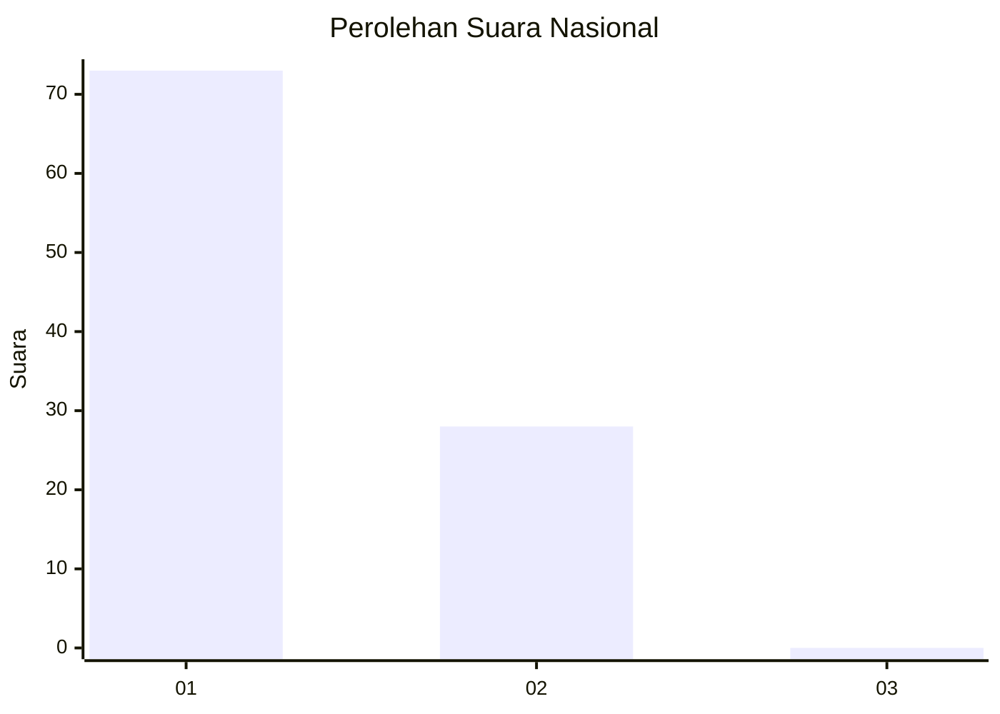
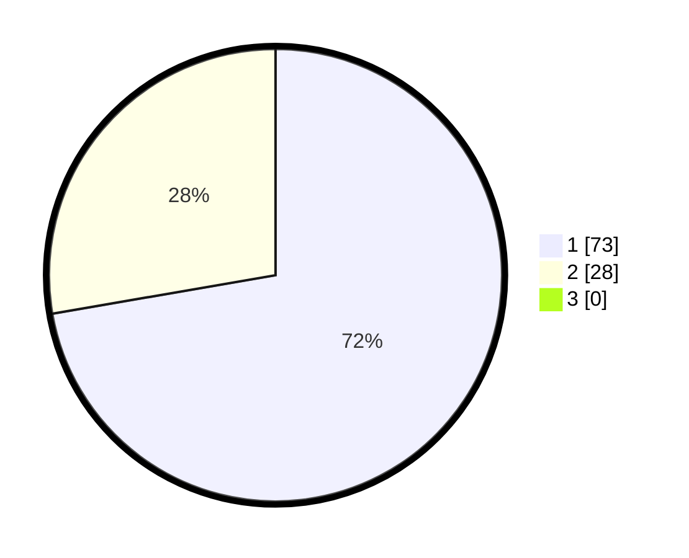

# Hasil

## Grafik

## Tabel

| No. | Nama Paslon    | Suara | Suara (raw) | Persentase |
|:--- |:-------------- | -----:| -----------:| ----------:|
| 1   | ANIES MUHAIMIN | 73    | [73][p-1]   | 72,28      |
| 2   | PRABOWO GIBRAN | 28    | [28][p-2]   | 27,72      |
| 3   | GANJAR MAHFUD  | 0     | [0][p-3]    | 0,00       |

[p-1]: https://github.com/gigit-pemilu/pemilu-2024/blob/main/pilpres/hitung-suara/sub/11-aceh/sub/08-aceh-utara/sub/04-lhoksukon/sub/2066-meucat/sub/001-tps/sub/paslon-1.txt
[p-2]: https://github.com/gigit-pemilu/pemilu-2024/blob/main/pilpres/hitung-suara/sub/11-aceh/sub/08-aceh-utara/sub/04-lhoksukon/sub/2066-meucat/sub/001-tps/sub/paslon-2.txt
[p-3]: https://github.com/gigit-pemilu/pemilu-2024/blob/main/pilpres/hitung-suara/sub/11-aceh/sub/08-aceh-utara/sub/04-lhoksukon/sub/2066-meucat/sub/001-tps/sub/paslon-3.txt

## Foto C Plano

https://sirekap-obj-formc.kpu.go.id/a608/pemilu/ppwp/11/08/04/20/66/1108042066001-20240216-131640--882ca98e-8c4f-4ad8-9a55-2c6d67af9c91.jpg

https://sirekap-obj-formc.kpu.go.id/a608/pemilu/ppwp/11/08/04/20/66/1108042066001-20240214-215615--38579106-5af4-4515-a621-b61761ca0bad.jpg

https://sirekap-obj-formc.kpu.go.id/a608/pemilu/ppwp/11/08/04/20/66/1108042066001-20240215-012634--783f637b-cf21-4ae0-a487-010c469f97e5.jpg

## Metadata

| Key        | Value               |
| ---------- | ------------------- |
| Time Stamp | 2024-02-17 00:28:35 |

## DATA PEMILIH TETAP

Jumlah pemilih dalam DPT: **117**.
 * L: **61**.
 * P: **56**.

## DATA PENGGUNA HAK PILIH

Jumlah pengguna hak pilih dalam DPT: **101**.
 * L: **50**.
 * P: **51**.

Jumlah pengguna hak pilih dalam DPTb: **1**.
 * L: **0**.
 * P: **1**.

Jumlah pengguna hak pilih dalam DPK: **0**.
 * L: **0**.
 * P: **0**.

Jumlah pengguna hak pilih: **102**.
 * L: **50**.
 * P: **52**.

## JUMLAH SUARA SAH DAN TIDAK SAH

JUMLAH SELURUH SUARA SAH: **101**.

JUMLAH SUARA TIDAK SAH: **1**.

JUMLAH SELURUH SUARA SAH DAN SUARA TIDAK SAH: **102**.

