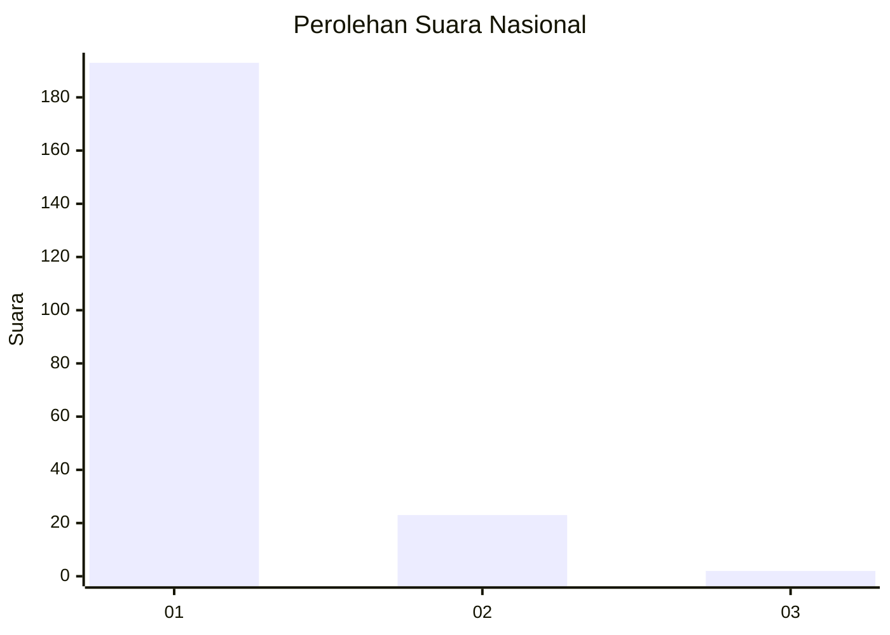
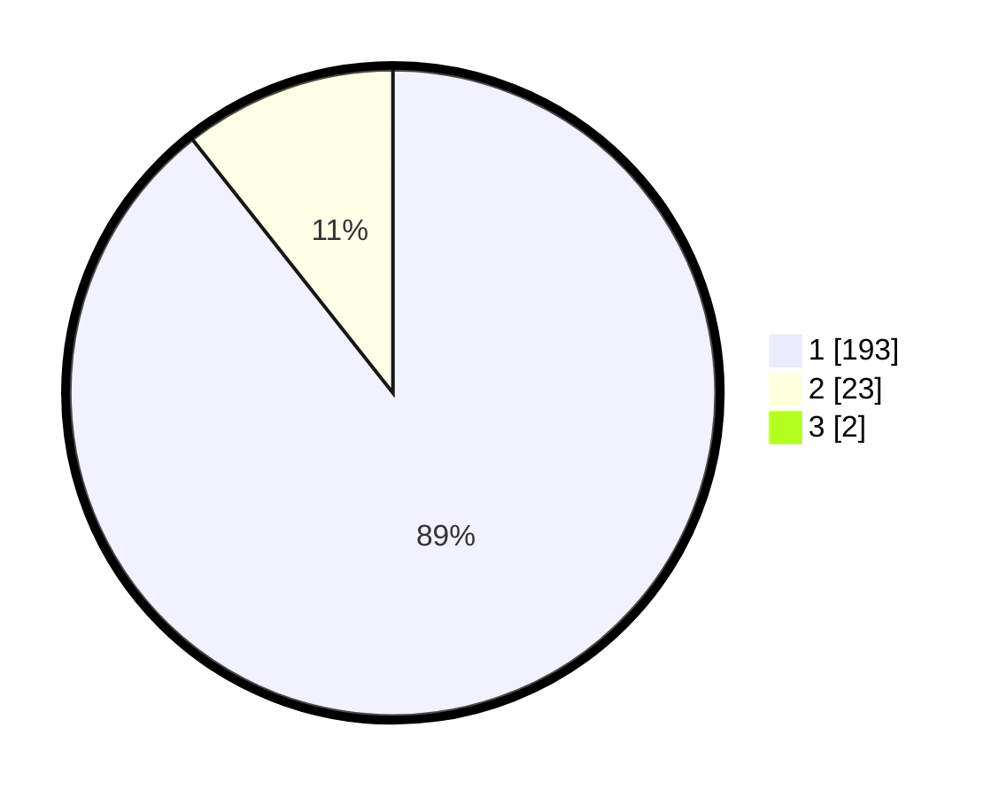

# Hasil

## Grafik

## Tabel

| No. | Nama Paslon    | Suara | Suara (raw) | Persentase |
|:--- |:-------------- | -----:| -----------:| ----------:|
| 1   | ANIES MUHAIMIN | 193   | [193][p-1]  | 88,53      |
| 2   | PRABOWO GIBRAN | 23    | [23][p-2]   | 10,55      |
| 3   | GANJAR MAHFUD  | 2     | [2][p-3]    | 0,92       |

[p-1]: https://github.com/gigit-pemilu/pemilu-2024/blob/main/pilpres/hitung-suara/sub/11-aceh/sub/08-aceh-utara/sub/04-lhoksukon/sub/2068-ulee-tanoh/sub/001-tps/sub/paslon-1.txt
[p-2]: https://github.com/gigit-pemilu/pemilu-2024/blob/main/pilpres/hitung-suara/sub/11-aceh/sub/08-aceh-utara/sub/04-lhoksukon/sub/2068-ulee-tanoh/sub/001-tps/sub/paslon-2.txt
[p-3]: https://github.com/gigit-pemilu/pemilu-2024/blob/main/pilpres/hitung-suara/sub/11-aceh/sub/08-aceh-utara/sub/04-lhoksukon/sub/2068-ulee-tanoh/sub/001-tps/sub/paslon-3.txt

## Foto C Plano

https://sirekap-obj-formc.kpu.go.id/98ac/pemilu/ppwp/11/08/04/20/68/1108042068001-20240215-094038--cbc7183c-8ca7-44f6-88d2-e904aaca4dff.jpg

https://sirekap-obj-formc.kpu.go.id/98ac/pemilu/ppwp/11/08/04/20/68/1108042068001-20240215-094102--1125a475-1bde-4874-b29b-e450aba6e6dc.jpg

https://sirekap-obj-formc.kpu.go.id/98ac/pemilu/ppwp/11/08/04/20/68/1108042068001-20240215-094130--99f2c37a-a481-4a73-ab1e-a30649c7f651.jpg

## Metadata

| Key        | Value               |
| ---------- | ------------------- |
| Time Stamp | 2024-02-16 23:30:00 |

