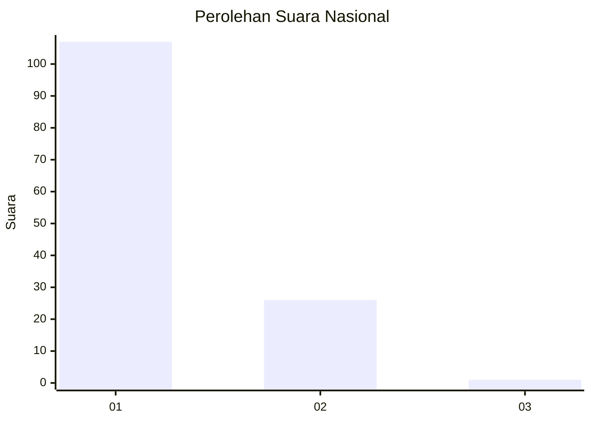
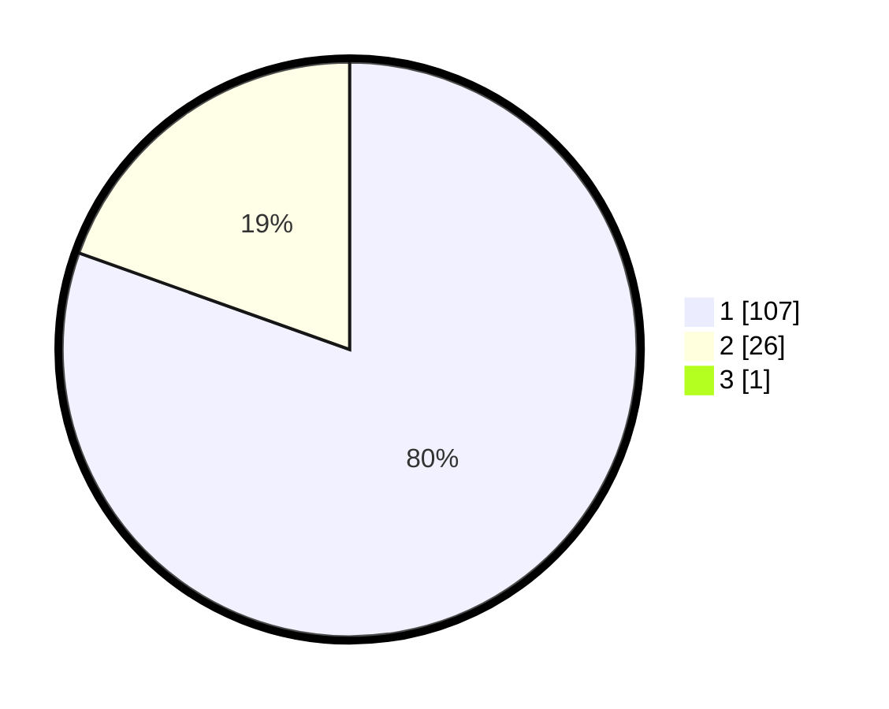

# Hasil

## Grafik

## Tabel

| No. | Nama Paslon    | Suara | Suara (raw) | Persentase |
|:--- |:-------------- | -----:| -----------:| ----------:|
| 1   | ANIES MUHAIMIN | 107   | [107][p-1]  | 79,85      |
| 2   | PRABOWO GIBRAN | 26    | [26][p-2]   | 19,40      |
| 3   | GANJAR MAHFUD  | 1     | [1][p-3]    | 0,75       |

[p-1]: https://github.com/gigit-pemilu/pemilu-2024/blob/main/pilpres/hitung-suara/sub/11-aceh/sub/08-aceh-utara/sub/04-lhoksukon/sub/2069-buket-krueng/sub/001-tps/sub/paslon-1.txt
[p-2]: https://github.com/gigit-pemilu/pemilu-2024/blob/main/pilpres/hitung-suara/sub/11-aceh/sub/08-aceh-utara/sub/04-lhoksukon/sub/2069-buket-krueng/sub/001-tps/sub/paslon-2.txt
[p-3]: https://github.com/gigit-pemilu/pemilu-2024/blob/main/pilpres/hitung-suara/sub/11-aceh/sub/08-aceh-utara/sub/04-lhoksukon/sub/2069-buket-krueng/sub/001-tps/sub/paslon-3.txt

## Foto C Plano

https://sirekap-obj-formc.kpu.go.id/7594/pemilu/ppwp/11/08/04/20/69/1108042069001-20240223-221215--289943f7-59a2-4436-9e31-bef220689b4a.jpg

https://sirekap-obj-formc.kpu.go.id/7594/pemilu/ppwp/11/08/04/20/69/1108042069001-20240223-221416--dfe88cc3-71ed-421f-9682-adacc559fa30.jpg

https://sirekap-obj-formc.kpu.go.id/7594/pemilu/ppwp/11/08/04/20/69/1108042069001-20240223-221507--c1c8f476-37cd-4883-80f5-8650430b931b.jpg

## Metadata

| Key        | Value               |
| ---------- | ------------------- |
| Time Stamp | 2024-02-24 22:31:28 |

